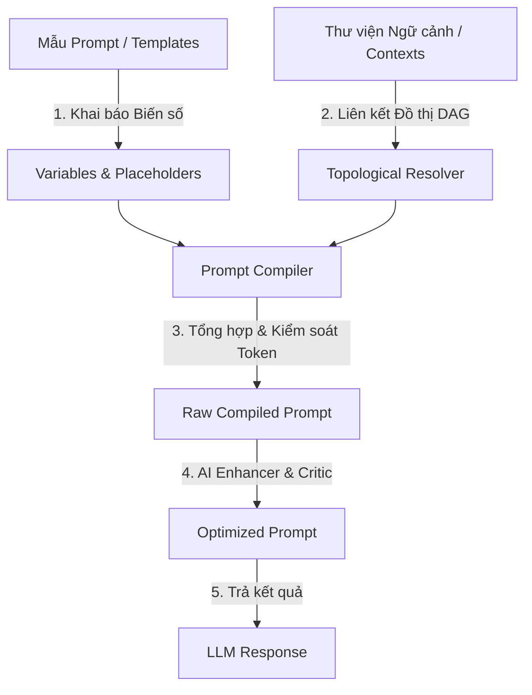

# Pocket — Personal Context Engineering Platform

**Pocket** là một nền tảng quản lý và kỹ nghệ ngữ cảnh (Context Engineering) cá nhân mạnh mẽ dành cho các kỹ sư prompt (Prompt Engineers) và nhà phát triển AI. 

Thay vì sao chép và dán thủ công các đoạn prompt dài dòng hoặc các thông tin ngữ cảnh lặp đi lặp lại, Pocket giúp bạn cấu trúc hóa, liên kết và tự động tối ưu hóa các thành phần để tạo ra những prompt chất lượng cao nhất cho các mô hình ngôn ngữ lớn (LLMs).

---

## 🌟 Tính năng chính nổi bật

### 1. Thư viện ngữ cảnh thông minh (Context Library)
- Định nghĩa các loại ngữ cảnh đa dạng: **Persona** (Tính cách AI), **Role** (Vai trò), **Instruction** (Chỉ dẫn cụ thể), và **Knowledge** (Kiến thức nền tảng).
- Đánh chỉ mục thẻ (Tags) và danh mục (Categories) để tìm kiếm tức thì.
- Chấm điểm tin cậy (Confidence) và ghim (Pin) các tài liệu quan trọng lên đầu thư viện.

### 2. Ràng buộc quan hệ Ngữ cảnh (DAG Dependency Constraints)
- Thiết lập các mối quan hệ logic giữa các ngữ cảnh (ví dụ: Ngữ cảnh "Bảo mật nâng cao" *yêu cầu* ngữ cảnh "Kết nối Cơ sở dữ liệu").
- Pocket tự động phân tích và sắp xếp thứ tự các mảnh ngữ cảnh theo thuật toán đồ thị có hướng không chu trình (DAG - Directed Acyclic Graph) để đảm bảo tính logic và mạch lạc trước khi đưa vào LLM.

### 3. Quản lý Biến số & Mẫu Prompt (Variables & Templates)
- Tạo mẫu prompt động với các biến số dạng `{{variable_name}}`.
- Định nghĩa kiểu dữ liệu cho biến (Text, Secret API Keys, Select list) và ánh xạ chúng trực tiếp vào các nguồn dữ liệu ngữ cảnh khác nhau.

### 4. Pipeline biên dịch & Tối ưu AI (Prompt Compiler & AI Pipeline)
- **Tự động tối ưu hóa:** Sử dụng mô hình AI (Enhancer & Critic) để phân tích, phản biện và tinh chỉnh prompt của bạn nhằm tăng tính rõ ràng và hiệu suất.
- **Kiểm soát Token (Token Management):** Dự báo trước số lượng token để tối ưu chi phí và tránh vượt quá giới hạn ngữ cảnh (Context Window) của LLM.

### 5. Đánh giá Prompt & Kiểm tra Sức khỏe (Benchmark & Health Check)
- **Prompt Benchmark:** Chạy thử nghiệm và so sánh chất lượng prompt hiện tại với phiên bản tối ưu do AI đề xuất.
- **AI Health Check:** Hệ thống tự động quét và đánh giá "sức khỏe" của kho ngữ cảnh (độ tươi mới, tần suất sử dụng, chất lượng phản hồi) để đưa ra khuyến nghị lưu trữ hoặc cập nhật các ngữ cảnh lỗi thời.

### 6. Nhật ký phản hồi (Conversation Journals)
- Tích hợp trình soạn thảo Markdown chuyên nghiệp (Monaco Editor) giúp bạn ghi lại các nhật ký hội thoại, ghi chú kinh nghiệm và phản xạ nhanh sau mỗi lần chạy thử nghiệm prompt với LLM.

---

## 🛠️ Cách thức hoạt động

Pocket hoạt động theo mô hình **Biên dịch Ngữ cảnh (Context Compilation)** khép kín:



1. **Định nghĩa:** Bạn khai báo các mảnh ngữ cảnh nhỏ và mẫu Prompt.
2. **Giải quyết ràng buộc:** Hệ thống tự động liên kết các mảnh ngữ cảnh dựa trên mối quan hệ phụ thuộc để sắp xếp nội dung tối ưu.
3. **Biên dịch:** Compiler thay thế các biến số và chèn các mảnh ngữ cảnh liên quan vào đúng vị trí để tạo ra Prompt thô.
4. **Tinh lọc:** AI Engine đóng vai trò "Phản biện" để loại bỏ các điểm thừa thãi, cải thiện độ chính xác và tinh gọn số lượng token sử dụng.

---

## 🚀 Hướng dẫn khởi chạy nhanh cho người dùng

Pocket được đóng gói theo kiến trúc **Single-Deploy** nguyên khối, giúp bạn khởi chạy cả giao diện đồ họa (UI) và API hệ thống chỉ trên một process duy nhất.

### Bước 1: Build và đóng gói ứng dụng
```bash
python build_single_deploy.py
```
*(Yêu cầu máy tính của bạn đã cài đặt trình quản lý package `Bun`)*

### Bước 2: Chạy ứng dụng
```bash
cd backend
.venv\Scripts\activate  # Windows
# source .venv/bin/activate  # macOS/Linux

uvicorn app.main:app --port 8000
```
Mở trình duyệt và truy cập: `http://localhost:8000` để bắt đầu thiết kế prompt của riêng bạn!
Để cấu hình môi trường chi tiết (bao gồm cấu hình Azure OpenAI Key), hãy tham khảo [SINGLE_DEPLOY_GUIDE.md](file:///c:/Users/admin.VM-DEMO-D675C0C/Documents/VibeProjects/Pocket/docs/SINGLE_DEPLOY_GUIDE.md).
