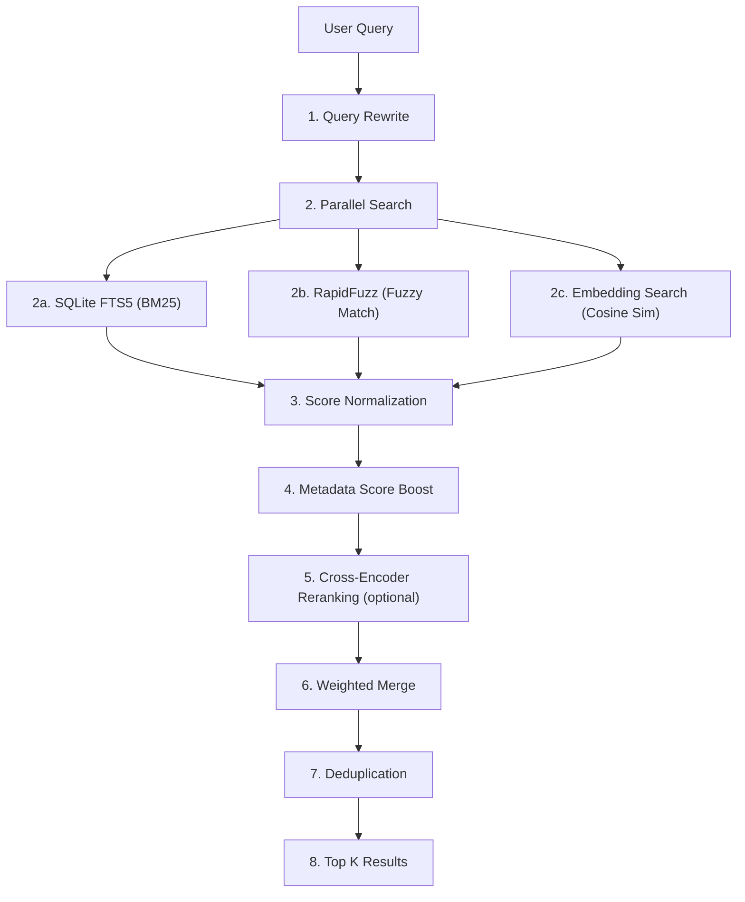
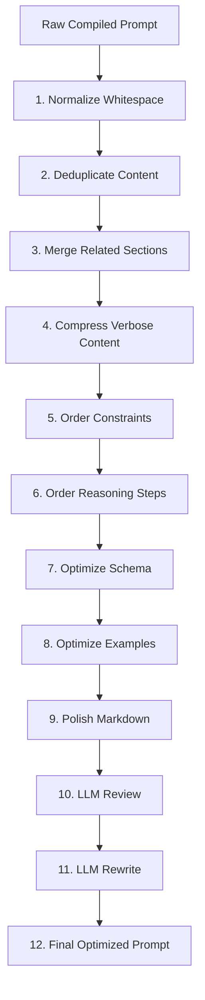
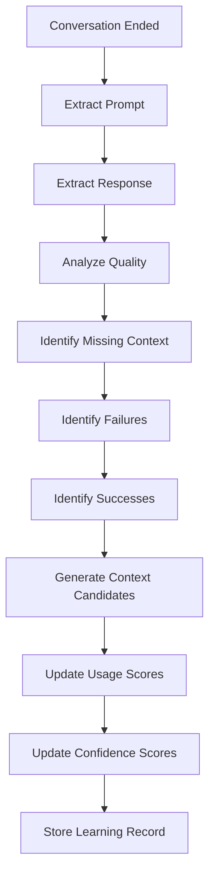

# Pocket — AI Architecture Specification

> **Version:** 1.0.0
> **Last Updated:** 2026-07-03
> **Status:** Authoritative
> **Audience:** Claude Code, development agents

---

## Table of Contents

1. [Overview](#1-overview)
2. [Model Strategy](#2-model-strategy)
3. [Azure OpenAI Integration](#3-azure-openai-integration)
4. [AI Pipeline](#4-ai-pipeline)
5. [Retrieval Engine](#5-retrieval-engine)
6. [Context Ranking Algorithm](#6-context-ranking-algorithm)
7. [Validation Engine](#7-validation-engine)
8. [Prompt Optimization Engine](#8-prompt-optimization-engine)
9. [Prompt Scoring](#9-prompt-scoring)
10. [AI Features](#10-ai-features)
11. [Learning Engine](#11-learning-engine)
12. [Embedding Engine](#12-embedding-engine)
13. [Token Management](#13-token-management)
14. [Error Handling & Resilience](#14-error-handling--resilience)

---

## 1. Overview

The AI layer is the core differentiator of Pocket. It is **not** a thin wrapper around Azure OpenAI. It is a multi-stage pipeline that transforms a user's intent into a high-quality, context-rich prompt, sends it to Azure OpenAI, and learns from the result.

### 1.1 Architecture Position

```
┌─────────────────────────────┐
│       Service Layer         │ ← Business logic calls AI layer
├─────────────────────────────┤
│        AI Layer             │ ← THIS DOCUMENT
│  ┌─────────────────────┐    │
│  │  Pipeline Orchestr. │    │
│  │  ┌───┬───┬───┬───┐ │    │
│  │  │Int│Ret│Val│Opt│ │    │
│  │  └───┴───┴───┴───┘ │    │
│  ├─────────────────────┤    │
│  │  AI Features        │    │
│  ├─────────────────────┤    │
│  │  Learning Engine    │    │
│  ├─────────────────────┤    │
│  │  Embedding Engine   │    │
│  └─────────────────────┘    │
├─────────────────────────────┤
│    Infrastructure Layer     │ ← Azure SDK, sentence-transformers
└─────────────────────────────┘
```

### 1.2 Key Rules

| Rule | Detail |
|------|--------|
| **AI layer has no direct DB access** | All data access through service layer or passed as parameters |
| **Every pipeline step has a contract** | Defined input type → output type |
| **Pipeline is synchronous by default** | Steps execute sequentially; parallelism only where specified |
| **All AI calls are auditable** | Every LLM call logged with input, output, tokens, cost, latency |
| **Failure is graceful** | Pipeline step failure falls back to previous step's output |
| **No hallucinated data** | AI suggestions always marked as candidates, never auto-applied |

---

## 2. Model Strategy

### 2.1 Model Routing

| Use Case | Model | Deployment | Rationale |
|----------|-------|------------|-----------|
| **Chat completion** | GPT-4.1 | `AZURE_OPENAI_DEPLOYMENT_CHAT` | Highest quality for user-facing responses |
| **Intent detection** | GPT-4.1 Mini | `AZURE_OPENAI_DEPLOYMENT_CHAT_MINI` | Fast, cheap, sufficient for classification |
| **AI Enhancement** | GPT-4.1 | `AZURE_OPENAI_DEPLOYMENT_CHAT` | Needs reasoning for prompt improvement |
| **AI Critique** | GPT-4.1 | `AZURE_OPENAI_DEPLOYMENT_CHAT` | Needs reasoning for quality assessment |
| **Prompt Scoring** | GPT-4.1 Mini | `AZURE_OPENAI_DEPLOYMENT_CHAT_MINI` | Structured output, scoring rubric |
| **Auto Tagging** | GPT-4.1 Mini | `AZURE_OPENAI_DEPLOYMENT_CHAT_MINI` | Simple classification |
| **Variable Extraction** | GPT-4.1 Mini | `AZURE_OPENAI_DEPLOYMENT_CHAT_MINI` | Pattern extraction |
| **Duplicate Detection** | GPT-4.1 Mini | `AZURE_OPENAI_DEPLOYMENT_CHAT_MINI` | Comparison task |
| **Context Generation** | GPT-4.1 | `AZURE_OPENAI_DEPLOYMENT_CHAT` | Creative content generation |
| **Weekly Review** | GPT-4.1 | `AZURE_OPENAI_DEPLOYMENT_CHAT` | Complex analysis |
| **Learning Analysis** | GPT-4.1 Mini | `AZURE_OPENAI_DEPLOYMENT_CHAT_MINI` | Pattern analysis |
| **Embedding** | text-embedding-3-large | `AZURE_OPENAI_DEPLOYMENT_EMBEDDING` | High-dimensional semantic search |
| **Local Embedding** | all-MiniLM-L6-v2 | Local (sentence-transformers) | Fast, offline, lightweight |

### 2.2 Model Selection Logic

```python
class ModelSelector:
    """Routes tasks to appropriate models."""

    def select(self, task_type: TaskType, complexity: str = "normal") -> str:
        if task_type in (TaskType.CHAT, TaskType.ENHANCE, TaskType.CRITIQUE,
                         TaskType.GENERATE, TaskType.WEEKLY_REVIEW):
            return self.settings.azure_openai_deployment_chat  # GPT-4.1

        return self.settings.azure_openai_deployment_chat_mini  # GPT-4.1 Mini
```

---

## 3. Azure OpenAI Integration

### 3.1 Client Wrapper

```python
# app/ai/client.py

from openai import AsyncAzureOpenAI
from app.config import Settings

class AzureAIClient:
    """Centralized Azure OpenAI client. All AI calls go through this."""

    def __init__(self, settings: Settings):
        self._client = AsyncAzureOpenAI(
            azure_endpoint=settings.azure_openai_endpoint,
            api_key=settings.azure_openai_api_key,
            api_version=settings.azure_openai_api_version,
        )
        self._settings = settings

    async def chat(
        self,
        messages: list[dict],
        *,
        model: str | None = None,
        temperature: float = 0.7,
        max_tokens: int = 4096,
        response_format: dict | None = None,
        timeout: float = 60.0,
    ) -> ChatResult:
        deployment = model or self._settings.azure_openai_deployment_chat
        try:
            response = await self._client.chat.completions.create(
                model=deployment,
                messages=messages,
                temperature=temperature,
                max_tokens=max_tokens,
                response_format=response_format,
                timeout=timeout,
            )
            return ChatResult(
                content=response.choices[0].message.content,
                finish_reason=response.choices[0].finish_reason,
                prompt_tokens=response.usage.prompt_tokens,
                completion_tokens=response.usage.completion_tokens,
                total_tokens=response.usage.total_tokens,
                model=deployment,
                latency_ms=response.response_ms if hasattr(response, 'response_ms') else None,
            )
        except Exception as e:
            raise AIServiceError(f"Azure OpenAI error: {str(e)}")

    async def chat_json(
        self,
        messages: list[dict],
        *,
        model: str | None = None,
        temperature: float = 0.3,
        max_tokens: int = 4096,
    ) -> dict:
        """Chat with JSON response format. Returns parsed dict."""
        result = await self.chat(
            messages,
            model=model,
            temperature=temperature,
            max_tokens=max_tokens,
            response_format={"type": "json_object"},
        )
        return json.loads(result.content)

    async def embed(
        self,
        texts: list[str],
        *,
        model: str | None = None,
        dimensions: int | None = None,
    ) -> list[list[float]]:
        deployment = model or self._settings.azure_openai_deployment_embedding
        response = await self._client.embeddings.create(
            model=deployment,
            input=texts,
            dimensions=dimensions,
        )
        return [item.embedding for item in response.data]
```

### 3.2 Chat Result Data Class

```python
@dataclass
class ChatResult:
    content: str
    finish_reason: str
    prompt_tokens: int
    completion_tokens: int
    total_tokens: int
    model: str
    latency_ms: int | None = None
    cost: float = 0.0

    def compute_cost(self, pricing: ModelPricing) -> float:
        self.cost = (
            self.prompt_tokens * pricing.input_per_token +
            self.completion_tokens * pricing.output_per_token
        )
        return self.cost
```

### 3.3 Retry & Resilience

```python
import asyncio
from tenacity import retry, stop_after_attempt, wait_exponential, retry_if_exception_type

class AzureAIClient:
    @retry(
        stop=stop_after_attempt(3),
        wait=wait_exponential(multiplier=1, min=1, max=30),
        retry=retry_if_exception_type((TimeoutError, ConnectionError)),
    )
    async def chat(self, ...):
        # ... implementation above
```

---

## 4. AI Pipeline

### 4.1 Pipeline Overview

The AI Pipeline is the heart of Pocket. Every user message goes through this pipeline before reaching Azure OpenAI.

```mermaid
graph TD
    A["1. User Request"] --> B["2. Intent Detection"]
    B --> C["3. Workspace Detection"]
    C --> D["4. Variable Resolution"]
    D --> E["5. Hybrid Retrieval"]
    E --> F["6. Dependency Resolution"]
    F --> G["7. Conflict Detection"]
    G --> H["8. Context Ranking"]
    H --> I["9. Prompt Compilation"]
    I --> J["10. Prompt Validation"]
    J -->|Fail| FAIL["Return Validation Errors"]
    J -->|Pass| K["11. Token Optimization"]
    K --> L["12. AI Enhancement"]
    L --> M["13. AI Critique"]
    M --> N["14. Prompt Score"]
    N --> O["15. Final Prompt"]
    O --> P["16. Azure OpenAI Chat"]
    P --> Q["17. Conversation Storage"]
    Q --> R["18. Learning Engine"]

    style A fill:#0f3460
    style FAIL fill:#e94560
    style P fill:#533483
    style R fill:#16213e
```



### 4.2 Pipeline Orchestrator

```python
# app/ai/pipeline/orchestrator.py

@dataclass
class PipelineInput:
    user_message: str
    workspace_id: str
    conversation_id: str | None = None
    template_id: str | None = None
    selected_context_ids: list[str] | None = None
    variable_overrides: dict[str, str] | None = None

@dataclass
class PipelineOutput:
    final_prompt: str
    system_prompt: str
    ai_response: str
    contexts_used: list[ContextUsed]
    variables_resolved: dict[str, str]
    validation_result: ValidationResult
    prompt_score: PromptScore | None
    token_usage: TokenUsage
    cost: float
    latency_ms: int
    pipeline_trace: list[PipelineStepTrace]  # For debugging

@dataclass
class PipelineStepTrace:
    step_name: str
    input_summary: str
    output_summary: str
    duration_ms: int
    status: str  # success | skipped | failed | fallback

class PipelineOrchestrator:
    def __init__(
        self,
        intent_detector: IntentDetector,
        retrieval_engine: RetrievalEngine,
        dependency_resolver: DependencyResolver,
        conflict_detector: ConflictDetector,
        ranking_engine: RankingEngine,
        compiler: PromptCompiler,
        validator: ValidationEngine,
        optimizer: PromptOptimizer,
        enhancer: PromptEnhancer,
        critic: PromptCritic,
        scorer: PromptScorer,
        ai_client: AzureAIClient,
        token_counter: TokenCounter,
    ):
        self._steps = [
            intent_detector,
            retrieval_engine,
            dependency_resolver,
            conflict_detector,
            ranking_engine,
            compiler,
            validator,
            optimizer,
            enhancer,
            critic,
            scorer,
        ]
        self._ai_client = ai_client
        self._token_counter = token_counter

    async def execute(self, input: PipelineInput) -> PipelineOutput:
        trace: list[PipelineStepTrace] = []
        context = PipelineContext(input=input)

        for step in self._steps:
            start = time.monotonic()
            try:
                context = await step.execute(context)
                trace.append(PipelineStepTrace(
                    step_name=step.name,
                    input_summary=step.summarize_input(context),
                    output_summary=step.summarize_output(context),
                    duration_ms=int((time.monotonic() - start) * 1000),
                    status="success",
                ))
            except ValidationFailedError as e:
                # Validation failure stops the pipeline
                return PipelineOutput(
                    validation_result=e.result,
                    # ... fill other fields as empty/default
                )
            except PipelineStepError as e:
                # Non-critical step failure: use fallback
                trace.append(PipelineStepTrace(
                    step_name=step.name,
                    status="fallback",
                    # ...
                ))
                context = step.fallback(context)

        # Step 16: Send to Azure OpenAI
        ai_result = await self._ai_client.chat(
            messages=context.compiled_messages,
            model=context.selected_model,
        )

        return PipelineOutput(
            final_prompt=context.final_prompt,
            system_prompt=context.system_prompt,
            ai_response=ai_result.content,
            contexts_used=context.contexts_used,
            variables_resolved=context.resolved_variables,
            validation_result=context.validation_result,
            prompt_score=context.prompt_score,
            token_usage=TokenUsage(
                prompt=ai_result.prompt_tokens,
                completion=ai_result.completion_tokens,
                total=ai_result.total_tokens,
            ),
            cost=ai_result.cost,
            latency_ms=ai_result.latency_ms,
            pipeline_trace=trace,
        )
```

### 4.3 Pipeline Steps — Detailed Contracts

#### Step 1: User Request (Input)

```python
# Input = PipelineInput (defined above)
# No processing. Entry point.
```

---

#### Step 2: Intent Detection

```python
# app/ai/pipeline/intent.py

@dataclass
class IntentResult:
    intent: str           # question | instruction | creative | analysis | code | conversation
    entities: list[str]   # Extracted entities (topics, technologies, names)
    complexity: str       # simple | moderate | complex
    language: str         # detected language
    suggested_model: str  # gpt-4.1 or gpt-4.1-mini

class IntentDetector(PipelineStep):
    name = "intent_detection"

    async def execute(self, ctx: PipelineContext) -> PipelineContext:
        result = await self._ai_client.chat_json(
            messages=[
                {"role": "system", "content": INTENT_DETECTION_PROMPT},
                {"role": "user", "content": ctx.input.user_message},
            ],
            model=self._settings.azure_openai_deployment_chat_mini,
            temperature=0.1,
            max_tokens=500,
        )
        ctx.intent = IntentResult(**result)
        ctx.selected_model = ctx.intent.suggested_model
        return ctx

    def fallback(self, ctx: PipelineContext) -> PipelineContext:
        ctx.intent = IntentResult(
            intent="instruction",
            entities=[],
            complexity="moderate",
            language="en",
            suggested_model=self._settings.azure_openai_deployment_chat,
        )
        return ctx
```

**Intent Detection Prompt (system):**

```
You are an intent classifier. Analyze the user's message and return JSON:
{
  "intent": "question|instruction|creative|analysis|code|conversation",
  "entities": ["entity1", "entity2"],
  "complexity": "simple|moderate|complex",
  "language": "en|vi|...",
  "suggested_model": "gpt-4.1|gpt-4.1-mini"
}

Rules:
- "question" = user asking for information
- "instruction" = user giving a task to execute
- "creative" = writing, brainstorming, ideation
- "analysis" = code review, data analysis, evaluation
- "code" = code generation, debugging, refactoring
- "conversation" = casual chat, follow-up
- Use "gpt-4.1-mini" for simple questions and casual conversation
- Use "gpt-4.1" for everything else
```

---

#### Step 3: Workspace Detection

```python
# Determine which workspace this request belongs to.
# If workspace_id provided in input → use it.
# If not → infer from entities, current UI state, or default workspace.

class WorkspaceDetector(PipelineStep):
    name = "workspace_detection"

    async def execute(self, ctx: PipelineContext) -> PipelineContext:
        if ctx.input.workspace_id:
            ctx.workspace = await self._workspace_service.get(ctx.input.workspace_id)
        else:
            # Infer from entities
            ctx.workspace = await self._workspace_service.detect_from_entities(
                ctx.intent.entities
            )
        return ctx
```

---

#### Step 4: Variable Resolution

```python
# Resolve all variables for the current workspace + template.

@dataclass
class ResolvedVariables:
    variables: dict[str, str]     # name → resolved value
    unresolved: list[str]         # Variables with no value
    source_map: dict[str, str]    # name → source (global|workspace|template|runtime|system)

class VariableResolver(PipelineStep):
    name = "variable_resolution"

    async def execute(self, ctx: PipelineContext) -> PipelineContext:
        # Resolution order (later overrides earlier):
        # 1. System variables (current_date, current_time, workspace_name, model_name)
        # 2. Global variables
        # 3. Workspace variables
        # 4. Template default variables
        # 5. Runtime overrides (from user input)

        system_vars = {
            "current_date": datetime.utcnow().strftime("%Y-%m-%d"),
            "current_time": datetime.utcnow().strftime("%H:%M:%S UTC"),
            "workspace_name": ctx.workspace.name,
            "model_name": ctx.selected_model,
        }

        global_vars = await self._variable_service.get_global_variables()
        workspace_vars = await self._variable_service.get_workspace_variables(
            ctx.workspace.id
        )
        template_vars = {}
        if ctx.input.template_id:
            template_vars = await self._variable_service.get_template_defaults(
                ctx.input.template_id
            )

        runtime_vars = ctx.input.variable_overrides or {}

        # Merge in priority order
        resolved = {**system_vars, **global_vars, **workspace_vars, **template_vars, **runtime_vars}

        ctx.resolved_variables = ResolvedVariables(
            variables=resolved,
            unresolved=[k for k, v in resolved.items() if v is None],
            source_map=self._build_source_map(system_vars, global_vars, workspace_vars, template_vars, runtime_vars),
        )
        return ctx
```

---

#### Step 5: Hybrid Retrieval

See [Section 5: Retrieval Engine](#5-retrieval-engine) for full details.

```python
class HybridRetrievalStep(PipelineStep):
    name = "hybrid_retrieval"

    async def execute(self, ctx: PipelineContext) -> PipelineContext:
        # If user manually selected contexts, use those
        if ctx.input.selected_context_ids:
            ctx.retrieved_contexts = await self._context_service.get_by_ids(
                ctx.input.selected_context_ids
            )
        else:
            # Auto-retrieve relevant contexts
            ctx.retrieved_contexts = await self._retrieval_engine.search(
                query=ctx.input.user_message,
                workspace_id=ctx.workspace.id,
                intent=ctx.intent,
                top_k=self._settings.search_top_k,
            )
        return ctx
```

---

#### Step 6: Dependency Resolution

```python
# Resolve the Context DAG. If context A depends on B, B must be included.
# Uses topological sort to determine correct ordering.

class DependencyResolver(PipelineStep):
    name = "dependency_resolution"

    async def execute(self, ctx: PipelineContext) -> PipelineContext:
        context_ids = [c.id for c in ctx.retrieved_contexts]

        # Get all dependencies for selected contexts
        all_deps = await self._dep_service.resolve_all(context_ids)

        # Add missing dependencies
        missing_ids = [d.id for d in all_deps if d.id not in context_ids]
        if missing_ids:
            missing_contexts = await self._context_service.get_by_ids(missing_ids)
            ctx.retrieved_contexts.extend(missing_contexts)

        # Topological sort
        ctx.ordered_contexts = self._topological_sort(
            ctx.retrieved_contexts,
            await self._dep_service.get_edges(
                [c.id for c in ctx.retrieved_contexts]
            ),
        )
        return ctx

    def _topological_sort(
        self,
        contexts: list[Context],
        edges: list[tuple[str, str]],  # (source_id, target_id)
    ) -> list[Context]:
        """Kahn's algorithm for topological sort."""
        graph: dict[str, list[str]] = defaultdict(list)
        in_degree: dict[str, int] = {c.id: 0 for c in contexts}

        for source, target in edges:
            if source in in_degree and target in in_degree:
                graph[target].append(source)  # target must come before source
                in_degree[source] += 1

        queue = deque([id for id, deg in in_degree.items() if deg == 0])
        sorted_ids: list[str] = []

        while queue:
            node = queue.popleft()
            sorted_ids.append(node)
            for neighbor in graph[node]:
                in_degree[neighbor] -= 1
                if in_degree[neighbor] == 0:
                    queue.append(neighbor)

        if len(sorted_ids) != len(contexts):
            unsorted = [c.id for c in contexts if c.id not in sorted_ids]
            raise CircularDependencyError(unsorted)

        id_to_context = {c.id: c for c in contexts}
        return [id_to_context[id] for id in sorted_ids]
```

---

#### Step 7: Conflict Detection

```python
# Detect conflicting contexts (e.g., two personas, contradictory instructions).

@dataclass
class Conflict:
    context_a_id: str
    context_b_id: str
    conflict_type: str  # duplicate | contradictory | override
    description: str
    resolution: str     # keep_a | keep_b | merge | warn

class ConflictDetector(PipelineStep):
    name = "conflict_detection"

    async def execute(self, ctx: PipelineContext) -> PipelineContext:
        conflicts: list[Conflict] = []

        # Rule 1: Only one persona allowed
        personas = [c for c in ctx.ordered_contexts if c.context_type == "persona"]
        if len(personas) > 1:
            conflicts.append(Conflict(
                context_a_id=personas[0].id,
                context_b_id=personas[1].id,
                conflict_type="duplicate",
                description="Multiple personas detected",
                resolution="keep_a",  # Keep highest priority
            ))

        # Rule 2: Check for override dependencies
        for ctx_item in ctx.ordered_contexts:
            overrides = [d for d in ctx.dependencies
                        if d.source_id == ctx_item.id and d.dependency_type == "overrides"]
            for override in overrides:
                conflicts.append(Conflict(
                    context_a_id=override.source_id,
                    context_b_id=override.target_id,
                    conflict_type="override",
                    description=f"Context overrides another",
                    resolution="keep_a",
                ))

        ctx.conflicts = conflicts
        # Apply resolutions (remove lower-priority conflicting contexts)
        if conflicts:
            ctx.ordered_contexts = self._resolve_conflicts(
                ctx.ordered_contexts, conflicts
            )

        return ctx
```

---

#### Step 8: Context Ranking

See [Section 6: Context Ranking Algorithm](#6-context-ranking-algorithm).

---

#### Step 9: Prompt Compilation

```python
# Compile the final prompt from template + contexts + variables.

class PromptCompiler(PipelineStep):
    name = "prompt_compilation"

    async def execute(self, ctx: PipelineContext) -> PipelineContext:
        # 1. Build system prompt sections
        sections: list[str] = []

        # Group contexts by type, in defined order
        type_order = ["persona", "role", "instruction", "knowledge",
                      "constraint", "example", "reference", "snippet"]

        for ctx_type in type_order:
            type_contexts = [c for c in ctx.ranked_contexts if c.context_type == ctx_type]
            if type_contexts:
                section_header = f"## {ctx_type.title()}"
                section_content = "\n\n".join(c.content for c in type_contexts)
                sections.append(f"{section_header}\n\n{section_content}")

        system_prompt = "\n\n---\n\n".join(sections)

        # 2. Resolve Jinja2 variables
        if ctx.resolved_variables:
            template = jinja2.Template(system_prompt)
            system_prompt = template.render(**ctx.resolved_variables.variables)

        # 3. If template specified, use template structure
        if ctx.input.template_id:
            template = await self._template_service.get(ctx.input.template_id)
            jinja_template = jinja2.Template(template.content)
            system_prompt = jinja_template.render(
                **ctx.resolved_variables.variables,
                contexts=ctx.ranked_contexts,
            )

        ctx.system_prompt = system_prompt
        ctx.compiled_messages = [
            {"role": "system", "content": system_prompt},
            {"role": "user", "content": ctx.input.user_message},
        ]

        # Include conversation history if continuing
        if ctx.conversation_history:
            ctx.compiled_messages = (
                [ctx.compiled_messages[0]] +  # system
                ctx.conversation_history +     # history
                [ctx.compiled_messages[-1]]    # new user message
            )

        ctx.final_prompt = system_prompt
        return ctx
```

---

#### Step 10: Prompt Validation

See [Section 7: Validation Engine](#7-validation-engine).

---

#### Step 11: Token Optimization

```python
class TokenOptimizer(PipelineStep):
    name = "token_optimization"

    async def execute(self, ctx: PipelineContext) -> PipelineContext:
        total_tokens = self._token_counter.count(ctx.final_prompt)
        token_limit = self._settings.token_limit

        if total_tokens <= token_limit * 0.8:
            # Under 80% of limit → no optimization needed
            return ctx

        # Optimization strategies (applied in order until under limit)
        strategies = [
            self._remove_low_priority_contexts,
            self._compress_examples,
            self._truncate_references,
            self._summarize_long_contexts,
        ]

        for strategy in strategies:
            ctx = await strategy(ctx)
            total_tokens = self._token_counter.count(ctx.final_prompt)
            if total_tokens <= token_limit * 0.8:
                break

        if total_tokens > token_limit:
            raise TokenLimitError(current=total_tokens, limit=token_limit)

        return ctx
```

---

#### Steps 12-14: AI Enhancement, Critique, Scoring

```python
class PromptEnhancer(PipelineStep):
    """Uses AI to improve the compiled prompt."""
    name = "ai_enhancement"

    async def execute(self, ctx: PipelineContext) -> PipelineContext:
        result = await self._ai_client.chat_json(
            messages=[
                {"role": "system", "content": ENHANCE_PROMPT},
                {"role": "user", "content": json.dumps({
                    "original_prompt": ctx.final_prompt,
                    "user_intent": ctx.input.user_message,
                    "intent_analysis": asdict(ctx.intent),
                })},
            ],
            model=self._settings.azure_openai_deployment_chat,
            temperature=0.4,
        )
        if result.get("enhanced_prompt"):
            ctx.final_prompt = result["enhanced_prompt"]
            ctx.enhancement_notes = result.get("changes", [])
        return ctx

class PromptCritic(PipelineStep):
    """Uses AI to critique the prompt and suggest improvements."""
    name = "ai_critique"

    async def execute(self, ctx: PipelineContext) -> PipelineContext:
        result = await self._ai_client.chat_json(
            messages=[
                {"role": "system", "content": CRITIQUE_PROMPT},
                {"role": "user", "content": ctx.final_prompt},
            ],
            model=self._settings.azure_openai_deployment_chat,
            temperature=0.3,
        )
        ctx.critique = CritiqueResult(
            issues=result.get("issues", []),
            suggestions=result.get("suggestions", []),
            overall_assessment=result.get("assessment", ""),
        )
        # Apply auto-fixable suggestions
        if result.get("improved_prompt"):
            ctx.final_prompt = result["improved_prompt"]
        return ctx

class PromptScorer(PipelineStep):
    """Scores the final prompt quality."""
    name = "prompt_scoring"
    # See Section 9 for scoring details
```

---

## 5. Retrieval Engine

### 5.1 Hybrid Search Pipeline



### 5.2 Implementation

```python
# app/ai/pipeline/retrieval.py

@dataclass
class RetrievalResult:
    context: Context
    fts_score: float       # BM25 score (normalized 0-1)
    fuzzy_score: float     # RapidFuzz score (0-100 → 0-1)
    semantic_score: float  # Cosine similarity (0-1)
    metadata_score: float  # Metadata boost (0-1)
    final_score: float     # Weighted aggregate

class RetrievalEngine:
    # Weights for hybrid scoring
    WEIGHTS = {
        "fts": 0.25,       # BM25 text match
        "fuzzy": 0.10,     # Fuzzy string match
        "semantic": 0.35,  # Embedding similarity
        "metadata": 0.30,  # Metadata (priority, usage, recency)
    }

    async def search(
        self,
        query: str,
        workspace_id: str,
        intent: IntentResult | None = None,
        top_k: int = 10,
    ) -> list[RetrievalResult]:
        # Step 1: Query rewrite (expand query for better recall)
        expanded_query = await self._rewrite_query(query, intent)

        # Step 2: Parallel search
        fts_results, fuzzy_results, semantic_results = await asyncio.gather(
            self._fts_search(expanded_query, workspace_id),
            self._fuzzy_search(query, workspace_id),
            self._semantic_search(query, workspace_id),
        )

        # Step 3: Merge results by context ID
        merged = self._merge_results(fts_results, fuzzy_results, semantic_results)

        # Step 4: Apply metadata score
        merged = await self._apply_metadata_scores(merged, workspace_id)

        # Step 5: Compute weighted final score
        for result in merged:
            result.final_score = (
                self.WEIGHTS["fts"] * result.fts_score +
                self.WEIGHTS["fuzzy"] * result.fuzzy_score +
                self.WEIGHTS["semantic"] * result.semantic_score +
                self.WEIGHTS["metadata"] * result.metadata_score
            )

        # Step 6: Sort and return top K
        merged.sort(key=lambda r: r.final_score, reverse=True)
        return merged[:top_k]
```

### 5.3 FTS5 Search (BM25)

```python
async def _fts_search(
    self, query: str, workspace_id: str, limit: int = 50,
) -> list[tuple[str, float]]:
    """Full-text search using SQLite FTS5 with BM25 ranking."""
    sql = """
        SELECT c.id, bm25(contexts_fts, 10.0, 1.0, 0.0) as score
        FROM contexts c
        JOIN contexts_fts ON contexts_fts.rowid = c.rowid
        WHERE contexts_fts MATCH :query
          AND c.workspace_id = :workspace_id
          AND c.deleted_at IS NULL
        ORDER BY score
        LIMIT :limit
    """
    results = await self._session.execute(text(sql), {
        "query": self._prepare_fts_query(query),
        "workspace_id": workspace_id,
        "limit": limit,
    })
    return [(row.id, self._normalize_bm25(row.score)) for row in results]
```

### 5.4 Fuzzy Search (RapidFuzz)

```python
from rapidfuzz import fuzz, process

async def _fuzzy_search(
    self, query: str, workspace_id: str, limit: int = 50,
) -> list[tuple[str, float]]:
    """Fuzzy string matching on titles and tags."""
    # Get all context titles in workspace
    contexts = await self._repo.get_titles_and_tags(workspace_id)
    choices = {c.id: f"{c.title} {' '.join(c.tags)}" for c in contexts}

    results = process.extract(
        query,
        choices,
        scorer=fuzz.WRatio,
        limit=limit,
        score_cutoff=60,  # Minimum 60% match
    )

    return [(match[2], match[1] / 100.0) for match in results]
```

### 5.5 Semantic Search (Embedding)

```python
async def _semantic_search(
    self, query: str, workspace_id: str, limit: int = 50,
) -> list[tuple[str, float]]:
    """Embedding-based semantic search using cosine similarity."""
    # Compute query embedding
    query_embedding = await self._embedding_service.embed_text(query)

    # Get all context embeddings for workspace
    # Note: For production with >10K contexts, use approximate NN
    embeddings = await self._embedding_repo.get_by_workspace(workspace_id)

    # Compute cosine similarities
    scores = []
    for emb in embeddings:
        sim = cosine_similarity(query_embedding, emb.embedding_vector)
        if sim >= 0.3:  # Minimum threshold
            scores.append((emb.context_id, sim))

    scores.sort(key=lambda x: x[1], reverse=True)
    return scores[:limit]

def cosine_similarity(a: list[float], b: list[float]) -> float:
    """Compute cosine similarity between two vectors."""
    dot = sum(x * y for x, y in zip(a, b))
    norm_a = sum(x * x for x in a) ** 0.5
    norm_b = sum(x * x for x in b) ** 0.5
    if norm_a == 0 or norm_b == 0:
        return 0.0
    return dot / (norm_a * norm_b)
```

### 5.6 Query Rewrite

```python
async def _rewrite_query(
    self, query: str, intent: IntentResult | None,
) -> str:
    """Expand the query for better FTS recall."""
    # Simple expansion: add intent entities
    expanded = query
    if intent and intent.entities:
        expanded = f"{query} {' '.join(intent.entities)}"

    # For complex queries, use LLM to generate search terms
    if intent and intent.complexity == "complex":
        result = await self._ai_client.chat_json(
            messages=[
                {"role": "system", "content": QUERY_REWRITE_PROMPT},
                {"role": "user", "content": query},
            ],
            model=self._settings.azure_openai_deployment_chat_mini,
            temperature=0.1,
            max_tokens=200,
        )
        expanded = result.get("expanded_query", expanded)

    return expanded
```

---

## 6. Context Ranking Algorithm

### 6.1 Scoring Formula

```
FinalScore = (
    w_semantic × SemanticSimilarity +
    w_priority × NormalizedPriority +
    w_usage    × NormalizedUsage +
    w_recency  × RecencyScore +
    w_workspace× WorkspaceBoost +
    w_favorite × FavoriteBoost +
    w_dep      × DependencyWeight +
    w_conf     × ConfidenceScore +
    w_quality  × QualityScore
)
```

### 6.2 Weights

```python
RANKING_WEIGHTS = {
    "semantic":    0.25,  # Semantic similarity from retrieval
    "priority":    0.15,  # User-defined priority (0-100 → 0-1)
    "usage":       0.10,  # Usage frequency (log-normalized)
    "recency":     0.10,  # Days since last used (decay function)
    "workspace":   0.05,  # Boost if context belongs to current workspace
    "favorite":    0.05,  # Boost if favorited
    "dependency":  0.10,  # Weight from dependency edges
    "confidence":  0.10,  # AI-adjusted confidence score
    "quality":     0.10,  # AI-evaluated quality score
}
```

### 6.3 Score Computation

```python
class RankingEngine:
    def rank(
        self,
        results: list[RetrievalResult],
        workspace_id: str,
        favorites: set[str],
    ) -> list[RankedContext]:
        ranked = []
        for result in results:
            ctx = result.context

            scores = {
                "semantic": result.final_score,
                "priority": ctx.priority / 100.0,
                "usage": self._usage_score(ctx.usage_count),
                "recency": self._recency_score(ctx.last_used_at),
                "workspace": 1.0 if ctx.workspace_id == workspace_id else 0.3,
                "favorite": 1.0 if ctx.id in favorites else 0.0,
                "dependency": result.metadata_score,
                "confidence": ctx.confidence,
                "quality": ctx.quality_score or 0.5,
            }

            final = sum(
                RANKING_WEIGHTS[k] * v for k, v in scores.items()
            )

            ranked.append(RankedContext(
                context=ctx,
                score=final,
                score_breakdown=scores,
            ))

        ranked.sort(key=lambda r: r.score, reverse=True)
        return ranked

    def _usage_score(self, count: int) -> float:
        """Log-normalized usage score. Diminishing returns."""
        if count == 0:
            return 0.0
        return min(1.0, math.log(count + 1) / math.log(100))

    def _recency_score(self, last_used: str | None) -> float:
        """Exponential decay based on days since last use."""
        if not last_used:
            return 0.0
        days = (datetime.utcnow() - parse_datetime(last_used)).days
        return math.exp(-0.05 * days)  # Half-life ≈ 14 days
```

---

## 7. Validation Engine

### 7.1 Validation as Compiler

The Validation Engine acts as a **compiler** for prompts. If validation fails, the prompt is NOT sent to Azure OpenAI.

### 7.2 Validation Checks

```python
# app/ai/pipeline/validator.py

@dataclass
class ValidationCheck:
    name: str
    passed: bool
    severity: str     # error | warning | info
    message: str
    suggestion: str | None = None

@dataclass
class ValidationResult:
    passed: bool
    checks: list[ValidationCheck]
    errors: list[ValidationCheck]      # severity == "error"
    warnings: list[ValidationCheck]    # severity == "warning"

class ValidationEngine(PipelineStep):
    name = "prompt_validation"

    async def execute(self, ctx: PipelineContext) -> PipelineContext:
        checks: list[ValidationCheck] = []

        # Run all validators
        validators = [
            self._check_duplicate_contexts,
            self._check_conflicting_instructions,
            self._check_circular_dependencies,
            self._check_missing_role,
            self._check_missing_output_format,
            self._check_missing_constraints,
            self._check_missing_variables,
            self._check_broken_references,
            self._check_token_overflow,
            self._check_unused_contexts,
            self._check_prompt_quality,
        ]

        for validator in validators:
            check = await validator(ctx)
            checks.append(check)

        errors = [c for c in checks if not c.passed and c.severity == "error"]
        warnings = [c for c in checks if not c.passed and c.severity == "warning"]

        ctx.validation_result = ValidationResult(
            passed=len(errors) == 0,
            checks=checks,
            errors=errors,
            warnings=warnings,
        )

        if not ctx.validation_result.passed:
            raise ValidationFailedError(ctx.validation_result)

        return ctx
```

### 7.3 Validation Rules

| # | Check | Severity | Rule |
|---|-------|----------|------|
| 1 | **Duplicate Contexts** | warning | No two contexts with >90% content similarity |
| 2 | **Conflicting Instructions** | error | No contradictory directives (AI-detected) |
| 3 | **Circular Dependencies** | error | No cycles in context DAG |
| 4 | **Missing Role** | warning | Prompt should have at least one persona or role |
| 5 | **Missing Output Format** | warning | Prompt should specify expected output format |
| 6 | **Missing Constraints** | info | Suggest adding constraints for better results |
| 7 | **Missing Variables** | error | All `{{ variable }}` must be resolved |
| 8 | **Broken References** | error | All referenced context IDs must exist |
| 9 | **Token Overflow** | error | Total tokens must be under model limit |
| 10 | **Unused Contexts** | warning | Contexts included but not referenced |
| 11 | **Prompt Quality** | warning | AI-assessed quality below threshold (0.5) |

### 7.4 Individual Check Implementations

```python
async def _check_missing_variables(self, ctx: PipelineContext) -> ValidationCheck:
    """Check for unresolved Jinja2 variables."""
    import re
    pattern = r'\{\{[\s]*(\w+)[\s]*\}\}'
    variables_in_prompt = set(re.findall(pattern, ctx.final_prompt))
    resolved = set(ctx.resolved_variables.variables.keys())
    unresolved = variables_in_prompt - resolved

    return ValidationCheck(
        name="missing_variables",
        passed=len(unresolved) == 0,
        severity="error",
        message=f"Unresolved variables: {', '.join(unresolved)}" if unresolved else "All variables resolved",
        suggestion=f"Define values for: {', '.join(unresolved)}" if unresolved else None,
    )

async def _check_token_overflow(self, ctx: PipelineContext) -> ValidationCheck:
    """Check if prompt exceeds token limit."""
    total = self._token_counter.count_messages(ctx.compiled_messages)
    limit = self._settings.token_limit
    ratio = total / limit

    if ratio > 1.0:
        return ValidationCheck(
            name="token_overflow",
            passed=False,
            severity="error",
            message=f"Token limit exceeded: {total:,} / {limit:,} ({ratio:.0%})",
            suggestion="Remove low-priority contexts or compress content",
        )
    elif ratio > 0.9:
        return ValidationCheck(
            name="token_overflow",
            passed=True,
            severity="warning",
            message=f"Approaching token limit: {total:,} / {limit:,} ({ratio:.0%})",
        )
    else:
        return ValidationCheck(
            name="token_overflow",
            passed=True,
            severity="info",
            message=f"Token usage: {total:,} / {limit:,} ({ratio:.0%})",
        )

async def _check_circular_dependencies(self, ctx: PipelineContext) -> ValidationCheck:
    """Check for cycles in context dependency graph."""
    context_ids = [c.id for c in ctx.ordered_contexts]
    edges = await self._dep_service.get_edges(context_ids)

    has_cycle, cycle_path = self._detect_cycle(context_ids, edges)

    return ValidationCheck(
        name="circular_dependencies",
        passed=not has_cycle,
        severity="error",
        message=f"Circular dependency: {' → '.join(cycle_path)}" if has_cycle else "No circular dependencies",
    )
```

---

## 8. Prompt Optimization Engine

### 8.1 Optimization Pipeline



### 8.2 Implementation

```python
# app/ai/pipeline/optimizer.py

class PromptOptimizer(PipelineStep):
    name = "prompt_optimization"

    async def execute(self, ctx: PipelineContext) -> PipelineContext:
        prompt = ctx.final_prompt

        # Steps 1-9: Rule-based optimizations (fast, no LLM)
        prompt = self._normalize_whitespace(prompt)
        prompt = self._deduplicate_content(prompt)
        prompt = self._merge_related_sections(prompt)
        prompt = self._compress_verbose(prompt)
        prompt = self._order_constraints(prompt)
        prompt = self._order_reasoning(prompt)
        prompt = self._optimize_schema(prompt)
        prompt = self._optimize_examples(prompt)
        prompt = self._polish_markdown(prompt)

        # Steps 10-11: LLM-based optimizations (optional, based on settings)
        if self._settings.ai_optimization_enabled:
            prompt = await self._llm_review_and_rewrite(prompt, ctx)

        ctx.final_prompt = prompt
        ctx.optimization_applied = True
        return ctx

    def _normalize_whitespace(self, prompt: str) -> str:
        """Remove excessive blank lines, normalize indentation."""
        lines = prompt.split('\n')
        normalized = []
        prev_blank = False
        for line in lines:
            is_blank = line.strip() == ''
            if is_blank and prev_blank:
                continue  # Skip consecutive blank lines
            normalized.append(line.rstrip())
            prev_blank = is_blank
        return '\n'.join(normalized)

    def _deduplicate_content(self, prompt: str) -> str:
        """Remove duplicate paragraphs and sections."""
        sections = prompt.split('\n\n')
        seen: set[str] = set()
        unique: list[str] = []
        for section in sections:
            normalized = section.strip().lower()
            if normalized not in seen:
                seen.add(normalized)
                unique.append(section)
        return '\n\n'.join(unique)

    def _order_constraints(self, prompt: str) -> str:
        """Order constraints from most to least important."""
        # Parse constraint sections and sort by priority markers
        # (e.g., MUST > SHOULD > MAY)
        return prompt  # Implementation uses regex to find and reorder

    async def _llm_review_and_rewrite(
        self, prompt: str, ctx: PipelineContext,
    ) -> str:
        """Use LLM to review and rewrite the prompt for clarity."""
        result = await self._ai_client.chat_json(
            messages=[
                {"role": "system", "content": OPTIMIZATION_PROMPT},
                {"role": "user", "content": json.dumps({
                    "prompt": prompt,
                    "intent": ctx.intent.intent,
                    "token_budget": self._settings.token_limit,
                })},
            ],
            model=self._settings.azure_openai_deployment_chat,
            temperature=0.2,
        )
        return result.get("optimized_prompt", prompt)
```

---

## 9. Prompt Scoring

### 9.1 Scoring Rubric

```python
@dataclass
class PromptScore:
    overall: float          # 0.0 - 1.0
    clarity: float          # How clear and unambiguous
    specificity: float      # How specific and detailed
    completeness: float     # Has all necessary components
    consistency: float      # No contradictions
    efficiency: float       # Token efficiency
    reasoning: str          # AI explanation
    suggestions: list[str]  # Improvement suggestions

class PromptScorer(PipelineStep):
    name = "prompt_scoring"

    async def execute(self, ctx: PipelineContext) -> PipelineContext:
        result = await self._ai_client.chat_json(
            messages=[
                {"role": "system", "content": SCORING_PROMPT},
                {"role": "user", "content": ctx.final_prompt},
            ],
            model=self._settings.azure_openai_deployment_chat_mini,
            temperature=0.1,
        )
        ctx.prompt_score = PromptScore(
            overall=result["overall"],
            clarity=result["clarity"],
            specificity=result["specificity"],
            completeness=result["completeness"],
            consistency=result["consistency"],
            efficiency=result["efficiency"],
            reasoning=result["reasoning"],
            suggestions=result.get("suggestions", []),
        )
        return ctx
```

### 9.2 Scoring System Prompt

```
You are a prompt quality evaluator. Score the following prompt on these dimensions (0.0 to 1.0):

1. **Clarity** (0-1): Is the prompt clear and unambiguous? Are instructions easy to follow?
2. **Specificity** (0-1): Does it provide enough detail for the AI to produce the desired output?
3. **Completeness** (0-1): Does it include role, task, constraints, output format, and examples?
4. **Consistency** (0-1): Are there any contradictions or conflicting instructions?
5. **Efficiency** (0-1): Is the prompt concise? No unnecessary repetition or verbosity?

Return JSON:
{
  "overall": 0.85,
  "clarity": 0.9,
  "specificity": 0.8,
  "completeness": 0.85,
  "consistency": 0.95,
  "efficiency": 0.75,
  "reasoning": "The prompt is well-structured with clear role definition...",
  "suggestions": ["Add output format specification", "Remove redundant constraint"]
}
```

---

## 10. AI Features

### 10.1 Feature Catalog

Each AI feature is a standalone service with defined input/output contract.

#### AI Enhance

```python
class AIEnhanceService:
    """Improve a context or prompt using AI."""

    async def enhance(self, content: str, context_type: str) -> EnhanceResult:
        # Input: raw content + type
        # Output: enhanced content + list of changes made
        pass

@dataclass
class EnhanceResult:
    enhanced_content: str
    changes: list[str]      # What was changed
    token_delta: int         # Token count difference
```

#### AI Critique

```python
class AICritiqueService:
    """Critique a context or prompt and suggest improvements."""

    async def critique(self, content: str) -> CritiqueResult:
        pass

@dataclass
class CritiqueResult:
    issues: list[Issue]
    suggestions: list[str]
    quality_score: float
    overall_assessment: str
```

#### AI Auto Tagging

```python
class AIAutoTagService:
    """Automatically suggest tags for a context."""

    async def suggest_tags(self, content: str, existing_tags: list[str]) -> list[TagSuggestion]:
        pass

@dataclass
class TagSuggestion:
    name: str
    confidence: float  # 0-1
    reasoning: str
```

#### AI Variable Extraction

```python
class AIVariableExtractService:
    """Extract parameterizable variables from content."""

    async def extract(self, content: str) -> list[VariableSuggestion]:
        pass

@dataclass
class VariableSuggestion:
    name: str
    value: str          # Current hardcoded value
    description: str
    value_type: str     # text | number | select
```

#### AI Duplicate Detection

```python
class AIDuplicateDetectService:
    """Detect duplicate or near-duplicate contexts."""

    async def detect(self, workspace_id: str) -> list[DuplicateGroup]:
        pass

@dataclass
class DuplicateGroup:
    contexts: list[str]     # Context IDs
    similarity: float       # 0-1
    merge_suggestion: str   # How to merge them
```

#### AI Context Generation

```python
class AIGenerateContextService:
    """Generate a new context from a description."""

    async def generate(
        self, description: str, context_type: str, workspace_id: str,
    ) -> GeneratedContext:
        pass

@dataclass
class GeneratedContext:
    title: str
    content: str
    context_type: str
    suggested_tags: list[str]
    confidence: float
```

#### AI Context Suggestion

```python
class AIContextSuggestionService:
    """Suggest relevant contexts for a query or conversation."""

    async def suggest(
        self, query: str, workspace_id: str, excluded_ids: list[str],
    ) -> list[ContextSuggestion]:
        pass

@dataclass
class ContextSuggestion:
    context_id: str
    relevance_score: float
    reasoning: str
```

#### AI Merge Context

```python
class AIMergeContextService:
    """Merge multiple similar contexts into one."""

    async def merge(self, context_ids: list[str]) -> MergeResult:
        pass

@dataclass
class MergeResult:
    merged_content: str
    merged_title: str
    source_contexts: list[str]
    changes_summary: str
```

#### AI Prompt Benchmark

```python
class AIBenchmarkService:
    """Benchmark a prompt against alternatives."""

    async def benchmark(
        self, prompt: str, variants: list[str] | None = None,
    ) -> BenchmarkResult:
        pass

@dataclass
class BenchmarkResult:
    scores: list[PromptScore]
    best_variant_index: int
    comparison: str
```

#### AI Weekly Review

```python
class AIWeeklyReviewService:
    """Generate weekly usage review and recommendations."""

    async def generate_review(self, workspace_id: str | None = None) -> WeeklyReview:
        pass

@dataclass
class WeeklyReview:
    period: str
    total_conversations: int
    total_tokens: int
    total_cost: float
    top_contexts: list[str]
    dead_contexts: list[str]
    recommendations: list[str]
    health_summary: str
```

#### AI Context Health

```python
class AIHealthCheckService:
    """Evaluate health of all contexts."""

    async def check_health(self, workspace_id: str) -> HealthReport:
        pass

@dataclass
class HealthReport:
    total_contexts: int
    healthy: int
    stale: int
    low_quality: int
    needs_review: int
    recommendations: list[HealthRecommendation]
```

---

## 11. Learning Engine

### 11.1 Post-Conversation Analysis

After every conversation ends (or after every N messages), the Learning Engine analyzes:



### 11.2 Implementation

```python
# app/ai/learning/engine.py

class LearningEngine:
    async def analyze_conversation(
        self, conversation_id: str,
    ) -> LearningRecord:
        # Fetch conversation data
        conversation = await self._conv_service.get_with_messages(conversation_id)
        prompt_runs = await self._prompt_service.get_by_conversation(conversation_id)

        # AI analysis
        analysis = await self._ai_client.chat_json(
            messages=[
                {"role": "system", "content": LEARNING_ANALYSIS_PROMPT},
                {"role": "user", "content": json.dumps({
                    "messages": [
                        {"role": m.role, "content": m.content[:1000]}
                        for m in conversation.messages
                    ],
                    "contexts_used": [
                        {"title": c.title, "type": c.context_type}
                        for run in prompt_runs
                        for c in run.contexts
                    ],
                })},
            ],
            model=self._settings.azure_openai_deployment_chat_mini,
            temperature=0.2,
        )

        # Create learning record
        record = LearningRecord(
            id=generate_uuid(),
            conversation_id=conversation_id,
            analysis=json.dumps(analysis),
            missing_contexts=json.dumps(analysis.get("missing_contexts", [])),
            success_factors=json.dumps(analysis.get("successes", [])),
            failure_factors=json.dumps(analysis.get("failures", [])),
            recommendations=json.dumps(analysis.get("recommendations", [])),
        )
        await self._learning_repo.create(record)

        # Generate context candidates
        for candidate in analysis.get("new_context_suggestions", []):
            await self._candidate_repo.create(ContextCandidate(
                id=generate_uuid(),
                learning_record_id=record.id,
                workspace_id=conversation.workspace_id,
                suggested_title=candidate["title"],
                suggested_content=candidate["content"],
                suggested_type=candidate["type"],
                reasoning=candidate["reasoning"],
                confidence=candidate["confidence"],
            ))

        # Update context scores
        for ctx_usage in analysis.get("context_effectiveness", []):
            await self._context_service.update_scores(
                context_id=ctx_usage["context_id"],
                delta_confidence=ctx_usage.get("confidence_delta", 0),
                delta_usage=1,
            )

        return record
```

### 11.3 Learning Analysis Prompt

```
Analyze this AI conversation and provide insights in JSON format:

{
  "quality_assessment": "good|fair|poor",
  "missing_contexts": [
    {
      "topic": "What context was missing",
      "impact": "How it affected the conversation"
    }
  ],
  "successes": ["What worked well"],
  "failures": ["What went wrong"],
  "context_effectiveness": [
    {
      "context_id": "...",
      "was_helpful": true,
      "confidence_delta": 0.05
    }
  ],
  "new_context_suggestions": [
    {
      "title": "Suggested context title",
      "content": "Suggested content...",
      "type": "knowledge|instruction|...",
      "reasoning": "Why this context is needed",
      "confidence": 0.7
    }
  ],
  "recommendations": ["Actionable recommendations"]
}
```

---

## 12. Embedding Engine

### 12.1 Dual Embedding Strategy

| Model | Use Case | Dimensions | Speed | Quality |
|-------|----------|-----------|-------|---------|
| `all-MiniLM-L6-v2` (local) | Default embedding for contexts | 384 | Fast | Good |
| `text-embedding-3-large` (Azure) | High-quality semantic search | 3072 | Slow | Excellent |

### 12.2 Implementation

```python
# app/ai/embeddings.py

class EmbeddingService:
    def __init__(
        self,
        ai_client: AzureAIClient,
        settings: Settings,
    ):
        self._ai_client = ai_client
        self._settings = settings
        self._local_model = None  # Lazy loaded

    def _get_local_model(self):
        if self._local_model is None:
            from sentence_transformers import SentenceTransformer
            self._local_model = SentenceTransformer(
                self._settings.embedding_model_name
            )
        return self._local_model

    async def embed_text(
        self, text: str, use_azure: bool = False,
    ) -> list[float]:
        """Embed a single text."""
        if use_azure:
            result = await self._ai_client.embed([text])
            return result[0]
        else:
            model = self._get_local_model()
            embedding = model.encode(text, normalize_embeddings=True)
            return embedding.tolist()

    async def embed_batch(
        self,
        texts: list[str],
        use_azure: bool = False,
        batch_size: int = 32,
    ) -> list[list[float]]:
        """Embed multiple texts in batches."""
        all_embeddings: list[list[float]] = []

        for i in range(0, len(texts), batch_size):
            batch = texts[i:i + batch_size]
            if use_azure:
                embeddings = await self._ai_client.embed(batch)
            else:
                model = self._get_local_model()
                embeddings = model.encode(
                    batch, normalize_embeddings=True, show_progress_bar=False,
                ).tolist()
            all_embeddings.extend(embeddings)

        return all_embeddings

    async def embed_context(self, context_id: str) -> None:
        """Embed a context and store the result."""
        context = await self._context_repo.get_by_id(context_id)
        if not context:
            return

        content_hash = hashlib.sha256(context.content.encode()).hexdigest()

        # Check if already embedded with same content
        existing = await self._embedding_repo.get_by_context(context_id)
        if existing and existing.content_hash == content_hash:
            return  # Content unchanged, skip

        embedding = await self.embed_text(context.content)

        await self._embedding_repo.upsert(ContextEmbedding(
            id=generate_uuid(),
            context_id=context_id,
            model_name=self._settings.embedding_model_name,
            dimensions=len(embedding),
            embedding=json.dumps(embedding),
            content_hash=content_hash,
        ))
```

### 12.3 Background Embedding Job

```python
async def schedule_embedding(self, context_id: str) -> str:
    """Schedule a background embedding job."""
    job = AIJob(
        id=generate_uuid(),
        job_type="embedding",
        status="pending",
        input_data=json.dumps({"context_id": context_id}),
    )
    await self._job_repo.create(job)
    # FastAPI BackgroundTasks picks this up
    return job.id
```

---

## 13. Token Management

### 13.1 Token Counter

```python
# app/ai/pipeline/token_counter.py

import tiktoken

class TokenCounter:
    def __init__(self, model: str = "gpt-4.1"):
        self._encoding = tiktoken.encoding_for_model(model)

    def count(self, text: str) -> int:
        """Count tokens in a text string."""
        return len(self._encoding.encode(text))

    def count_messages(self, messages: list[dict]) -> int:
        """Count tokens in a list of chat messages (OpenAI format)."""
        total = 0
        for message in messages:
            total += 4  # Every message has overhead tokens
            for key, value in message.items():
                total += len(self._encoding.encode(value))
                if key == "name":
                    total += -1
        total += 2  # Reply priming tokens
        return total

    def truncate(self, text: str, max_tokens: int) -> str:
        """Truncate text to fit within token limit."""
        tokens = self._encoding.encode(text)
        if len(tokens) <= max_tokens:
            return text
        return self._encoding.decode(tokens[:max_tokens])
```

### 13.2 Token Budget Allocation

```python
# For a 128K context window:
TOKEN_BUDGET = {
    "system_prompt": 0.60,    # 76,800 tokens for system prompt + contexts
    "conversation_history": 0.25,  # 32,000 tokens for conversation history
    "user_message": 0.05,     # 6,400 tokens for current user message
    "completion": 0.10,       # 12,800 tokens reserved for AI response
}
```

---

## 14. Error Handling & Resilience

### 14.1 AI Error Taxonomy

| Error | Handling |
|-------|---------|
| **Azure timeout** | Retry 3x with exponential backoff (1s, 2s, 4s) |
| **Rate limited (429)** | Retry after `Retry-After` header value |
| **Content filtered** | Log, return user-friendly error, skip step |
| **Invalid JSON response** | Retry once with explicit JSON formatting instruction |
| **Model overloaded** | Fall back to Mini model |
| **Embedding failure** | Mark context as "pending_embedding", retry in next batch |
| **Pipeline step failure** | Use step's fallback output, continue pipeline |

### 14.2 Graceful Degradation

```python
class PipelineStep(ABC):
    """Base class for all pipeline steps."""

    @abstractmethod
    async def execute(self, ctx: PipelineContext) -> PipelineContext:
        pass

    def fallback(self, ctx: PipelineContext) -> PipelineContext:
        """Default fallback: return context unchanged."""
        return ctx

    @property
    def is_critical(self) -> bool:
        """If True, pipeline stops on failure. If False, uses fallback."""
        return False
```

**Critical vs. non-critical steps:**

| Step | Critical | Reason |
|------|----------|--------|
| Intent Detection | No | Falls back to "instruction" |
| Hybrid Retrieval | No | Can use manually selected contexts |
| Dependency Resolution | Yes | Incorrect ordering produces bad prompts |
| Conflict Detection | No | Warnings only |
| Context Ranking | No | Falls back to priority-based ordering |
| Prompt Compilation | Yes | Core functionality |
| Validation | Yes | Must not send invalid prompts |
| Token Optimization | No | Falls back to unoptimized prompt |
| AI Enhancement | No | Falls back to un-enhanced prompt |
| AI Critique | No | Falls back to un-critiqued prompt |
| Prompt Scoring | No | Falls back to no score |

---

*End of AI_ARCHITECTURE.md*
