# Pocket — Software Architecture Specification

> **Version:** 1.0.0
> **Last Updated:** 2026-07-03
> **Status:** Authoritative
> **Audience:** Claude Code, development agents

---

## Table of Contents

1. [System Overview](#1-system-overview)
2. [Architecture Principles](#2-architecture-principles)
3. [Layer Architecture](#3-layer-architecture)
4. [Backend Architecture](#4-backend-architecture)
5. [Frontend Architecture](#5-frontend-architecture)
6. [Module Map](#6-module-map)
7. [Data Flow](#7-data-flow)
8. [AI Flow](#8-ai-flow)
9. [API Design](#9-api-design)
10. [Security Architecture](#10-security-architecture)
11. [Performance Architecture](#11-performance-architecture)
12. [Deployment Architecture](#12-deployment-architecture)
13. [Sequence Diagrams](#13-sequence-diagrams)
14. [State Diagrams](#14-state-diagrams)
15. [Error Handling](#15-error-handling)
16. [Configuration Management](#16-configuration-management)

---

## 1. System Overview

### 1.1 High-Level Architecture

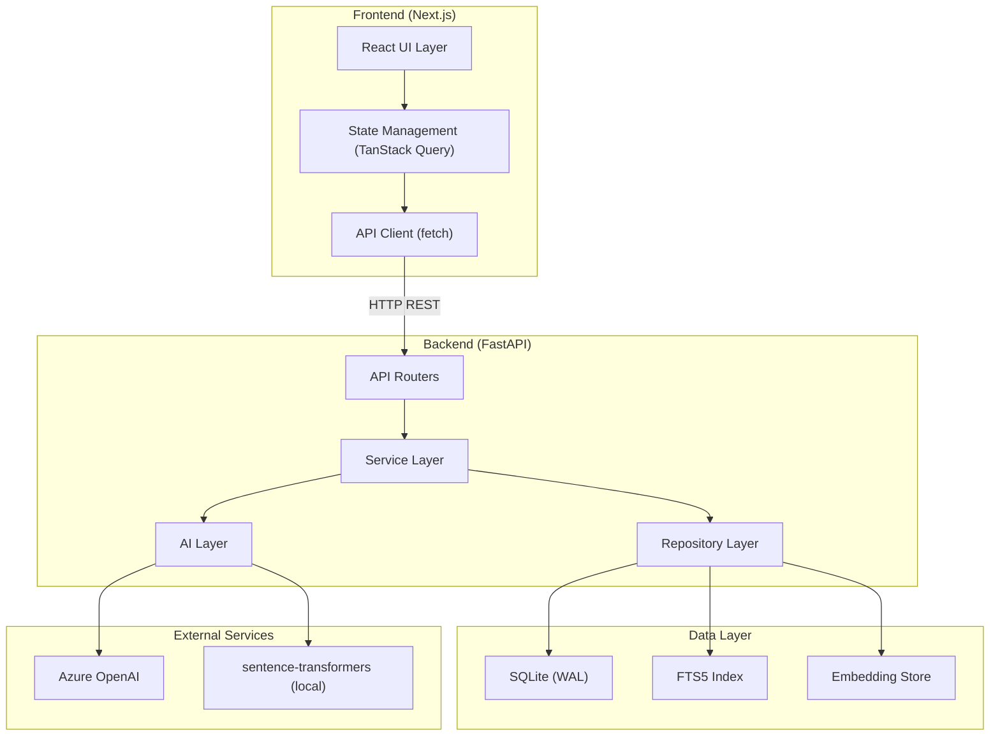

### 1.2 Key Boundaries

| Boundary | Rule |
|----------|------|
| **Frontend ↔ Backend** | HTTP REST only. No direct DB access from frontend. |
| **Service ↔ Repository** | Services NEVER write raw SQL. Repositories handle all data access. |
| **Service ↔ AI Layer** | Services call AI layer through defined interfaces. AI layer has no direct DB access. |
| **Router ↔ Service** | Routers handle HTTP concerns only. Zero business logic in routers. |

---

## 2. Architecture Principles

### 2.1 Core Principles

| Principle | Application |
|-----------|------------|
| **Clean Architecture** | Dependencies point inward. Domain has zero external dependencies. |
| **Feature-First** | Code organized by feature/domain, not by technical layer. |
| **Dependency Injection** | All services receive dependencies via constructor. No global state. |
| **Repository Pattern** | Data access abstracted behind repository interfaces. |
| **Single Responsibility** | One class = one reason to change. |
| **Interface Segregation** | Small, focused interfaces over large ones. |
| **Explicit over Implicit** | No magic. All behavior traceable through code. |

### 2.2 Anti-Patterns (Forbidden)

| Forbidden | Instead |
|-----------|---------|
| Business logic in routers | Move to service layer |
| Raw SQL in service layer | Use repository methods |
| Direct Azure API calls outside AI layer | Call through AI service abstractions |
| Global mutable state | Dependency injection |
| God classes (>300 lines) | Split into focused modules |
| Circular imports | Restructure dependencies |
| `Any` type in TypeScript | Use proper types or generics |
| `# type: ignore` in Python | Fix the type error |

---

## 3. Layer Architecture

```mermaid
graph TB
    subgraph Presentation["Presentation Layer"]
        direction LR
        Routers["FastAPI Routers"]
        Schemas["Pydantic Schemas"]
        Middleware["Middleware"]
    end

    subgraph Application["Application Layer"]
        direction LR
        Services["Services"]
        UseCases["Use Cases"]
        DTOs["Data Transfer Objects"]
    end

    subgraph Domain["Domain Layer"]
        direction LR
        Entities["Entities"]
        ValueObjects["Value Objects"]
        Interfaces["Repository Interfaces"]
        DomainEvents["Domain Events"]
    end

    subgraph Infrastructure["Infrastructure Layer"]
        direction LR
        RepoImpl["Repository Implementations"]
        AIClients["AI Clients"]
        SearchEngine["Search Engine"]
        EmbeddingEngine["Embedding Engine"]
    end

    Presentation --> Application
    Application --> Domain
    Infrastructure --> Domain

    style Domain fill:#1a1a2e,stroke:#e94560,stroke-width:2px
    style Application fill:#16213e,stroke:#0f3460,stroke-width:2px
    style Presentation fill:#0f3460,stroke:#533483,stroke-width:2px
    style Infrastructure fill:#1a1a2e,stroke:#533483,stroke-width:2px
```

### 3.1 Layer Rules

| Layer | Can Import | Cannot Import |
|-------|-----------|--------------|
| **Presentation** | Application, Domain | Infrastructure |
| **Application** | Domain | Presentation, Infrastructure |
| **Domain** | Nothing | Everything else |
| **Infrastructure** | Domain | Presentation, Application |

### 3.2 Layer Responsibilities

**Presentation Layer:**
- HTTP request/response handling
- Input validation (Pydantic schemas)
- Authentication (if ever added)
- CORS, rate limiting, middleware
- Error response formatting

**Application Layer:**
- Business logic orchestration
- Transaction management
- Cross-module coordination
- AI pipeline orchestration
- Event dispatching

**Domain Layer:**
- Entity definitions
- Value objects (e.g., ContextType, PromptScore)
- Repository interfaces (abstract)
- Domain validation rules
- Business rules

**Infrastructure Layer:**
- SQLAlchemy repository implementations
- Azure OpenAI client
- sentence-transformers client
- FTS5 search implementation
- File system operations (import/export)

---

## 4. Backend Architecture

### 4.1 Project Structure

```
backend/
├── app/
│   ├── __init__.py
│   ├── main.py                      # FastAPI app factory
│   ├── config.py                    # Settings (Pydantic BaseSettings)
│   ├── dependencies.py              # Dependency injection container
│   │
│   ├── core/                        # Cross-cutting concerns
│   │   ├── __init__.py
│   │   ├── database.py              # SQLAlchemy engine, session factory
│   │   ├── exceptions.py            # Custom exception classes
│   │   ├── middleware.py            # CORS, error handling, timing
│   │   ├── security.py              # Input sanitization, rate limiting
│   │   └── events.py                # Domain event dispatcher
│   │
│   ├── models/                      # SQLAlchemy ORM models (all tables)
│   │   ├── __init__.py
│   │   ├── base.py                  # Base model with common fields
│   │   ├── workspace.py
│   │   ├── context.py
│   │   ├── template.py
│   │   ├── variable.py
│   │   ├── conversation.py
│   │   ├── prompt.py
│   │   ├── provider.py
│   │   ├── analytics.py
│   │   ├── ai_job.py
│   │   ├── learning.py
│   │   ├── journal.py
│   │   └── settings.py
│   │
│   ├── features/                    # Feature-first organization
│   │   ├── contexts/
│   │   │   ├── __init__.py
│   │   │   ├── router.py           # /api/v1/contexts endpoints
│   │   │   ├── schemas.py          # Request/response Pydantic models
│   │   │   ├── service.py          # ContextService
│   │   │   ├── repository.py       # ContextRepository
│   │   │   └── dependencies.py     # Feature-specific DI
│   │   │
│   │   ├── workspaces/
│   │   │   ├── router.py
│   │   │   ├── schemas.py
│   │   │   ├── service.py
│   │   │   └── repository.py
│   │   │
│   │   ├── templates/
│   │   │   ├── router.py
│   │   │   ├── schemas.py
│   │   │   ├── service.py
│   │   │   └── repository.py
│   │   │
│   │   ├── variables/
│   │   │   ├── router.py
│   │   │   ├── schemas.py
│   │   │   ├── service.py
│   │   │   └── repository.py
│   │   │
│   │   ├── conversations/
│   │   │   ├── router.py
│   │   │   ├── schemas.py
│   │   │   ├── service.py
│   │   │   └── repository.py
│   │   │
│   │   ├── prompts/
│   │   │   ├── router.py
│   │   │   ├── schemas.py
│   │   │   ├── service.py          # PromptService (compilation, validation)
│   │   │   └── repository.py
│   │   │
│   │   ├── search/
│   │   │   ├── router.py
│   │   │   ├── schemas.py
│   │   │   ├── service.py          # SearchService (hybrid search)
│   │   │   └── repository.py
│   │   │
│   │   ├── analytics/
│   │   │   ├── router.py
│   │   │   ├── schemas.py
│   │   │   ├── service.py
│   │   │   └── repository.py
│   │   │
│   │   ├── favorites/
│   │   │   ├── router.py
│   │   │   ├── schemas.py
│   │   │   ├── service.py
│   │   │   └── repository.py
│   │   │
│   │   ├── journals/
│   │   │   ├── router.py
│   │   │   ├── schemas.py
│   │   │   ├── service.py
│   │   │   └── repository.py
│   │   │
│   │   ├── settings/
│   │   │   ├── router.py
│   │   │   ├── schemas.py
│   │   │   ├── service.py
│   │   │   └── repository.py
│   │   │
│   │   └── providers/
│   │       ├── router.py
│   │       ├── schemas.py
│   │       ├── service.py
│   │       └── repository.py
│   │
│   └── ai/                          # AI Layer (isolated)
│       ├── __init__.py
│       ├── client.py                # Azure OpenAI client wrapper
│       ├── embeddings.py            # Embedding service (sentence-transformers)
│       ├── pipeline/
│       │   ├── __init__.py
│       │   ├── orchestrator.py      # Main pipeline orchestrator
│       │   ├── intent.py            # Intent detection step
│       │   ├── retrieval.py         # Hybrid retrieval step
│       │   ├── ranking.py           # Context ranking step
│       │   ├── compiler.py          # Prompt compilation step
│       │   ├── validator.py         # Prompt validation step
│       │   ├── optimizer.py         # Prompt optimization step
│       │   ├── enhancer.py          # AI enhancement step
│       │   ├── critic.py            # AI critique step
│       │   ├── scorer.py            # Prompt scoring step
│       │   └── token_counter.py     # Token counting utility
│       ├── features/
│       │   ├── __init__.py
│       │   ├── auto_tag.py          # AI auto-tagging
│       │   ├── variable_extract.py  # AI variable extraction
│       │   ├── duplicate_detect.py  # AI duplicate detection
│       │   ├── merge_context.py     # AI context merging
│       │   ├── generate_context.py  # AI context generation
│       │   ├── suggestion.py        # AI context/workspace suggestions
│       │   ├── benchmark.py         # AI prompt benchmarking
│       │   ├── weekly_review.py     # AI weekly review
│       │   └── health_check.py      # AI context health check
│       └── learning/
│           ├── __init__.py
│           ├── analyzer.py          # Post-conversation analyzer
│           └── engine.py            # Learning engine
│
├── alembic/                         # Database migrations
│   ├── versions/
│   ├── env.py
│   └── script.py.mako
├── alembic.ini
├── pyproject.toml
├── requirements.txt
└── tests/
    ├── conftest.py                  # Fixtures, test DB
    ├── unit/
    │   ├── test_context_service.py
    │   ├── test_prompt_compiler.py
    │   ├── test_validator.py
    │   ├── test_ranking.py
    │   └── ...
    ├── integration/
    │   ├── test_context_api.py
    │   ├── test_search_api.py
    │   ├── test_ai_pipeline.py
    │   └── ...
    └── regression/
        └── test_prompt_regression.py
```

### 4.2 Dependency Injection

```python
# app/dependencies.py

from functools import lru_cache
from app.config import Settings
from app.core.database import get_session
from app.features.contexts.repository import ContextRepository
from app.features.contexts.service import ContextService

@lru_cache()
def get_settings() -> Settings:
    return Settings()

async def get_context_repository(session = Depends(get_session)):
    return ContextRepository(session)

async def get_context_service(
    repo: ContextRepository = Depends(get_context_repository),
    settings: Settings = Depends(get_settings),
) -> ContextService:
    return ContextService(repo=repo, settings=settings)
```

### 4.3 Base Repository Pattern

```python
# app/features/base_repository.py

from typing import Generic, TypeVar, Optional, Sequence
from sqlalchemy import select, update, func
from sqlalchemy.ext.asyncio import AsyncSession
from app.models.base import BaseModel

T = TypeVar("T", bound=BaseModel)

class BaseRepository(Generic[T]):
    def __init__(self, session: AsyncSession, model: type[T]):
        self._session = session
        self._model = model

    async def get_by_id(self, id: str) -> Optional[T]:
        return await self._session.get(self._model, id)

    async def get_all(
        self,
        *,
        offset: int = 0,
        limit: int = 50,
        filters: dict | None = None,
    ) -> tuple[Sequence[T], int]:
        query = select(self._model).where(self._model.deleted_at.is_(None))
        if filters:
            for key, value in filters.items():
                query = query.where(getattr(self._model, key) == value)
        count = await self._session.scalar(
            select(func.count()).select_from(query.subquery())
        )
        results = await self._session.scalars(
            query.offset(offset).limit(limit)
        )
        return results.all(), count or 0

    async def create(self, entity: T) -> T:
        self._session.add(entity)
        await self._session.flush()
        return entity

    async def update_by_id(self, id: str, data: dict) -> Optional[T]:
        data["updated_at"] = utc_now()
        await self._session.execute(
            update(self._model).where(self._model.id == id).values(**data)
        )
        return await self.get_by_id(id)

    async def soft_delete(self, id: str) -> bool:
        result = await self._session.execute(
            update(self._model)
            .where(self._model.id == id)
            .values(deleted_at=utc_now())
        )
        return result.rowcount > 0
```

### 4.4 Service Layer Pattern

```python
# app/features/contexts/service.py

class ContextService:
    def __init__(
        self,
        repo: ContextRepository,
        version_repo: ContextVersionRepository,
        tag_repo: TagRepository,
        embedding_service: EmbeddingService,
        event_dispatcher: EventDispatcher,
        settings: Settings,
    ):
        self._repo = repo
        self._version_repo = version_repo
        self._tag_repo = tag_repo
        self._embedding_service = embedding_service
        self._events = event_dispatcher
        self._settings = settings

    async def create_context(self, data: ContextCreate) -> Context:
        # 1. Validate
        # 2. Create entity
        # 3. Create initial version
        # 4. Compute token count
        # 5. Schedule embedding (background)
        # 6. Dispatch event
        # 7. Return
        context = Context(
            id=generate_uuid(),
            workspace_id=data.workspace_id,
            title=data.title,
            slug=slugify(data.title),
            content=data.content,
            content_type=data.content_type,
            context_type=data.context_type,
            priority=data.priority,
            token_count=count_tokens(data.content),
        )
        context = await self._repo.create(context)

        await self._version_repo.create(ContextVersion(
            id=generate_uuid(),
            context_id=context.id,
            version_number=1,
            title=context.title,
            content=context.content,
            content_type=context.content_type,
            context_type=context.context_type,
            change_summary="Initial version",
        ))

        if self._settings.auto_embed:
            await self._embedding_service.schedule_embedding(context.id)

        await self._events.dispatch("context.created", {
            "context_id": context.id,
            "workspace_id": context.workspace_id,
        })

        return context
```

### 4.5 Router Pattern

```python
# app/features/contexts/router.py

from fastapi import APIRouter, Depends, Query, HTTPException, status
from app.features.contexts.schemas import (
    ContextCreate, ContextUpdate, ContextResponse, ContextListResponse,
)
from app.features.contexts.service import ContextService

router = APIRouter(prefix="/contexts", tags=["Contexts"])

@router.get("", response_model=ContextListResponse)
async def list_contexts(
    workspace_id: str = Query(...),
    context_type: str | None = Query(None),
    search: str | None = Query(None),
    offset: int = Query(0, ge=0),
    limit: int = Query(50, ge=1, le=100),
    service: ContextService = Depends(get_context_service),
):
    """List contexts with filtering and pagination."""
    contexts, total = await service.list_contexts(
        workspace_id=workspace_id,
        context_type=context_type,
        search=search,
        offset=offset,
        limit=limit,
    )
    return ContextListResponse(items=contexts, total=total, offset=offset, limit=limit)

@router.post("", response_model=ContextResponse, status_code=status.HTTP_201_CREATED)
async def create_context(
    data: ContextCreate,
    service: ContextService = Depends(get_context_service),
):
    """Create a new context."""
    return await service.create_context(data)

@router.get("/{context_id}", response_model=ContextResponse)
async def get_context(
    context_id: str,
    service: ContextService = Depends(get_context_service),
):
    """Get a context by ID."""
    context = await service.get_context(context_id)
    if not context:
        raise HTTPException(status_code=404, detail="Context not found")
    return context

@router.patch("/{context_id}", response_model=ContextResponse)
async def update_context(
    context_id: str,
    data: ContextUpdate,
    service: ContextService = Depends(get_context_service),
):
    """Update a context. Creates a new version if content changed."""
    return await service.update_context(context_id, data)

@router.delete("/{context_id}", status_code=status.HTTP_204_NO_CONTENT)
async def delete_context(
    context_id: str,
    service: ContextService = Depends(get_context_service),
):
    """Soft-delete a context."""
    await service.delete_context(context_id)
```

---

## 5. Frontend Architecture

### 5.1 Project Structure

```
frontend/
├── public/
│   └── fonts/                       # Self-hosted fonts
├── src/
│   ├── app/                         # Next.js App Router
│   │   ├── layout.tsx               # Root layout (providers, theme)
│   │   ├── page.tsx                 # Dashboard (redirect or main)
│   │   ├── (dashboard)/
│   │   │   ├── layout.tsx           # Dashboard shell (sidebar + main)
│   │   │   ├── page.tsx             # Dashboard home
│   │   │   ├── contexts/
│   │   │   │   ├── page.tsx         # Context Library
│   │   │   │   └── [id]/
│   │   │   │       └── page.tsx     # Context Detail/Editor
│   │   │   ├── templates/
│   │   │   │   ├── page.tsx
│   │   │   │   └── [id]/page.tsx
│   │   │   ├── variables/
│   │   │   │   └── page.tsx
│   │   │   ├── conversations/
│   │   │   │   ├── page.tsx
│   │   │   │   └── [id]/page.tsx
│   │   │   ├── builder/
│   │   │   │   └── page.tsx         # Prompt Builder
│   │   │   ├── graph/
│   │   │   │   └── page.tsx         # Context Graph Explorer
│   │   │   ├── analytics/
│   │   │   │   └── page.tsx
│   │   │   ├── journals/
│   │   │   │   ├── page.tsx
│   │   │   │   └── [id]/page.tsx
│   │   │   └── settings/
│   │   │       └── page.tsx
│   │   └── globals.css
│   │
│   ├── components/                  # Shared components
│   │   ├── ui/                      # shadcn/ui components
│   │   │   ├── button.tsx
│   │   │   ├── dialog.tsx
│   │   │   ├── dropdown-menu.tsx
│   │   │   ├── input.tsx
│   │   │   ├── select.tsx
│   │   │   ├── tooltip.tsx
│   │   │   ├── badge.tsx
│   │   │   ├── skeleton.tsx
│   │   │   ├── toast.tsx
│   │   │   └── ...
│   │   ├── layout/
│   │   │   ├── sidebar.tsx          # Main navigation sidebar
│   │   │   ├── header.tsx           # Page header with breadcrumbs
│   │   │   ├── workspace-switcher.tsx
│   │   │   └── command-palette.tsx  # Global command palette (Cmd+K)
│   │   ├── editor/
│   │   │   ├── monaco-editor.tsx    # Monaco editor wrapper
│   │   │   └── markdown-preview.tsx # Markdown renderer
│   │   ├── context/
│   │   │   ├── context-card.tsx
│   │   │   ├── context-list.tsx
│   │   │   ├── context-editor.tsx
│   │   │   ├── context-preview.tsx
│   │   │   └── dependency-selector.tsx
│   │   ├── prompt/
│   │   │   ├── prompt-builder.tsx
│   │   │   ├── prompt-preview.tsx
│   │   │   ├── token-counter.tsx
│   │   │   └── variable-resolver.tsx
│   │   ├── graph/
│   │   │   └── context-graph.tsx    # ReactFlow graph component
│   │   ├── chat/
│   │   │   ├── chat-panel.tsx
│   │   │   ├── message-bubble.tsx
│   │   │   └── chat-input.tsx
│   │   └── shared/
│   │       ├── empty-state.tsx
│   │       ├── loading-state.tsx
│   │       ├── error-boundary.tsx
│   │       ├── confirm-dialog.tsx
│   │       ├── search-input.tsx
│   │       └── tag-input.tsx
│   │
│   ├── hooks/                       # Custom React hooks
│   │   ├── use-contexts.ts          # TanStack Query hooks for contexts
│   │   ├── use-workspaces.ts
│   │   ├── use-templates.ts
│   │   ├── use-variables.ts
│   │   ├── use-conversations.ts
│   │   ├── use-search.ts
│   │   ├── use-analytics.ts
│   │   ├── use-keyboard.ts          # Global keyboard shortcuts
│   │   ├── use-debounce.ts
│   │   ├── use-local-storage.ts
│   │   └── use-command-palette.ts
│   │
│   ├── lib/                         # Utility libraries
│   │   ├── api.ts                   # API client (fetch wrapper)
│   │   ├── utils.ts                 # General utilities
│   │   ├── constants.ts             # App constants
│   │   ├── format.ts               # Date, number formatting
│   │   └── token-counter.ts        # Client-side token estimation
│   │
│   ├── types/                       # TypeScript types
│   │   ├── context.ts
│   │   ├── workspace.ts
│   │   ├── template.ts
│   │   ├── variable.ts
│   │   ├── conversation.ts
│   │   ├── prompt.ts
│   │   ├── analytics.ts
│   │   └── api.ts                   # API response types
│   │
│   └── styles/                      # Additional styles
│       ├── editor.css               # Monaco editor overrides
│       └── graph.css                # ReactFlow overrides
│
├── next.config.ts
├── tailwind.config.ts
├── tsconfig.json
├── package.json
├── components.json                  # shadcn/ui config
└── tests/
    ├── unit/
    ├── integration/
    └── e2e/
        └── playwright.config.ts
```

### 5.2 State Management Strategy

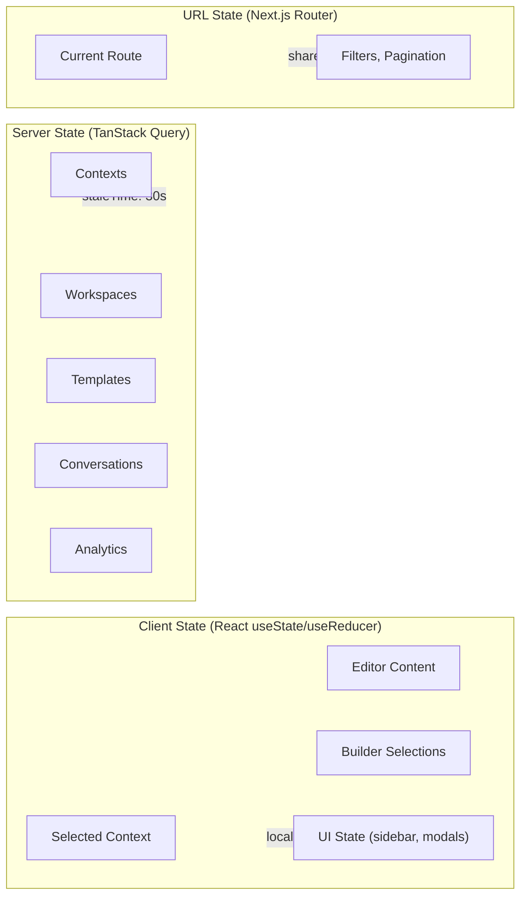

**Rules:**
- **Server data** → TanStack Query (automatic caching, refetching, invalidation)
- **UI-only state** → React `useState` / `useReducer` (sidebar open, modal state, editor content)
- **URL-derived state** → Next.js `useSearchParams` (filters, pagination, active tab)
- **No Redux. No Zustand. No Context API for server state.**

### 5.3 API Client

```typescript
// src/lib/api.ts

const API_BASE = process.env.NEXT_PUBLIC_API_URL || "http://localhost:8000/api/v1";

interface ApiOptions<T> {
  method?: "GET" | "POST" | "PATCH" | "PUT" | "DELETE";
  body?: unknown;
  params?: Record<string, string | number | boolean | undefined>;
  signal?: AbortSignal;
}

async function api<T>(endpoint: string, options: ApiOptions<T> = {}): Promise<T> {
  const { method = "GET", body, params, signal } = options;

  const url = new URL(`${API_BASE}${endpoint}`);
  if (params) {
    Object.entries(params).forEach(([key, value]) => {
      if (value !== undefined) url.searchParams.set(key, String(value));
    });
  }

  const response = await fetch(url.toString(), {
    method,
    headers: body ? { "Content-Type": "application/json" } : undefined,
    body: body ? JSON.stringify(body) : undefined,
    signal,
  });

  if (!response.ok) {
    const error = await response.json().catch(() => ({ detail: "Unknown error" }));
    throw new ApiError(response.status, error.detail);
  }

  if (response.status === 204) return undefined as T;
  return response.json();
}
```

### 5.4 TanStack Query Hook Pattern

```typescript
// src/hooks/use-contexts.ts

import { useQuery, useMutation, useQueryClient } from "@tanstack/react-query";
import { api } from "@/lib/api";
import type { Context, ContextCreate, ContextListResponse } from "@/types/context";

const QUERY_KEY = "contexts";

export function useContexts(params: {
  workspaceId: string;
  contextType?: string;
  search?: string;
  offset?: number;
  limit?: number;
}) {
  return useQuery({
    queryKey: [QUERY_KEY, params],
    queryFn: () =>
      api<ContextListResponse>("/contexts", { params }),
    staleTime: 30_000, // 30 seconds
  });
}

export function useContext(id: string) {
  return useQuery({
    queryKey: [QUERY_KEY, id],
    queryFn: () => api<Context>(`/contexts/${id}`),
    enabled: !!id,
  });
}

export function useCreateContext() {
  const queryClient = useQueryClient();
  return useMutation({
    mutationFn: (data: ContextCreate) =>
      api<Context>("/contexts", { method: "POST", body: data }),
    onSuccess: () => {
      queryClient.invalidateQueries({ queryKey: [QUERY_KEY] });
    },
  });
}

export function useUpdateContext(id: string) {
  const queryClient = useQueryClient();
  return useMutation({
    mutationFn: (data: Partial<ContextCreate>) =>
      api<Context>(`/contexts/${id}`, { method: "PATCH", body: data }),
    onSuccess: (updated) => {
      queryClient.setQueryData([QUERY_KEY, id], updated);
      queryClient.invalidateQueries({ queryKey: [QUERY_KEY] });
    },
  });
}

export function useDeleteContext() {
  const queryClient = useQueryClient();
  return useMutation({
    mutationFn: (id: string) =>
      api(`/contexts/${id}`, { method: "DELETE" }),
    onSuccess: () => {
      queryClient.invalidateQueries({ queryKey: [QUERY_KEY] });
    },
  });
}
```

---

## 6. Module Map

### 6.1 Backend Modules

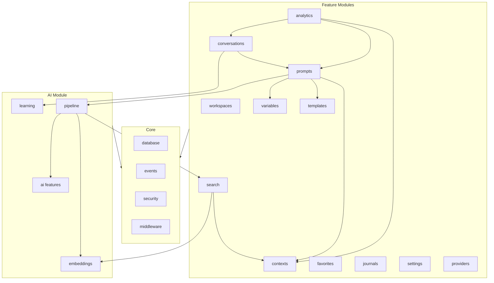

### 6.2 Module Dependency Rules

| Module | Can Depend On | Cannot Depend On |
|--------|--------------|-----------------|
| `contexts` | `core` | Any other feature |
| `workspaces` | `core` | Any other feature |
| `templates` | `core`, `variables` | `contexts`, `prompts` |
| `variables` | `core` | Any other feature |
| `prompts` | `core`, `contexts`, `templates`, `variables`, `ai.pipeline` | `conversations` |
| `conversations` | `core`, `prompts`, `ai.learning` | Direct DB access |
| `search` | `core`, `contexts`, `ai.embeddings` | `prompts`, `conversations` |
| `analytics` | `core` (read-only to all) | Write to other modules |
| `ai.pipeline` | `ai.embeddings`, `search` | Feature modules directly |
| `ai.learning` | `core` | Feature modules directly |

---

## 7. Data Flow

### 7.1 CRUD Request Flow

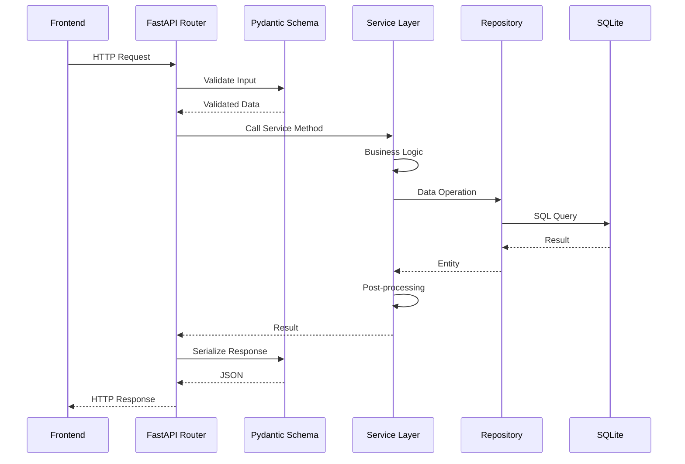

### 7.2 Prompt Compilation Flow

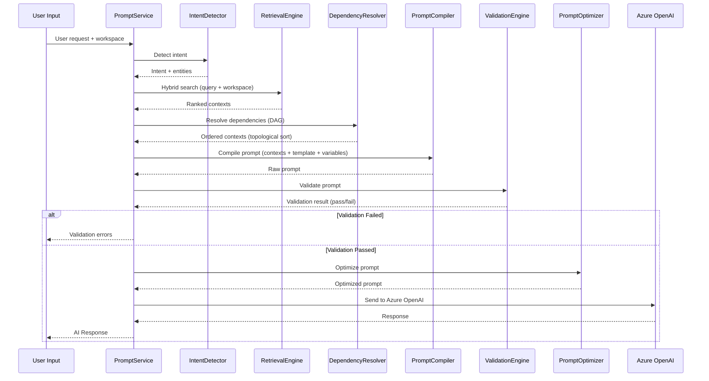

---

## 8. AI Flow

See **AI_ARCHITECTURE.md** for full details. Summary:

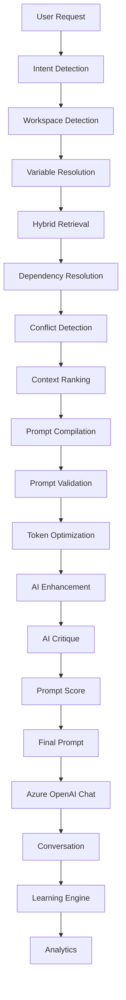

---

## 9. API Design

### 9.1 Conventions

| Convention | Rule |
|-----------|------|
| **Base URL** | `/api/v1` |
| **Resource naming** | Plural nouns, kebab-case for multi-word |
| **HTTP methods** | GET (read), POST (create), PATCH (partial update), DELETE (soft delete) |
| **Status codes** | 200 (OK), 201 (Created), 204 (No Content), 400 (Bad Request), 404 (Not Found), 422 (Validation Error), 500 (Server Error) |
| **Pagination** | `?offset=0&limit=50` (cursor-based for large datasets) |
| **Filtering** | Query parameters: `?workspace_id=...&context_type=...` |
| **Sorting** | `?sort_by=updated_at&sort_order=desc` |
| **Search** | `?search=query` |
| **Versioning** | URL path versioning (`/api/v1/`) |

### 9.2 Endpoint Catalog

> [!NOTE]
> To enforce strict workspace isolation, core features (Contexts, Dependencies, Tags, Categories, Favorites) are registered under workspace-prefixed paths: `/api/v1/workspaces/{workspace_id}/...`.

#### Workspaces
```
GET     /api/v1/workspaces                    List all workspaces
POST    /api/v1/workspaces                    Create workspace
GET     /api/v1/workspaces/{id}                Get workspace
PUT     /api/v1/workspaces/{id}                Update workspace
DELETE  /api/v1/workspaces/{id}                Soft-delete workspace
```

#### Contexts
```
GET     /api/v1/workspaces/{workspace_id}/contexts                      List contexts
POST    /api/v1/workspaces/{workspace_id}/contexts                      Create context
GET     /api/v1/workspaces/{workspace_id}/contexts/{id}                  Get context with metadata
PUT     /api/v1/workspaces/{workspace_id}/contexts/{id}                  Update context (creates version)
DELETE  /api/v1/workspaces/{workspace_id}/contexts/{id}                  Soft-delete context
GET     /api/v1/workspaces/{workspace_id}/contexts/{id}/versions         List context versions
GET     /api/v1/workspaces/{workspace_id}/contexts/{id}/versions/{ver}    Get specific version
POST    /api/v1/workspaces/{workspace_id}/contexts/{id}/restore/{ver}     Restore to specific version
POST    /api/v1/workspaces/{workspace_id}/contexts/{id}/embed            Trigger re-embedding
GET     /api/v1/workspaces/{workspace_id}/contexts/{id}/health           Get health score
```

#### Context Dependencies
```
GET     /api/v1/workspaces/{workspace_id}/contexts/{id}/dependencies     Get context dependencies
POST    /api/v1/workspaces/{workspace_id}/contexts/{id}/dependencies     Add dependency
DELETE  /api/v1/workspaces/{workspace_id}/contexts/{id}/dependencies/{dep_id}  Remove dependency
GET     /api/v1/workspaces/{workspace_id}/dependency-graph               Get dependency graph
```

#### Templates
```
GET     /api/v1/templates                     List templates
POST    /api/v1/templates                     Create template
GET     /api/v1/templates/:id                 Get template
PATCH   /api/v1/templates/:id                 Update template
DELETE  /api/v1/templates/:id                 Soft-delete template
POST    /api/v1/templates/:id/preview         Preview compiled template
GET     /api/v1/templates/:id/versions        List versions
```

#### Variables
```
GET     /api/v1/variables                     List all variables
POST    /api/v1/variables                     Create variable
GET     /api/v1/variables/:id                 Get variable
PATCH   /api/v1/variables/:id                 Update variable
DELETE  /api/v1/variables/:id                 Delete variable
GET     /api/v1/variables/resolve             Resolve all variables for workspace
```

#### Conversations
```
GET     /api/v1/conversations                 List conversations
POST    /api/v1/conversations                 Start new conversation
GET     /api/v1/conversations/:id             Get conversation with messages
DELETE  /api/v1/conversations/:id             Soft-delete conversation
POST    /api/v1/conversations/:id/messages    Send message (triggers AI pipeline)
GET     /api/v1/conversations/:id/messages    Get messages (paginated)
```

#### Prompts
```
POST    /api/v1/prompts/compile               Compile prompt (no send)
POST    /api/v1/prompts/validate              Validate prompt
POST    /api/v1/prompts/optimize              Optimize prompt
POST    /api/v1/prompts/score                 Score prompt quality
GET     /api/v1/prompts/runs                  List prompt run history
GET     /api/v1/prompts/runs/:id              Get prompt run detail
```

#### Search
```
POST    /api/v1/search                        Hybrid search across all entities
POST    /api/v1/search/contexts               Search contexts only
POST    /api/v1/search/semantic               Semantic search (embedding-based)
GET     /api/v1/search/suggest                Auto-complete suggestions
```

#### AI Features
```
POST    /api/v1/ai/enhance                    AI-enhance a prompt
POST    /api/v1/ai/critique                   AI-critique a prompt
POST    /api/v1/ai/auto-tag                   Auto-tag a context
POST    /api/v1/ai/extract-variables          Extract variables from text
POST    /api/v1/ai/detect-duplicates          Detect duplicate contexts
POST    /api/v1/ai/merge-contexts             Merge multiple contexts
POST    /api/v1/ai/generate-context           Generate new context from description
POST    /api/v1/ai/suggest-contexts           Suggest contexts for a query
POST    /api/v1/ai/benchmark                  Benchmark prompt quality
GET     /api/v1/ai/weekly-review              Get weekly review report
GET     /api/v1/ai/health                     Context health report
GET     /api/v1/ai/jobs                       List AI background jobs
GET     /api/v1/ai/jobs/:id                   Get job status
```

#### Analytics
```
GET     /api/v1/analytics/dashboard           Dashboard aggregations
GET     /api/v1/analytics/usage               Usage statistics
GET     /api/v1/analytics/costs               Cost breakdown
GET     /api/v1/analytics/trends              Weekly/monthly trends
GET     /api/v1/analytics/contexts/top        Most used contexts
GET     /api/v1/analytics/contexts/dead       Unused contexts
```

#### Favorites
GET     /api/v1/workspaces/{workspace_id}/favorites          List all favorites
POST    /api/v1/workspaces/{workspace_id}/favorites/toggle   Toggle favorite status
PUT     /api/v1/workspaces/{workspace_id}/favorites/reorder  Reorder favorites
```

#### Journals
```
GET     /api/v1/journals                      List journals
POST    /api/v1/journals                      Create journal
GET     /api/v1/journals/:id                  Get journal
PATCH   /api/v1/journals/:id                  Update journal
DELETE  /api/v1/journals/:id                  Soft-delete journal
```

#### Settings
```
GET     /api/v1/settings                      Get all settings
PUT     /api/v1/settings                      Update settings (bulk)
GET     /api/v1/settings/{key}                Get single setting
```

#### Providers
```
GET     /api/v1/providers                     List providers
POST    /api/v1/providers                     Create provider
PUT     /api/v1/providers/{id}                Update provider
DELETE  /api/v1/providers/{id}                Delete provider
POST    /api/v1/providers/{id}/default        Set default provider
POST    /api/v1/providers/{id}/test           Test provider connection
```

#### Import/Export
```
POST    /api/v1/import/markdown               Import from markdown files
POST    /api/v1/import/json                   Import from JSON
GET     /api/v1/export/workspace/:id          Export workspace as JSON
GET     /api/v1/export/contexts               Export contexts as markdown
```

### 9.3 Standard Response Envelope

```typescript
// Success (single entity)
{
  "id": "uuid",
  "title": "...",
  // ... entity fields
  "created_at": "2026-07-03T15:00:00Z",
  "updated_at": "2026-07-03T15:00:00Z"
}

// Success (list)
{
  "items": [...],
  "total": 150,
  "offset": 0,
  "limit": 50
}

// Error
{
  "detail": "Human-readable error message",
  "error_code": "CONTEXT_NOT_FOUND",
  "errors": [
    {
      "field": "title",
      "message": "Title is required",
      "code": "REQUIRED"
    }
  ]
}
```

---

## 10. Security Architecture

### 10.1 Threat Model

| Threat | Mitigation |
|--------|-----------|
| **SQL Injection** | All queries use parameterized statements (SQLAlchemy). Zero string interpolation. |
| **XSS** | React auto-escapes. Markdown rendered with sanitization (`rehype-sanitize`). |
| **API Key Exposure** | Keys stored in `.env` only. Never in DB, never in frontend, never in logs. |
| **Secret in Prompts** | Audit log redacts content containing patterns matching API keys or secrets. |
| **Denial of Service** | Rate limiting on AI endpoints (10 req/min). Request size limits. |
| **Path Traversal** | File operations use allowlisted base directories. |
| **CORS** | Restrict to `localhost:3000` in development. |

### 10.2 Input Validation

```python
# Every API input validated via Pydantic with strict constraints
class ContextCreate(BaseModel):
    model_config = ConfigDict(strict=True)

    workspace_id: str = Field(..., min_length=36, max_length=36)
    title: str = Field(..., min_length=1, max_length=500)
    content: str = Field(..., min_length=1, max_length=500_000)
    content_type: Literal["markdown", "yaml", "json", "text"] = "markdown"
    context_type: Literal[
        "persona", "role", "instruction", "knowledge",
        "constraint", "example", "reference", "snippet"
    ]
    priority: int = Field(default=50, ge=0, le=100)
    tags: list[str] = Field(default_factory=list, max_length=50)
```

### 10.3 Rate Limiting

```python
# Applied via middleware
RATE_LIMITS = {
    "/api/v1/ai/*": "10/minute",        # AI-heavy endpoints
    "/api/v1/conversations/*/messages": "20/minute",  # Chat messages
    "/api/v1/search": "30/minute",       # Search queries
    "/api/v1/*": "100/minute",           # General API
}
```

---

## 11. Performance Architecture

### 11.1 Caching Strategy

| Data | Cache | TTL | Invalidation |
|------|-------|-----|-------------|
| **Workspace list** | TanStack Query | 60s | On mutation |
| **Context list** | TanStack Query | 30s | On mutation |
| **Settings** | Python `lru_cache` | Until restart | Manual clear |
| **Embeddings** | SQLite (content_hash) | Forever | On content change |
| **FTS5 index** | SQLite (auto-managed) | Real-time | Trigger-based |
| **Analytics aggregations** | Python in-memory | 5 min | Time-based |

### 11.2 Background Processing

```python
# Background tasks for non-blocking operations
from fastapi import BackgroundTasks

@router.post("/contexts")
async def create_context(
    data: ContextCreate,
    background_tasks: BackgroundTasks,
    service: ContextService = Depends(get_context_service),
):
    context = await service.create_context(data)

    # Non-blocking: embedding, auto-tagging
    background_tasks.add_task(service.embed_context, context.id)
    background_tasks.add_task(service.auto_tag_context, context.id)

    return context
```

### 11.3 Frontend Performance

| Technique | Implementation |
|-----------|---------------|
| **Code splitting** | Next.js automatic per-route splitting |
| **Lazy loading** | `React.lazy()` for Monaco Editor, Graph component |
| **Virtual scrolling** | `@tanstack/react-virtual` for long lists |
| **Debounced search** | 300ms debounce on search input |
| **Optimistic updates** | TanStack Query `onMutate` for instant feedback |
| **Image optimization** | Next.js `Image` component |
| **Bundle analysis** | `@next/bundle-analyzer` |

---

## 12. Deployment Architecture

### 12.1 Target Environments

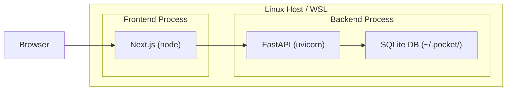

### 12.2 Process Management

```bash
# Development
# Terminal 1: Backend
cd backend && uvicorn app.main:app --reload --host 0.0.0.0 --port 8000

# Terminal 2: Frontend
cd frontend && npm run dev -- --port 3000
```

### 12.3 Environment Variables

```bash
# .env (backend)
POCKET_ENV=development                     # development | production
POCKET_DB_PATH=~/.pocket/pocket.db         # SQLite database path
POCKET_LOG_LEVEL=INFO                      # DEBUG | INFO | WARNING | ERROR

# Azure OpenAI (NEVER hardcode)
AZURE_OPENAI_ENDPOINT=https://your-resource.openai.azure.com/
AZURE_OPENAI_API_KEY=your-api-key
AZURE_OPENAI_API_VERSION=2024-12-01-preview
AZURE_OPENAI_DEPLOYMENT_CHAT=gpt-4.1
AZURE_OPENAI_DEPLOYMENT_CHAT_MINI=gpt-4.1-mini
AZURE_OPENAI_DEPLOYMENT_EMBEDDING=text-embedding-3-large

# Embedding model (local)
EMBEDDING_MODEL_NAME=all-MiniLM-L6-v2      # sentence-transformers model
EMBEDDING_DIMENSIONS=384                    # Model output dimensions
```

```bash
# .env.local (frontend)
NEXT_PUBLIC_API_URL=http://localhost:8000/api/v1
```

---

## 13. Sequence Diagrams

### 13.1 Create Context Flow

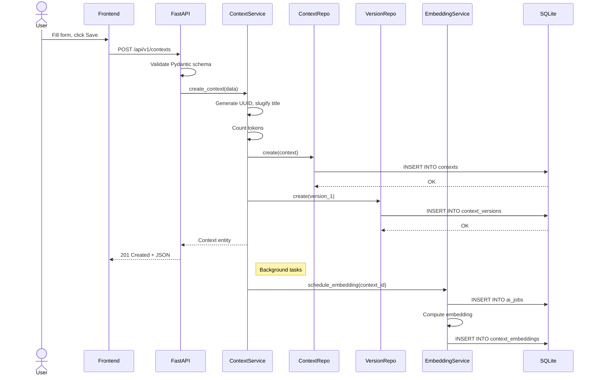

### 13.2 Chat Message Flow

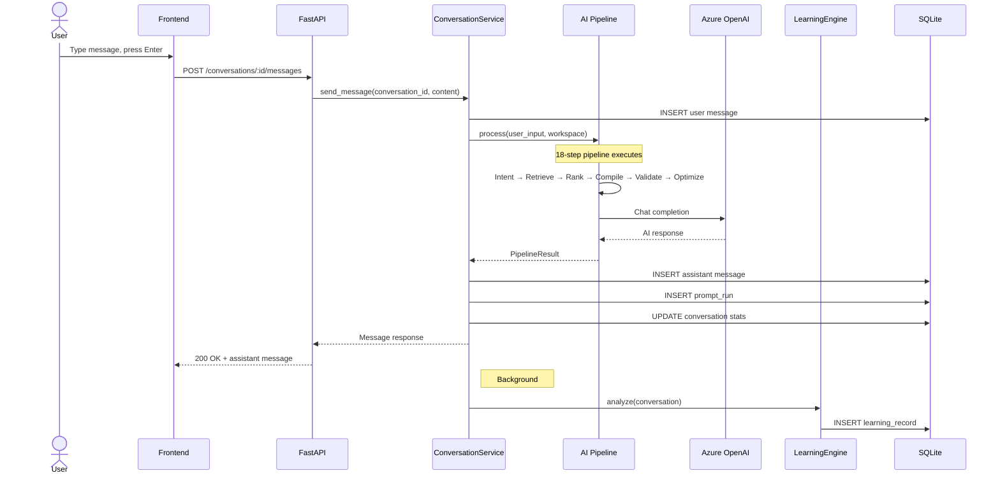

### 13.3 Hybrid Search Flow

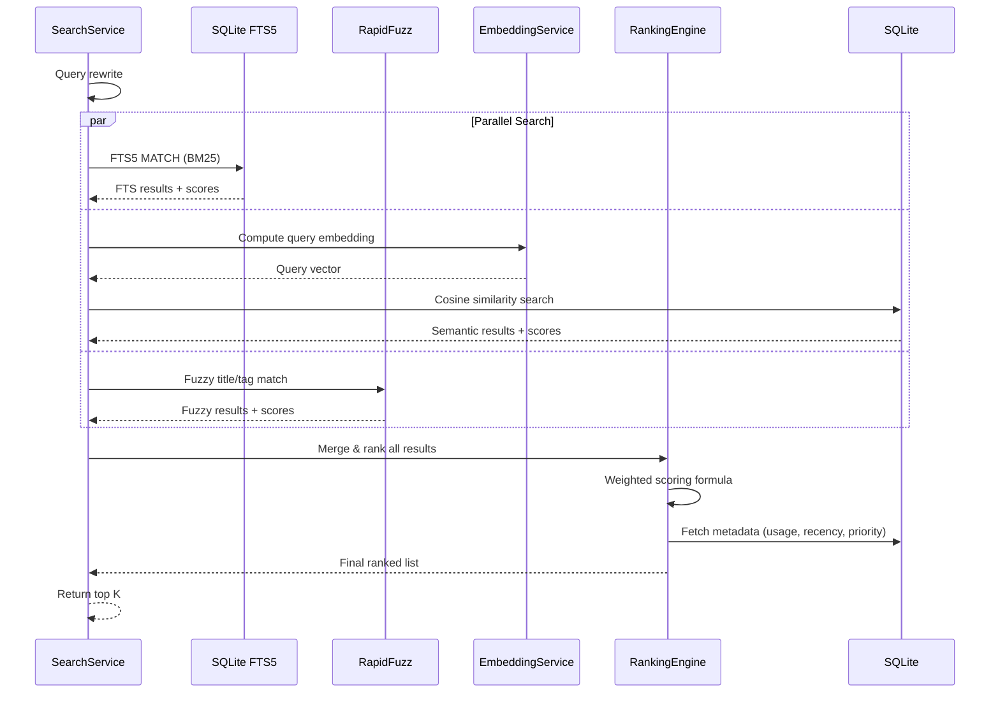

---

## 14. State Diagrams

### 14.1 Context Lifecycle

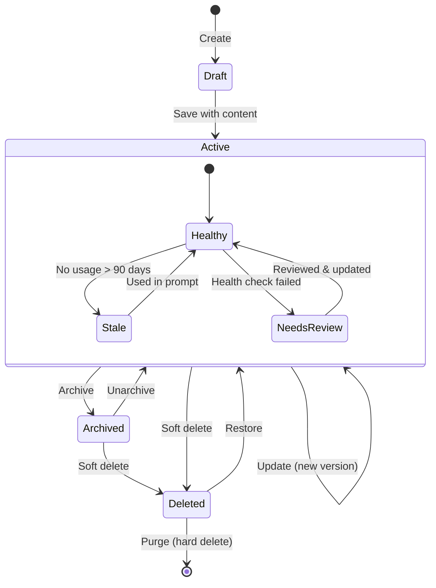

### 14.2 Prompt Lifecycle

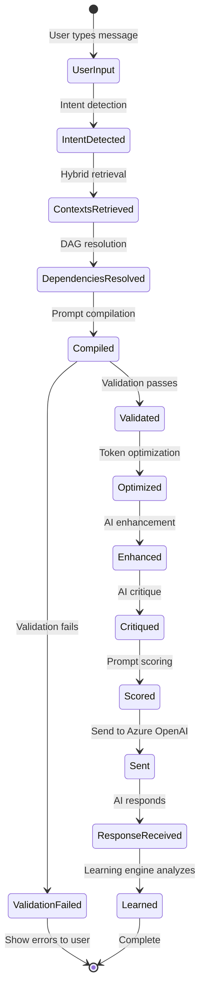

### 14.3 AI Job Lifecycle

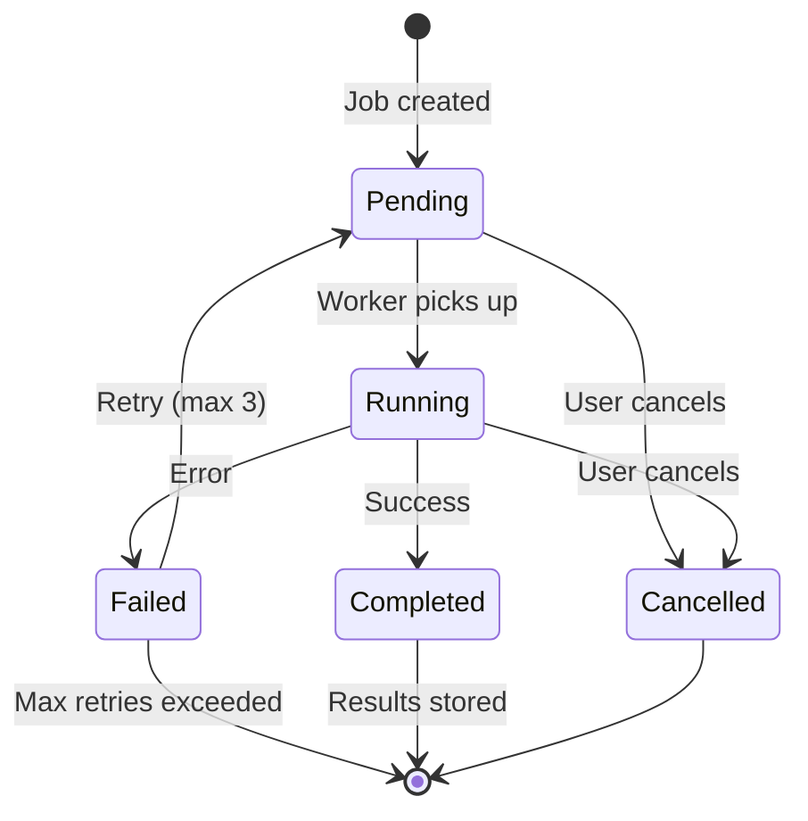

---

## 15. Error Handling

### 15.1 Exception Hierarchy

```python
# app/core/exceptions.py

class PocketError(Exception):
    """Base exception for all Pocket errors."""
    def __init__(self, message: str, error_code: str):
        self.message = message
        self.error_code = error_code
        super().__init__(message)

class NotFoundError(PocketError):
    """Entity not found."""
    def __init__(self, entity: str, id: str):
        super().__init__(f"{entity} not found: {id}", "NOT_FOUND")

class ValidationError(PocketError):
    """Business validation failed."""
    def __init__(self, message: str, errors: list[dict] | None = None):
        self.errors = errors or []
        super().__init__(message, "VALIDATION_ERROR")

class ConflictError(PocketError):
    """Duplicate or conflict."""
    def __init__(self, message: str):
        super().__init__(message, "CONFLICT")

class CircularDependencyError(PocketError):
    """Circular dependency detected in context graph."""
    def __init__(self, path: list[str]):
        self.path = path
        super().__init__(
            f"Circular dependency detected: {' → '.join(path)}",
            "CIRCULAR_DEPENDENCY"
        )

class PromptValidationError(PocketError):
    """Prompt failed validation checks."""
    def __init__(self, checks: list[dict]):
        self.checks = checks
        super().__init__("Prompt validation failed", "PROMPT_VALIDATION_ERROR")

class AIServiceError(PocketError):
    """Azure OpenAI or AI service error."""
    def __init__(self, message: str, provider: str = "azure_openai"):
        self.provider = provider
        super().__init__(message, "AI_SERVICE_ERROR")

class TokenLimitError(PocketError):
    """Prompt exceeds token limit."""
    def __init__(self, current: int, limit: int):
        self.current = current
        self.limit = limit
        super().__init__(
            f"Token limit exceeded: {current}/{limit}",
            "TOKEN_LIMIT_EXCEEDED"
        )
```

### 15.2 Global Exception Handler

```python
# app/core/middleware.py

@app.exception_handler(PocketError)
async def pocket_error_handler(request: Request, exc: PocketError):
    status_map = {
        "NOT_FOUND": 404,
        "VALIDATION_ERROR": 422,
        "CONFLICT": 409,
        "CIRCULAR_DEPENDENCY": 422,
        "PROMPT_VALIDATION_ERROR": 422,
        "AI_SERVICE_ERROR": 502,
        "TOKEN_LIMIT_EXCEEDED": 422,
    }
    return JSONResponse(
        status_code=status_map.get(exc.error_code, 500),
        content={
            "detail": exc.message,
            "error_code": exc.error_code,
            "errors": getattr(exc, "errors", None),
        },
    )
```

---

## 16. Configuration Management

### 16.1 Settings Class

```python
# app/config.py

from pydantic_settings import BaseSettings, SettingsConfigDict

class Settings(BaseSettings):
    model_config = SettingsConfigDict(
        env_file=".env",
        env_prefix="POCKET_",
        case_sensitive=False,
    )

    # App
    env: str = "development"
    db_path: str = "~/.pocket/pocket.db"
    log_level: str = "INFO"

    # Azure OpenAI
    azure_openai_endpoint: str = ""
    azure_openai_api_key: str = ""
    azure_openai_api_version: str = "2024-12-01-preview"
    azure_openai_deployment_chat: str = "gpt-4.1"
    azure_openai_deployment_chat_mini: str = "gpt-4.1-mini"
    azure_openai_deployment_embedding: str = "text-embedding-3-large"

    # Embedding
    embedding_model_name: str = "all-MiniLM-L6-v2"
    embedding_dimensions: int = 384

    # Limits
    token_limit: int = 128_000
    search_top_k: int = 10
    rate_limit_ai: int = 10        # requests per minute
    rate_limit_general: int = 100  # requests per minute

    # Features
    auto_embed: bool = True
    auto_tag: bool = True
    learning_enabled: bool = True
```

---

*End of ARCHITECTURE.md*
