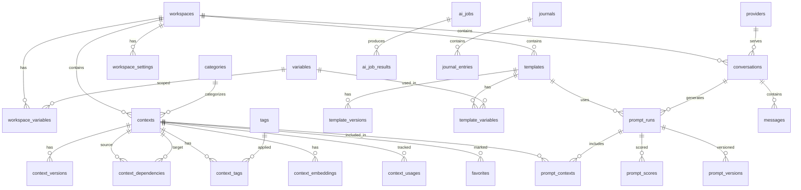
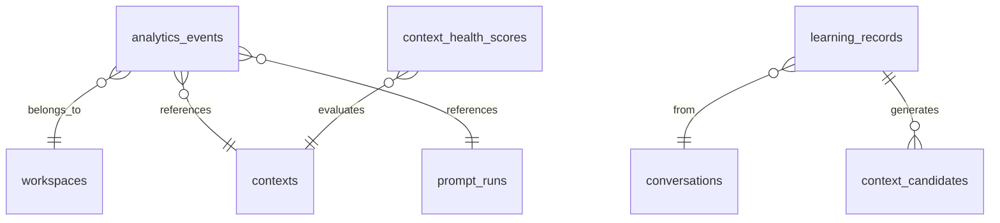

# Pocket — Database Design Specification

> **Version:** 1.0.0
> **Last Updated:** 2026-07-03
> **Status:** Authoritative
> **Audience:** Claude Code, development agents

---

## Table of Contents

1. [Overview](#1-overview)
2. [Design Principles](#2-design-principles)
3. [SQLite Configuration](#3-sqlite-configuration)
4. [Entity-Relationship Diagram](#4-entity-relationship-diagram)
5. [Table Definitions](#5-table-definitions)
6. [Relationships & Foreign Keys](#6-relationships--foreign-keys)
7. [Index Strategy](#7-index-strategy)
8. [Full-Text Search (FTS5)](#8-full-text-search-fts5)
9. [Migration Strategy (Alembic)](#9-migration-strategy-alembic)
10. [Query Patterns & Optimization](#10-query-patterns--optimization)
11. [Data Lifecycle](#11-data-lifecycle)
12. [Naming Conventions](#12-naming-conventions)

---

## 1. Overview

Pocket uses **SQLite** as its sole data store. There is no Redis, no PostgreSQL, no external cache. SQLite is sufficient for a single-user, local-first application and provides:

- Zero configuration
- Single-file database
- ACID transactions
- Full-text search via FTS5
- JSON support via `json_extract()`
- WAL mode for concurrent reads

**Database file location:** `~/.pocket/pocket.db`

**Total tables:** 32 (including FTS5 virtual tables and junction tables)

---

## 2. Design Principles

| Principle | Rule |
|-----------|------|
| **Normalization** | 3NF minimum. No denormalization unless proven bottleneck. |
| **Soft Delete** | All primary entities use `deleted_at` timestamp. Hard delete only via explicit purge. |
| **Versioning** | Content entities (contexts, templates) maintain version history in separate tables. |
| **Timestamps** | Every table has `created_at` and `updated_at` (ISO 8601, UTC). |
| **UUIDs** | Primary keys are UUIDv4 stored as `TEXT(36)`. No auto-increment integers. |
| **Foreign Keys** | Always enforced. `PRAGMA foreign_keys = ON`. |
| **No ORMs for queries** | SQLAlchemy Core for queries, ORM only for model definitions. |
| **Prepared Statements** | All queries use parameterized statements. Zero string interpolation. |

---

## 3. SQLite Configuration

```sql
-- Applied at connection time via SQLAlchemy event listener
PRAGMA journal_mode = WAL;          -- Write-Ahead Logging for concurrent reads
PRAGMA synchronous = NORMAL;         -- Balance between safety and speed
PRAGMA foreign_keys = ON;            -- Enforce referential integrity
PRAGMA busy_timeout = 5000;          -- 5s timeout for locked database
PRAGMA cache_size = -64000;          -- 64MB page cache
PRAGMA mmap_size = 268435456;        -- 256MB memory-mapped I/O
PRAGMA temp_store = MEMORY;          -- Temp tables in memory
PRAGMA auto_vacuum = INCREMENTAL;    -- Reclaim space incrementally
PRAGMA wal_autocheckpoint = 1000;    -- Checkpoint every 1000 pages
```

**Python configuration (SQLAlchemy event):**

```python
from sqlalchemy import event

@event.listens_for(engine, "connect")
def set_sqlite_pragma(dbapi_connection, connection_record):
    cursor = dbapi_connection.cursor()
    cursor.execute("PRAGMA journal_mode = WAL")
    cursor.execute("PRAGMA synchronous = NORMAL")
    cursor.execute("PRAGMA foreign_keys = ON")
    cursor.execute("PRAGMA busy_timeout = 5000")
    cursor.execute("PRAGMA cache_size = -64000")
    cursor.execute("PRAGMA mmap_size = 268435456")
    cursor.execute("PRAGMA temp_store = MEMORY")
    cursor.execute("PRAGMA auto_vacuum = INCREMENTAL")
    cursor.close()
```

---

## 4. Entity-Relationship Diagram

### 4.1 Core Domain ERD



### 4.2 Analytics & Learning ERD



---

## 5. Table Definitions

### 5.1 `workspaces`

The top-level organizational unit. All contexts, templates, conversations, and variables are scoped to a workspace.

```sql
CREATE TABLE workspaces (
    id              TEXT PRIMARY KEY NOT NULL,   -- UUIDv4
    name            TEXT NOT NULL UNIQUE,
    slug            TEXT NOT NULL UNIQUE,        -- URL-safe identifier
    description     TEXT,
    icon            TEXT,                        -- Lucide icon name
    color           TEXT,                        -- Hex color for UI
    sort_order      INTEGER NOT NULL DEFAULT 0,
    is_default      INTEGER NOT NULL DEFAULT 0,  -- Boolean: 1 = default workspace
    metadata        TEXT,                        -- JSON blob for extensibility
    created_at      TEXT NOT NULL DEFAULT (strftime('%Y-%m-%dT%H:%M:%fZ', 'now')),
    updated_at      TEXT NOT NULL DEFAULT (strftime('%Y-%m-%dT%H:%M:%fZ', 'now')),
    deleted_at      TEXT                         -- Soft delete
);
```

---

### 5.2 `contexts`

The core entity. A Context is a Knowledge Object — not plain text.

```sql
CREATE TABLE contexts (
    id              TEXT PRIMARY KEY NOT NULL,   -- UUIDv4
    workspace_id    TEXT NOT NULL REFERENCES workspaces(id) ON DELETE CASCADE,
    category_id     TEXT REFERENCES categories(id) ON DELETE SET NULL,
    title           TEXT NOT NULL,
    slug            TEXT NOT NULL,
    content         TEXT NOT NULL,               -- Markdown content
    content_type    TEXT NOT NULL DEFAULT 'markdown',  -- markdown | yaml | json | text
    context_type    TEXT NOT NULL,               -- persona | role | instruction | knowledge | constraint | example | reference | snippet
    priority        INTEGER NOT NULL DEFAULT 50, -- 0-100, higher = more important
    confidence      REAL NOT NULL DEFAULT 1.0,   -- 0.0-1.0, AI-adjusted
    quality_score   REAL,                        -- 0.0-1.0, computed by AI
    token_count     INTEGER NOT NULL DEFAULT 0,
    usage_count     INTEGER NOT NULL DEFAULT 0,
    last_used_at    TEXT,
    is_pinned       INTEGER NOT NULL DEFAULT 0,
    is_archived     INTEGER NOT NULL DEFAULT 0,
    current_version INTEGER NOT NULL DEFAULT 1,
    metadata        TEXT,                        -- JSON blob
    created_at      TEXT NOT NULL DEFAULT (strftime('%Y-%m-%dT%H:%M:%fZ', 'now')),
    updated_at      TEXT NOT NULL DEFAULT (strftime('%Y-%m-%dT%H:%M:%fZ', 'now')),
    deleted_at      TEXT,
    UNIQUE(workspace_id, slug)
);
```

**`context_type` enum values:**

| Value | Description |
|-------|-------------|
| `persona` | AI personality definition (e.g., "Senior Python Developer") |
| `role` | Task-specific role (e.g., "Code Reviewer") |
| `instruction` | Behavioral directives |
| `knowledge` | Domain knowledge, architecture docs, coding standards |
| `constraint` | Output constraints (format, length, style) |
| `example` | Few-shot examples |
| `reference` | External references, links, citations |
| `snippet` | Reusable code or text fragments |

---

### 5.3 `context_versions`

Immutable version history for every content change.

```sql
CREATE TABLE context_versions (
    id              TEXT PRIMARY KEY NOT NULL,
    context_id      TEXT NOT NULL REFERENCES contexts(id) ON DELETE CASCADE,
    version_number  INTEGER NOT NULL,
    title           TEXT NOT NULL,
    content         TEXT NOT NULL,
    content_type    TEXT NOT NULL,
    context_type    TEXT NOT NULL,
    change_summary  TEXT,                        -- What changed
    token_count     INTEGER NOT NULL DEFAULT 0,
    created_by      TEXT NOT NULL DEFAULT 'user', -- user | ai | import
    created_at      TEXT NOT NULL DEFAULT (strftime('%Y-%m-%dT%H:%M:%fZ', 'now')),
    UNIQUE(context_id, version_number)
);
```

---

### 5.4 `context_dependencies`

Directed edges in the Context DAG. Enforces dependency ordering during prompt compilation.

```sql
CREATE TABLE context_dependencies (
    id              TEXT PRIMARY KEY NOT NULL,
    source_id       TEXT NOT NULL REFERENCES contexts(id) ON DELETE CASCADE,
    target_id       TEXT NOT NULL REFERENCES contexts(id) ON DELETE CASCADE,
    dependency_type TEXT NOT NULL DEFAULT 'requires', -- requires | extends | overrides | complements
    weight          REAL NOT NULL DEFAULT 1.0,        -- 0.0-1.0, importance weight
    description     TEXT,
    created_at      TEXT NOT NULL DEFAULT (strftime('%Y-%m-%dT%H:%M:%fZ', 'now')),
    UNIQUE(source_id, target_id),
    CHECK(source_id != target_id)                     -- No self-references
);
```

**`dependency_type` semantics:**

| Type | Meaning |
|------|---------|
| `requires` | Source cannot be used without target |
| `extends` | Source adds to target's content |
| `overrides` | Source replaces parts of target |
| `complements` | Source and target work well together |

---

### 5.5 `tags`

Global tag registry.

```sql
CREATE TABLE tags (
    id              TEXT PRIMARY KEY NOT NULL,
    name            TEXT NOT NULL UNIQUE,
    slug            TEXT NOT NULL UNIQUE,
    color           TEXT,                        -- Hex color for UI
    usage_count     INTEGER NOT NULL DEFAULT 0,
    created_at      TEXT NOT NULL DEFAULT (strftime('%Y-%m-%dT%H:%M:%fZ', 'now'))
);
```

---

### 5.6 `context_tags`

Junction table for many-to-many context ↔ tag relationship.

```sql
CREATE TABLE context_tags (
    context_id      TEXT NOT NULL REFERENCES contexts(id) ON DELETE CASCADE,
    tag_id          TEXT NOT NULL REFERENCES tags(id) ON DELETE CASCADE,
    created_at      TEXT NOT NULL DEFAULT (strftime('%Y-%m-%dT%H:%M:%fZ', 'now')),
    PRIMARY KEY (context_id, tag_id)
);
```

---

### 5.7 `categories`

Hierarchical categorization for contexts.

```sql
CREATE TABLE categories (
    id              TEXT PRIMARY KEY NOT NULL,
    parent_id       TEXT REFERENCES categories(id) ON DELETE SET NULL,
    name            TEXT NOT NULL,
    slug            TEXT NOT NULL UNIQUE,
    description     TEXT,
    icon            TEXT,
    color           TEXT,
    sort_order      INTEGER NOT NULL DEFAULT 0,
    created_at      TEXT NOT NULL DEFAULT (strftime('%Y-%m-%dT%H:%M:%fZ', 'now')),
    updated_at      TEXT NOT NULL DEFAULT (strftime('%Y-%m-%dT%H:%M:%fZ', 'now'))
);
```

---

### 5.8 `context_embeddings`

Vector embeddings for semantic search. Stored as JSON arrays (SQLite has no native vector type).

```sql
CREATE TABLE context_embeddings (
    id              TEXT PRIMARY KEY NOT NULL,
    context_id      TEXT NOT NULL REFERENCES contexts(id) ON DELETE CASCADE,
    model_name      TEXT NOT NULL,               -- e.g., "text-embedding-3-large"
    dimensions      INTEGER NOT NULL,            -- e.g., 3072
    embedding       TEXT NOT NULL,               -- JSON array of floats
    content_hash    TEXT NOT NULL,               -- SHA256 of source content, skip re-embedding if unchanged
    created_at      TEXT NOT NULL DEFAULT (strftime('%Y-%m-%dT%H:%M:%fZ', 'now')),
    UNIQUE(context_id, model_name)
);
```

---

### 5.9 `context_usages`

Tracks every time a context is included in a prompt.

```sql
CREATE TABLE context_usages (
    id              TEXT PRIMARY KEY NOT NULL,
    context_id      TEXT NOT NULL REFERENCES contexts(id) ON DELETE CASCADE,
    prompt_run_id   TEXT REFERENCES prompt_runs(id) ON DELETE SET NULL,
    workspace_id    TEXT NOT NULL REFERENCES workspaces(id) ON DELETE CASCADE,
    used_at         TEXT NOT NULL DEFAULT (strftime('%Y-%m-%dT%H:%M:%fZ', 'now')),
    was_helpful     INTEGER,                     -- NULL = unknown, 1 = yes, 0 = no
    feedback        TEXT
);
```

---

### 5.10 `templates`

Prompt templates with Jinja2 variables and structured sections.

```sql
CREATE TABLE templates (
    id              TEXT PRIMARY KEY NOT NULL,
    workspace_id    TEXT NOT NULL REFERENCES workspaces(id) ON DELETE CASCADE,
    title           TEXT NOT NULL,
    slug            TEXT NOT NULL,
    description     TEXT,
    content         TEXT NOT NULL,               -- Jinja2 template content
    template_type   TEXT NOT NULL DEFAULT 'prompt', -- prompt | system | partial
    schema          TEXT,                        -- JSON Schema defining expected variables
    default_variables TEXT,                      -- JSON object of default variable values
    token_count     INTEGER NOT NULL DEFAULT 0,
    usage_count     INTEGER NOT NULL DEFAULT 0,
    is_pinned       INTEGER NOT NULL DEFAULT 0,
    current_version INTEGER NOT NULL DEFAULT 1,
    metadata        TEXT,
    created_at      TEXT NOT NULL DEFAULT (strftime('%Y-%m-%dT%H:%M:%fZ', 'now')),
    updated_at      TEXT NOT NULL DEFAULT (strftime('%Y-%m-%dT%H:%M:%fZ', 'now')),
    deleted_at      TEXT,
    UNIQUE(workspace_id, slug)
);
```

---

### 5.11 `template_versions`

```sql
CREATE TABLE template_versions (
    id              TEXT PRIMARY KEY NOT NULL,
    template_id     TEXT NOT NULL REFERENCES templates(id) ON DELETE CASCADE,
    version_number  INTEGER NOT NULL,
    content         TEXT NOT NULL,
    schema          TEXT,
    change_summary  TEXT,
    created_by      TEXT NOT NULL DEFAULT 'user',
    created_at      TEXT NOT NULL DEFAULT (strftime('%Y-%m-%dT%H:%M:%fZ', 'now')),
    UNIQUE(template_id, version_number)
);
```

---

### 5.12 `variables`

Global and workspace-scoped variable definitions.

```sql
CREATE TABLE variables (
    id              TEXT PRIMARY KEY NOT NULL,
    name            TEXT NOT NULL,               -- Variable name (e.g., "project_name")
    display_name    TEXT,                        -- Human-readable label
    description     TEXT,
    default_value   TEXT,
    value_type      TEXT NOT NULL DEFAULT 'text', -- text | number | boolean | json | select | date
    options         TEXT,                        -- JSON array for 'select' type
    is_required     INTEGER NOT NULL DEFAULT 0,
    is_system       INTEGER NOT NULL DEFAULT 0,  -- System-defined, non-deletable
    scope           TEXT NOT NULL DEFAULT 'global', -- global | workspace | template | runtime
    sort_order      INTEGER NOT NULL DEFAULT 0,
    created_at      TEXT NOT NULL DEFAULT (strftime('%Y-%m-%dT%H:%M:%fZ', 'now')),
    updated_at      TEXT NOT NULL DEFAULT (strftime('%Y-%m-%dT%H:%M:%fZ', 'now')),
    UNIQUE(name, scope)
);
```

---

### 5.13 `workspace_variables`

Variable values scoped to a specific workspace.

```sql
CREATE TABLE workspace_variables (
    id              TEXT PRIMARY KEY NOT NULL,
    workspace_id    TEXT NOT NULL REFERENCES workspaces(id) ON DELETE CASCADE,
    variable_id     TEXT NOT NULL REFERENCES variables(id) ON DELETE CASCADE,
    value           TEXT,
    created_at      TEXT NOT NULL DEFAULT (strftime('%Y-%m-%dT%H:%M:%fZ', 'now')),
    updated_at      TEXT NOT NULL DEFAULT (strftime('%Y-%m-%dT%H:%M:%fZ', 'now')),
    UNIQUE(workspace_id, variable_id)
);
```

---

### 5.14 `template_variables`

Links templates to the variables they use.

```sql
CREATE TABLE template_variables (
    template_id     TEXT NOT NULL REFERENCES templates(id) ON DELETE CASCADE,
    variable_id     TEXT NOT NULL REFERENCES variables(id) ON DELETE CASCADE,
    is_required     INTEGER NOT NULL DEFAULT 1,
    default_value   TEXT,                        -- Override for this template
    PRIMARY KEY (template_id, variable_id)
);
```

---

### 5.15 `conversations`

Chat conversations with AI.

```sql
CREATE TABLE conversations (
    id              TEXT PRIMARY KEY NOT NULL,
    workspace_id    TEXT NOT NULL REFERENCES workspaces(id) ON DELETE CASCADE,
    provider_id     TEXT REFERENCES providers(id) ON DELETE SET NULL,
    title           TEXT NOT NULL,
    summary         TEXT,                        -- AI-generated summary
    model           TEXT NOT NULL,               -- e.g., "gpt-4.1"
    system_prompt   TEXT,                        -- Compiled system prompt used
    total_tokens    INTEGER NOT NULL DEFAULT 0,
    total_cost      REAL NOT NULL DEFAULT 0.0,
    message_count   INTEGER NOT NULL DEFAULT 0,
    is_pinned       INTEGER NOT NULL DEFAULT 0,
    is_archived     INTEGER NOT NULL DEFAULT 0,
    metadata        TEXT,
    started_at      TEXT NOT NULL DEFAULT (strftime('%Y-%m-%dT%H:%M:%fZ', 'now')),
    ended_at        TEXT,
    created_at      TEXT NOT NULL DEFAULT (strftime('%Y-%m-%dT%H:%M:%fZ', 'now')),
    updated_at      TEXT NOT NULL DEFAULT (strftime('%Y-%m-%dT%H:%M:%fZ', 'now')),
    deleted_at      TEXT
);
```

---

### 5.16 `messages`

Individual messages within a conversation.

```sql
CREATE TABLE messages (
    id              TEXT PRIMARY KEY NOT NULL,
    conversation_id TEXT NOT NULL REFERENCES conversations(id) ON DELETE CASCADE,
    role            TEXT NOT NULL,               -- system | user | assistant
    content         TEXT NOT NULL,
    token_count     INTEGER NOT NULL DEFAULT 0,
    model           TEXT,
    latency_ms      INTEGER,                    -- Response time in milliseconds
    cost            REAL NOT NULL DEFAULT 0.0,
    finish_reason   TEXT,                        -- stop | length | content_filter
    metadata        TEXT,                        -- JSON: usage stats, model info
    created_at      TEXT NOT NULL DEFAULT (strftime('%Y-%m-%dT%H:%M:%fZ', 'now'))
);
```

---

### 5.17 `prompt_runs`

Records every prompt compilation and execution.

```sql
CREATE TABLE prompt_runs (
    id              TEXT PRIMARY KEY NOT NULL,
    workspace_id    TEXT NOT NULL REFERENCES workspaces(id) ON DELETE CASCADE,
    conversation_id TEXT REFERENCES conversations(id) ON DELETE SET NULL,
    template_id     TEXT REFERENCES templates(id) ON DELETE SET NULL,
    user_input      TEXT NOT NULL,               -- Original user request
    compiled_prompt TEXT NOT NULL,               -- Final compiled prompt
    system_prompt   TEXT,                        -- Compiled system prompt
    model           TEXT NOT NULL,
    total_tokens    INTEGER NOT NULL DEFAULT 0,
    prompt_tokens   INTEGER NOT NULL DEFAULT 0,
    completion_tokens INTEGER NOT NULL DEFAULT 0,
    cost            REAL NOT NULL DEFAULT 0.0,
    latency_ms      INTEGER,
    validation_passed INTEGER NOT NULL DEFAULT 1,
    validation_errors TEXT,                      -- JSON array of validation errors
    optimization_applied INTEGER NOT NULL DEFAULT 0,
    variables_used  TEXT,                        -- JSON object of resolved variables
    metadata        TEXT,
    created_at      TEXT NOT NULL DEFAULT (strftime('%Y-%m-%dT%H:%M:%fZ', 'now'))
);
```

---

### 5.18 `prompt_contexts`

Junction table: which contexts were included in a prompt run.

```sql
CREATE TABLE prompt_contexts (
    id              TEXT PRIMARY KEY NOT NULL,
    prompt_run_id   TEXT NOT NULL REFERENCES prompt_runs(id) ON DELETE CASCADE,
    context_id      TEXT NOT NULL REFERENCES contexts(id) ON DELETE CASCADE,
    rank_position   INTEGER NOT NULL,            -- Order in final prompt
    relevance_score REAL,                        -- Retrieval score
    was_auto_included INTEGER NOT NULL DEFAULT 0, -- 1 = auto-retrieved, 0 = manually selected
    UNIQUE(prompt_run_id, context_id)
);
```

---

### 5.19 `prompt_versions`

Compiled prompt snapshots for comparison and regression testing.

```sql
CREATE TABLE prompt_versions (
    id              TEXT PRIMARY KEY NOT NULL,
    prompt_run_id   TEXT NOT NULL REFERENCES prompt_runs(id) ON DELETE CASCADE,
    version_label   TEXT,                        -- e.g., "before_optimization", "after_ai_enhance"
    content         TEXT NOT NULL,
    token_count     INTEGER NOT NULL DEFAULT 0,
    stage           TEXT NOT NULL,               -- raw | compiled | optimized | enhanced | final
    created_at      TEXT NOT NULL DEFAULT (strftime('%Y-%m-%dT%H:%M:%fZ', 'now'))
);
```

---

### 5.20 `prompt_scores`

AI-evaluated prompt quality scores.

```sql
CREATE TABLE prompt_scores (
    id              TEXT PRIMARY KEY NOT NULL,
    prompt_run_id   TEXT NOT NULL REFERENCES prompt_runs(id) ON DELETE CASCADE,
    overall_score   REAL NOT NULL,               -- 0.0-1.0
    clarity_score   REAL,
    specificity_score REAL,
    completeness_score REAL,
    consistency_score REAL,
    efficiency_score REAL,                       -- Token efficiency
    reasoning       TEXT,                        -- AI explanation of score
    suggestions     TEXT,                        -- JSON array of improvement suggestions
    model           TEXT NOT NULL,               -- Model that scored this
    created_at      TEXT NOT NULL DEFAULT (strftime('%Y-%m-%dT%H:%M:%fZ', 'now')),
    UNIQUE(prompt_run_id)
);
```

---

### 5.21 `providers`

AI provider configurations.

```sql
CREATE TABLE providers (
    id              TEXT PRIMARY KEY NOT NULL,
    name            TEXT NOT NULL UNIQUE,         -- e.g., "Azure OpenAI Production"
    provider_type   TEXT NOT NULL,                -- azure_openai
    endpoint        TEXT NOT NULL,                -- Azure endpoint URL
    api_version     TEXT NOT NULL,                -- e.g., "2024-12-01-preview"
    deployment_chat TEXT,                         -- Chat model deployment name
    deployment_chat_mini TEXT,                    -- Mini model deployment name
    deployment_embedding TEXT,                    -- Embedding model deployment name
    is_default      INTEGER NOT NULL DEFAULT 0,
    is_active       INTEGER NOT NULL DEFAULT 1,
    api_key_encrypted TEXT,                       -- Encrypted API key using Fernet key from env
    metadata        TEXT,
    created_at      TEXT NOT NULL DEFAULT (strftime('%Y-%m-%dT%H:%M:%fZ', 'now')),
    updated_at      TEXT NOT NULL DEFAULT (strftime('%Y-%m-%dT%H:%M:%fZ', 'now'))
);
-- Note: API keys are symmetrically encrypted using POCKET_ENCRYPTION_KEY from env before being persisted.
```

---

### 5.22 `favorites`

User bookmarks for quick access.

```sql
CREATE TABLE favorites (
    id              TEXT PRIMARY KEY NOT NULL,
    entity_type     TEXT NOT NULL,               -- context | template | conversation | workspace
    entity_id       TEXT NOT NULL,
    sort_order      INTEGER NOT NULL DEFAULT 0,
    created_at      TEXT NOT NULL DEFAULT (strftime('%Y-%m-%dT%H:%M:%fZ', 'now')),
    UNIQUE(entity_type, entity_id)
);
```

---

### 5.23 `settings`

Application settings as key-value pairs.

```sql
CREATE TABLE settings (
    key             TEXT PRIMARY KEY NOT NULL,
    value           TEXT NOT NULL,
    value_type      TEXT NOT NULL DEFAULT 'text', -- text | number | boolean | json
    category        TEXT NOT NULL DEFAULT 'general', -- general | ai | ui | editor | search
    description     TEXT,
    updated_at      TEXT NOT NULL DEFAULT (strftime('%Y-%m-%dT%H:%M:%fZ', 'now'))
);
```

---

### 5.24 `ai_jobs`

Background AI processing tasks.

```sql
CREATE TABLE ai_jobs (
    id              TEXT PRIMARY KEY NOT NULL,
    job_type        TEXT NOT NULL,               -- embedding | tagging | scoring | review | learning | health_check
    status          TEXT NOT NULL DEFAULT 'pending', -- pending | running | completed | failed | cancelled
    input_data      TEXT,                        -- JSON input
    progress        REAL NOT NULL DEFAULT 0.0,   -- 0.0-1.0
    error_message   TEXT,
    started_at      TEXT,
    completed_at    TEXT,
    created_at      TEXT NOT NULL DEFAULT (strftime('%Y-%m-%dT%H:%M:%fZ', 'now'))
);
```

---

### 5.25 `ai_job_results`

Results produced by AI jobs.

```sql
CREATE TABLE ai_job_results (
    id              TEXT PRIMARY KEY NOT NULL,
    job_id          TEXT NOT NULL REFERENCES ai_jobs(id) ON DELETE CASCADE,
    result_type     TEXT NOT NULL,               -- embedding | tag_suggestion | score | context_candidate | review
    result_data     TEXT NOT NULL,               -- JSON result
    entity_type     TEXT,                        -- context | template | conversation
    entity_id       TEXT,
    applied         INTEGER NOT NULL DEFAULT 0,  -- Was this result applied?
    created_at      TEXT NOT NULL DEFAULT (strftime('%Y-%m-%dT%H:%M:%fZ', 'now'))
);
```

---

### 5.26 `analytics_events`

Event stream for analytics dashboard.

```sql
CREATE TABLE analytics_events (
    id              TEXT PRIMARY KEY NOT NULL,
    workspace_id    TEXT REFERENCES workspaces(id) ON DELETE SET NULL,
    event_type      TEXT NOT NULL,               -- See event taxonomy below
    entity_type     TEXT,                        -- context | template | conversation | prompt_run
    entity_id       TEXT,
    event_data      TEXT,                        -- JSON payload
    created_at      TEXT NOT NULL DEFAULT (strftime('%Y-%m-%dT%H:%M:%fZ', 'now'))
);
```

**Event taxonomy:**

| Event Type | Description |
|------------|-------------|
| `context.created` | New context created |
| `context.updated` | Context content modified |
| `context.viewed` | Context opened in UI |
| `context.used` | Context included in prompt |
| `context.archived` | Context archived |
| `template.used` | Template used in prompt |
| `prompt.compiled` | Prompt compilation completed |
| `prompt.sent` | Prompt sent to AI |
| `prompt.scored` | Prompt score computed |
| `conversation.started` | New conversation |
| `conversation.ended` | Conversation ended |
| `search.performed` | Search query executed |
| `ai.job_completed` | AI background job finished |
| `variable.resolved` | Variable value resolved |

---

### 5.27 `learning_records`

Post-conversation learning analysis.

```sql
CREATE TABLE learning_records (
    id              TEXT PRIMARY KEY NOT NULL,
    conversation_id TEXT NOT NULL REFERENCES conversations(id) ON DELETE CASCADE,
    analysis        TEXT NOT NULL,               -- AI analysis (JSON)
    missing_contexts TEXT,                       -- JSON array of identified gaps
    success_factors TEXT,                        -- JSON array of what worked
    failure_factors TEXT,                        -- JSON array of what failed
    recommendations TEXT,                        -- JSON array of recommendations
    applied         INTEGER NOT NULL DEFAULT 0,
    created_at      TEXT NOT NULL DEFAULT (strftime('%Y-%m-%dT%H:%M:%fZ', 'now'))
);
```

---

### 5.28 `context_candidates`

AI-generated context suggestions from learning.

```sql
CREATE TABLE context_candidates (
    id              TEXT PRIMARY KEY NOT NULL,
    learning_record_id TEXT NOT NULL REFERENCES learning_records(id) ON DELETE CASCADE,
    workspace_id    TEXT NOT NULL REFERENCES workspaces(id) ON DELETE CASCADE,
    suggested_title TEXT NOT NULL,
    suggested_content TEXT NOT NULL,
    suggested_type  TEXT NOT NULL,               -- context_type enum value
    reasoning       TEXT,                        -- Why AI suggests this
    confidence      REAL NOT NULL DEFAULT 0.5,
    status          TEXT NOT NULL DEFAULT 'pending', -- pending | accepted | rejected | merged
    created_at      TEXT NOT NULL DEFAULT (strftime('%Y-%m-%dT%H:%M:%fZ', 'now')),
    reviewed_at     TEXT
);
```

---

### 5.29 `context_health_scores`

Periodic health assessment of contexts.

```sql
CREATE TABLE context_health_scores (
    id              TEXT PRIMARY KEY NOT NULL,
    context_id      TEXT NOT NULL REFERENCES contexts(id) ON DELETE CASCADE,
    overall_health  REAL NOT NULL,               -- 0.0-1.0
    freshness_score REAL,                        -- Based on last update
    usage_score     REAL,                        -- Based on usage frequency
    quality_score   REAL,                        -- Based on AI evaluation
    relevance_score REAL,                        -- Based on recent retrieval hits
    issues          TEXT,                        -- JSON array of identified issues
    recommendations TEXT,                        -- JSON array of recommendations
    evaluated_at    TEXT NOT NULL DEFAULT (strftime('%Y-%m-%dT%H:%M:%fZ', 'now'))
);
```

---

### 5.30 `journals`

Conversation journals for reflection and notes.

```sql
CREATE TABLE journals (
    id              TEXT PRIMARY KEY NOT NULL,
    workspace_id    TEXT REFERENCES workspaces(id) ON DELETE SET NULL,
    title           TEXT NOT NULL,
    content         TEXT NOT NULL,               -- Markdown
    mood            TEXT,                        -- optional mood tag
    tags            TEXT,                        -- JSON array of tag strings
    is_pinned       INTEGER NOT NULL DEFAULT 0,
    created_at      TEXT NOT NULL DEFAULT (strftime('%Y-%m-%dT%H:%M:%fZ', 'now')),
    updated_at      TEXT NOT NULL DEFAULT (strftime('%Y-%m-%dT%H:%M:%fZ', 'now')),
    deleted_at      TEXT
);
```

---

### 5.31 `workspace_settings`

Per-workspace configuration overrides.

```sql
CREATE TABLE workspace_settings (
    id              TEXT PRIMARY KEY NOT NULL,
    workspace_id    TEXT NOT NULL REFERENCES workspaces(id) ON DELETE CASCADE,
    key             TEXT NOT NULL,
    value           TEXT NOT NULL,
    updated_at      TEXT NOT NULL DEFAULT (strftime('%Y-%m-%dT%H:%M:%fZ', 'now')),
    UNIQUE(workspace_id, key)
);
```

---

### 5.32 `audit_log`

Security and change audit trail.

```sql
CREATE TABLE audit_log (
    id              TEXT PRIMARY KEY NOT NULL,
    action          TEXT NOT NULL,               -- create | update | delete | login | export | import
    entity_type     TEXT NOT NULL,
    entity_id       TEXT,
    old_value       TEXT,                        -- JSON snapshot before change
    new_value       TEXT,                        -- JSON snapshot after change
    ip_address      TEXT,
    user_agent      TEXT,
    created_at      TEXT NOT NULL DEFAULT (strftime('%Y-%m-%dT%H:%M:%fZ', 'now'))
);
```

---

## 6. Relationships & Foreign Keys

### 6.1 Relationship Map

```
workspaces
├── contexts (1:N, CASCADE)
│   ├── context_versions (1:N, CASCADE)
│   ├── context_dependencies (N:M via self-join, CASCADE)
│   ├── context_tags (N:M via junction, CASCADE)
│   ├── context_embeddings (1:N, CASCADE)
│   ├── context_usages (1:N, CASCADE)
│   ├── context_health_scores (1:N, CASCADE)
│   └── favorites (polymorphic)
├── templates (1:N, CASCADE)
│   ├── template_versions (1:N, CASCADE)
│   └── template_variables (N:M via junction, CASCADE)
├── conversations (1:N, CASCADE)
│   ├── messages (1:N, CASCADE)
│   ├── prompt_runs (1:N, SET NULL)
│   └── learning_records (1:N, CASCADE)
├── workspace_variables (1:N, CASCADE)
├── workspace_settings (1:N, CASCADE)
└── analytics_events (1:N, SET NULL)

variables
├── workspace_variables (1:N, CASCADE)
└── template_variables (1:N, CASCADE)

tags
└── context_tags (1:N, CASCADE)

categories
├── contexts (1:N, SET NULL)
└── categories (self-referential, SET NULL)

providers
└── conversations (1:N, SET NULL)

prompt_runs
├── prompt_contexts (1:N, CASCADE)
├── prompt_versions (1:N, CASCADE)
└── prompt_scores (1:1, CASCADE)

ai_jobs
└── ai_job_results (1:N, CASCADE)

learning_records
└── context_candidates (1:N, CASCADE)
```

### 6.2 ON DELETE Behavior

| Relationship | ON DELETE | Rationale |
|-------------|-----------|-----------|
| workspace → contexts | CASCADE | Deleting workspace removes all its data |
| context → versions | CASCADE | Versions are owned by context |
| context → embeddings | CASCADE | Embeddings are derived from content |
| context → tags (junction) | CASCADE | Remove associations |
| context → category | SET NULL | Preserve context if category deleted |
| conversation → messages | CASCADE | Messages belong to conversation |
| conversation → provider | SET NULL | Preserve conversation history |
| prompt_run → template | SET NULL | Preserve run history |

---

## 7. Index Strategy

### 7.1 Primary Indexes (Created Automatically)

All PRIMARY KEY columns are automatically indexed by SQLite.

### 7.2 Foreign Key Indexes

Every foreign key column must have an index for JOIN performance:

```sql
CREATE INDEX idx_contexts_workspace_id ON contexts(workspace_id);
CREATE INDEX idx_contexts_category_id ON contexts(category_id);
CREATE INDEX idx_context_versions_context_id ON context_versions(context_id);
CREATE INDEX idx_context_dependencies_source_id ON context_dependencies(source_id);
CREATE INDEX idx_context_dependencies_target_id ON context_dependencies(target_id);
CREATE INDEX idx_context_tags_tag_id ON context_tags(tag_id);
CREATE INDEX idx_context_embeddings_context_id ON context_embeddings(context_id);
CREATE INDEX idx_context_usages_context_id ON context_usages(context_id);
CREATE INDEX idx_context_usages_workspace_id ON context_usages(workspace_id);
CREATE INDEX idx_templates_workspace_id ON templates(workspace_id);
CREATE INDEX idx_template_versions_template_id ON template_versions(template_id);
CREATE INDEX idx_workspace_variables_workspace_id ON workspace_variables(workspace_id);
CREATE INDEX idx_workspace_variables_variable_id ON workspace_variables(variable_id);
CREATE INDEX idx_conversations_workspace_id ON conversations(workspace_id);
CREATE INDEX idx_conversations_provider_id ON conversations(provider_id);
CREATE INDEX idx_messages_conversation_id ON messages(conversation_id);
CREATE INDEX idx_prompt_runs_workspace_id ON prompt_runs(workspace_id);
CREATE INDEX idx_prompt_runs_conversation_id ON prompt_runs(conversation_id);
CREATE INDEX idx_prompt_runs_template_id ON prompt_runs(template_id);
CREATE INDEX idx_prompt_contexts_prompt_run_id ON prompt_contexts(prompt_run_id);
CREATE INDEX idx_prompt_contexts_context_id ON prompt_contexts(context_id);
CREATE INDEX idx_prompt_versions_prompt_run_id ON prompt_versions(prompt_run_id);
CREATE INDEX idx_prompt_scores_prompt_run_id ON prompt_scores(prompt_run_id);
CREATE INDEX idx_ai_job_results_job_id ON ai_job_results(job_id);
CREATE INDEX idx_analytics_events_workspace_id ON analytics_events(workspace_id);
CREATE INDEX idx_learning_records_conversation_id ON learning_records(conversation_id);
CREATE INDEX idx_context_candidates_learning_record_id ON context_candidates(learning_record_id);
CREATE INDEX idx_context_candidates_workspace_id ON context_candidates(workspace_id);
CREATE INDEX idx_context_health_scores_context_id ON context_health_scores(context_id);
CREATE INDEX idx_journals_workspace_id ON journals(workspace_id);
CREATE INDEX idx_workspace_settings_workspace_id ON workspace_settings(workspace_id);
```

### 7.3 Query Performance Indexes

```sql
-- Context Library: filter by type, sort by updated
CREATE INDEX idx_contexts_type_updated ON contexts(context_type, updated_at DESC)
    WHERE deleted_at IS NULL;

-- Context Library: filter by workspace and type
CREATE INDEX idx_contexts_workspace_type ON contexts(workspace_id, context_type)
    WHERE deleted_at IS NULL;

-- Context usage tracking: recent usage
CREATE INDEX idx_context_usages_used_at ON context_usages(used_at DESC);

-- Conversations: recent conversations per workspace
CREATE INDEX idx_conversations_workspace_recent ON conversations(workspace_id, created_at DESC)
    WHERE deleted_at IS NULL;

-- Messages: chronological order within conversation
CREATE INDEX idx_messages_conversation_created ON messages(conversation_id, created_at ASC);

-- Analytics: time-range queries
CREATE INDEX idx_analytics_events_type_created ON analytics_events(event_type, created_at DESC);
CREATE INDEX idx_analytics_events_created ON analytics_events(created_at DESC);

-- Prompt runs: recent runs per workspace
CREATE INDEX idx_prompt_runs_workspace_created ON prompt_runs(workspace_id, created_at DESC);

-- AI Jobs: pending jobs
CREATE INDEX idx_ai_jobs_status ON ai_jobs(status) WHERE status IN ('pending', 'running');

-- Favorites: by entity type
CREATE INDEX idx_favorites_entity_type ON favorites(entity_type, sort_order);

-- Audit log: time-range queries
CREATE INDEX idx_audit_log_created ON audit_log(created_at DESC);
CREATE INDEX idx_audit_log_entity ON audit_log(entity_type, entity_id);

-- Context health: latest score per context
CREATE INDEX idx_context_health_context_evaluated ON context_health_scores(context_id, evaluated_at DESC);

-- Soft delete filters (partial indexes)
CREATE INDEX idx_contexts_active ON contexts(workspace_id) WHERE deleted_at IS NULL;
CREATE INDEX idx_templates_active ON templates(workspace_id) WHERE deleted_at IS NULL;
CREATE INDEX idx_conversations_active ON conversations(workspace_id) WHERE deleted_at IS NULL;
```

---

## 8. Full-Text Search (FTS5)

### 8.1 Context Search Index

```sql
CREATE VIRTUAL TABLE contexts_fts USING fts5(
    title,
    content,
    context_type,
    content='contexts',
    content_rowid='rowid',
    tokenize='porter unicode61 remove_diacritics 2'
);
```

**Triggers to keep FTS in sync:**

```sql
-- After INSERT
CREATE TRIGGER contexts_ai AFTER INSERT ON contexts BEGIN
    INSERT INTO contexts_fts(rowid, title, content, context_type)
    VALUES (new.rowid, new.title, new.content, new.context_type);
END;

-- After UPDATE
CREATE TRIGGER contexts_au AFTER UPDATE ON contexts BEGIN
    INSERT INTO contexts_fts(contexts_fts, rowid, title, content, context_type)
    VALUES ('delete', old.rowid, old.title, old.content, old.context_type);
    INSERT INTO contexts_fts(rowid, title, content, context_type)
    VALUES (new.rowid, new.title, new.content, new.context_type);
END;

-- After DELETE
CREATE TRIGGER contexts_ad AFTER DELETE ON contexts BEGIN
    INSERT INTO contexts_fts(contexts_fts, rowid, title, content, context_type)
    VALUES ('delete', old.rowid, old.title, old.content, old.context_type);
END;
```

### 8.2 Template Search Index

```sql
CREATE VIRTUAL TABLE templates_fts USING fts5(
    title,
    description,
    content,
    content='templates',
    content_rowid='rowid',
    tokenize='porter unicode61 remove_diacritics 2'
);
```

(Same trigger pattern as contexts_fts)

### 8.3 Conversation Search Index

```sql
CREATE VIRTUAL TABLE messages_fts USING fts5(
    content,
    content='messages',
    content_rowid='rowid',
    tokenize='porter unicode61 remove_diacritics 2'
);
```

### 8.4 FTS5 Query Examples

```sql
-- Basic search
SELECT c.* FROM contexts c
JOIN contexts_fts ON contexts_fts.rowid = c.rowid
WHERE contexts_fts MATCH 'python architecture'
ORDER BY rank;

-- Weighted column search (title 10x more important than content)
SELECT c.* FROM contexts c
JOIN contexts_fts ON contexts_fts.rowid = c.rowid
WHERE contexts_fts MATCH '{title content}: python architecture'
ORDER BY bm25(contexts_fts, 10.0, 1.0, 0.0);

-- Phrase search
SELECT c.* FROM contexts c
JOIN contexts_fts ON contexts_fts.rowid = c.rowid
WHERE contexts_fts MATCH '"clean architecture"';

-- Prefix search (autocomplete)
SELECT c.* FROM contexts c
JOIN contexts_fts ON contexts_fts.rowid = c.rowid
WHERE contexts_fts MATCH 'arch*';
```

---

## 9. Migration Strategy (Alembic)

### 9.1 Configuration

```
backend/
├── alembic/
│   ├── versions/           # Migration files
│   ├── env.py              # Alembic environment
│   └── script.py.mako      # Migration template
├── alembic.ini
```

### 9.2 Rules

| Rule | Detail |
|------|--------|
| **One migration per feature** | Do not combine unrelated schema changes |
| **Always reversible** | Every `upgrade()` must have a matching `downgrade()` |
| **Data migrations separate** | Schema DDL and data DML in separate migration files |
| **Naming convention** | `YYYY_MM_DD_HHMM_description.py` (e.g., `2026_07_03_1400_add_context_health_scores.py`) |
| **Test migrations** | Every migration tested with fresh DB and with existing data |
| **No raw SQL in app code** | Schema changes ONLY through Alembic |

### 9.3 Initial Migration

The first migration creates all 32 tables. Subsequent migrations are incremental.

```python
# alembic/versions/2026_07_03_0001_initial_schema.py

def upgrade():
    # Create tables in dependency order:
    # 1. Independent tables: workspaces, tags, categories, variables, providers, settings
    # 2. Dependent tables: contexts, templates, conversations
    # 3. Junction/child tables: context_tags, context_versions, etc.
    # 4. FTS virtual tables and triggers
    # 5. Indexes
    pass

def downgrade():
    # Drop in reverse order
    pass
```

### 9.4 Seed Data

```python
# alembic/versions/2026_07_03_0002_seed_data.py

def upgrade():
    # System variables
    op.execute("""
        INSERT INTO variables (id, name, display_name, scope, is_system, value_type, default_value) VALUES
        ('sys-var-date', 'current_date', 'Current Date', 'global', 1, 'text', NULL),
        ('sys-var-time', 'current_time', 'Current Time', 'global', 1, 'text', NULL),
        ('sys-var-workspace', 'workspace_name', 'Workspace Name', 'global', 1, 'text', NULL),
        ('sys-var-model', 'model_name', 'Model Name', 'global', 1, 'text', NULL);
    """)

    # Default settings
    op.execute("""
        INSERT INTO settings (key, value, value_type, category) VALUES
        ('theme', 'dark', 'text', 'ui'),
        ('default_model', 'gpt-4.1', 'text', 'ai'),
        ('token_limit', '128000', 'number', 'ai'),
        ('search_top_k', '10', 'number', 'search'),
        ('auto_embed', 'true', 'boolean', 'ai'),
        ('auto_save_interval', '5000', 'number', 'editor');
    """)
```

---

## 10. Query Patterns & Optimization

### 10.1 Common Query Patterns

**Context Library (paginated, filtered):**

```sql
SELECT c.*, GROUP_CONCAT(t.name) as tags
FROM contexts c
LEFT JOIN context_tags ct ON c.id = ct.context_id
LEFT JOIN tags t ON ct.tag_id = t.id
WHERE c.workspace_id = :workspace_id
  AND c.deleted_at IS NULL
  AND (:context_type IS NULL OR c.context_type = :context_type)
  AND (:search IS NULL OR c.id IN (
      SELECT rowid FROM contexts_fts WHERE contexts_fts MATCH :search
  ))
GROUP BY c.id
ORDER BY c.is_pinned DESC, c.updated_at DESC
LIMIT :limit OFFSET :offset;
```

**Context with Dependencies (DAG traversal):**

```sql
-- Get all dependencies for a context (recursive CTE)
WITH RECURSIVE dep_tree AS (
    SELECT target_id, 1 as depth
    FROM context_dependencies
    WHERE source_id = :context_id
    UNION ALL
    SELECT cd.target_id, dt.depth + 1
    FROM context_dependencies cd
    JOIN dep_tree dt ON cd.source_id = dt.target_id
    WHERE dt.depth < 10  -- Max depth guard
)
SELECT c.* FROM contexts c
JOIN dep_tree dt ON c.id = dt.target_id
WHERE c.deleted_at IS NULL
ORDER BY dt.depth ASC;
```

**Circular Dependency Detection:**

```sql
-- Detect if adding edge (source, target) creates a cycle
WITH RECURSIVE path AS (
    SELECT target_id, source_id FROM context_dependencies
    WHERE source_id = :target_id  -- Start from proposed target
    UNION ALL
    SELECT cd.target_id, cd.source_id
    FROM context_dependencies cd
    JOIN path p ON cd.source_id = p.target_id
)
SELECT 1 FROM path WHERE target_id = :source_id LIMIT 1;
-- If returns a row, the edge would create a cycle
```

**Analytics Dashboard Aggregations:**

```sql
-- Most used contexts (last 30 days)
SELECT c.id, c.title, COUNT(cu.id) as usage_count
FROM contexts c
JOIN context_usages cu ON c.id = cu.context_id
WHERE cu.used_at >= datetime('now', '-30 days')
GROUP BY c.id
ORDER BY usage_count DESC
LIMIT 20;

-- Average prompt score by workspace
SELECT w.name, AVG(ps.overall_score) as avg_score, COUNT(ps.id) as scored_count
FROM workspaces w
JOIN prompt_runs pr ON w.id = pr.workspace_id
JOIN prompt_scores ps ON pr.id = ps.prompt_run_id
WHERE pr.created_at >= datetime('now', '-30 days')
GROUP BY w.id;

-- Daily token usage
SELECT DATE(pr.created_at) as day,
       SUM(pr.total_tokens) as total_tokens,
       SUM(pr.cost) as total_cost,
       COUNT(*) as run_count
FROM prompt_runs pr
WHERE pr.created_at >= datetime('now', '-30 days')
GROUP BY DATE(pr.created_at)
ORDER BY day DESC;
```

### 10.2 Optimization Rules

| Rule | Implementation |
|------|---------------|
| **Use partial indexes** | Filter on `deleted_at IS NULL` for active record queries |
| **Use covering indexes** | Include commonly selected columns in composite indexes |
| **Avoid SELECT \*** | Always specify columns in production queries |
| **Use EXPLAIN QUERY PLAN** | Verify all queries use indexes, no full table scans |
| **Limit recursive CTEs** | Always include depth guard (max 10–20 levels) |
| **Batch inserts** | Use `executemany()` for bulk operations |
| **Connection reuse** | SQLAlchemy connection pool with `pool_size=5, max_overflow=10` |

---

## 11. Data Lifecycle

### 11.1 Soft Delete

All primary entities support soft delete via `deleted_at` timestamp:

```python
# Service layer
async def soft_delete_context(context_id: str) -> None:
    await repo.update(context_id, {"deleted_at": utc_now()})

# Repository query filter (always applied)
def active_filter(query):
    return query.where(Context.deleted_at.is_(None))
```

### 11.2 Hard Delete (Purge)

Available only through explicit admin action:

```python
async def purge_deleted(days_old: int = 30) -> int:
    """Permanently delete records soft-deleted more than N days ago."""
    cutoff = utc_now() - timedelta(days=days_old)
    return await repo.hard_delete_where(Context.deleted_at < cutoff)
```

### 11.3 Versioning

- Context and template content changes create a new version record before overwriting.
- Version numbers are monotonically increasing per entity.
- Versions are immutable — never updated, only created.
- Rollback = create new version with old content.

### 11.4 Data Export

```python
# Export format: JSON + Markdown
{
    "version": "1.0.0",
    "exported_at": "2026-07-03T15:00:00Z",
    "workspace": { ... },
    "contexts": [
        {
            "id": "...",
            "title": "...",
            "content": "...",  # Markdown
            "metadata": { ... },
            "tags": ["python", "architecture"],
            "dependencies": ["context-id-1", "context-id-2"]
        }
    ],
    "templates": [ ... ],
    "variables": [ ... ]
}
```

---

## 12. Naming Conventions

| Element | Convention | Example |
|---------|-----------|---------|
| Table names | `snake_case`, plural | `contexts`, `prompt_runs` |
| Column names | `snake_case` | `workspace_id`, `created_at` |
| Primary keys | `id` (always) | `contexts.id` |
| Foreign keys | `{table_singular}_id` | `workspace_id`, `context_id` |
| Junction tables | `{table1}_{table2}` | `context_tags`, `template_variables` |
| Indexes | `idx_{table}_{columns}` | `idx_contexts_workspace_id` |
| FTS tables | `{table}_fts` | `contexts_fts` |
| Boolean columns | `is_{adjective}` | `is_pinned`, `is_archived` |
| Timestamps | `{action}_at` | `created_at`, `deleted_at`, `used_at` |
| JSON columns | Descriptive name | `metadata`, `options`, `event_data` |
| Enum-like columns | Descriptive name + CHECK or comment | `context_type`, `status` |

---

## Appendix A: Table Summary

| # | Table | Type | Row Estimate | Description |
|---|-------|------|-------------|-------------|
| 1 | `workspaces` | Core | 5–20 | Organizational units |
| 2 | `contexts` | Core | 100–5,000 | Knowledge objects |
| 3 | `context_versions` | History | 500–25,000 | Content version history |
| 4 | `context_dependencies` | Graph | 50–2,000 | DAG edges |
| 5 | `tags` | Taxonomy | 20–200 | Tag definitions |
| 6 | `context_tags` | Junction | 200–10,000 | Context ↔ Tag |
| 7 | `categories` | Taxonomy | 10–100 | Hierarchical categories |
| 8 | `context_embeddings` | AI | 100–5,000 | Vector embeddings |
| 9 | `context_usages` | Analytics | 1,000–100,000 | Usage tracking |
| 10 | `templates` | Core | 20–500 | Prompt templates |
| 11 | `template_versions` | History | 100–2,500 | Template version history |
| 12 | `variables` | Core | 20–200 | Variable definitions |
| 13 | `workspace_variables` | Config | 50–1,000 | Workspace-scoped values |
| 14 | `template_variables` | Junction | 50–2,000 | Template ↔ Variable |
| 15 | `conversations` | Core | 50–5,000 | AI conversations |
| 16 | `messages` | Core | 500–50,000 | Conversation messages |
| 17 | `prompt_runs` | Analytics | 100–10,000 | Prompt execution records |
| 18 | `prompt_contexts` | Junction | 500–50,000 | Prompt ↔ Context |
| 19 | `prompt_versions` | History | 200–20,000 | Prompt compilation stages |
| 20 | `prompt_scores` | AI | 100–10,000 | Prompt quality scores |
| 21 | `providers` | Config | 1–5 | AI provider configs |
| 22 | `favorites` | UI | 10–100 | User bookmarks |
| 23 | `settings` | Config | 10–50 | App settings |
| 24 | `ai_jobs` | System | 100–10,000 | Background AI tasks |
| 25 | `ai_job_results` | System | 200–20,000 | AI task results |
| 26 | `analytics_events` | Analytics | 1,000–500,000 | Event stream |
| 27 | `learning_records` | AI | 50–5,000 | Post-conversation analysis |
| 28 | `context_candidates` | AI | 50–2,000 | AI-suggested contexts |
| 29 | `context_health_scores` | AI | 100–5,000 | Health assessments |
| 30 | `journals` | Core | 10–500 | Reflection journals |
| 31 | `workspace_settings` | Config | 20–200 | Per-workspace settings |
| 32 | `audit_log` | Security | 1,000–100,000 | Change audit trail |

---

*End of DATABASE.md*
