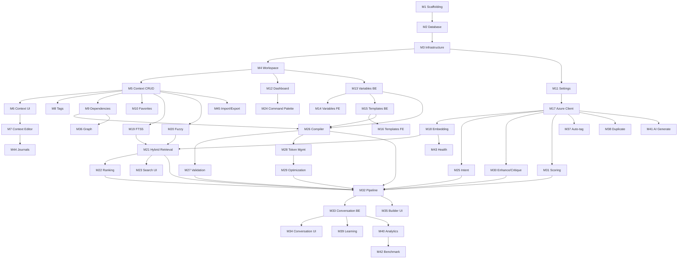

# Pocket — Implementation Plan

> **Version:** 1.0.0
> **Last Updated:** 2026-07-03
> **Status:** Authoritative
> **Audience:** Claude Code, development agents

---

## Overview

This document defines the complete implementation roadmap for Pocket. It contains **50 milestones** organized into **8 phases**. Each milestone includes Goal, Deliverables, Acceptance Criteria, Test Strategy, Risks, Dependencies, and Definition of Done.

**Claude Code must implement milestones sequentially.** Skipping milestones is forbidden unless explicitly approved.

---

## Phase 0: Foundation (M1–M3)

### M1 — Project Scaffolding

**Goal:** Initialize both backend and frontend projects with correct configurations.

**Deliverables:**
- Backend: Python project with `pyproject.toml`, `requirements.txt`, FastAPI app factory
- Frontend: Next.js 14+ project with App Router, TypeScript strict mode, Tailwind CSS, shadcn/ui
- Shared: `.env.example`, `.gitignore`, `README.md`, project documentation structure

**Acceptance Criteria:**
- `uvicorn app.main:app --reload` starts successfully on port 8000
- `npm run dev` starts successfully on port 3000
- `GET /api/v1/health` returns `{"status": "ok"}`
- TypeScript strict mode enabled, no `any` types
- Tailwind CSS configured with custom color tokens from UI_GUIDELINES.md
- shadcn/ui initialized with dark theme

**Test Strategy:**
- Backend: `pytest` discovers and runs, even if no tests exist yet
- Frontend: `vitest` configuration working

**Risks:**
- Version conflicts between dependencies

**Dependencies:** None (first milestone)

**Definition of Done:**
- Both servers start without errors
- Health endpoint responds
- Git initialized with first commit

---

### M2 — Database Schema & Migrations

**Goal:** Create all 32 database tables per DATABASE.md specification.

**Deliverables:**
- SQLAlchemy ORM models for all tables
- Base model with common fields (id, created_at, updated_at, deleted_at)
- Alembic initial migration
- SQLite PRAGMA configuration
- Seed data migration (system variables, default settings)

**Acceptance Criteria:**
- All 32 tables created per DATABASE.md schema
- All foreign keys enforced (PRAGMA foreign_keys = ON)
- WAL mode enabled
- All indexes created
- FTS5 virtual tables and triggers created
- Seed data inserted
- `alembic upgrade head` runs cleanly on fresh database
- `alembic downgrade base` reverses cleanly

**Test Strategy:**
- Unit tests for model creation
- Integration test: create → read → update → delete for each core table
- Verify foreign key constraints work (insert with invalid FK should fail)

**Risks:**
- FTS5 trigger complexity
- SQLite limitations with ALTER TABLE

**Dependencies:** M1

**Definition of Done:**
- Database file created at configured path
- All tables, indexes, FTS5 tables, and triggers verified
- Seed data present
- Migration reversible

---

### M3 — Core Infrastructure

**Goal:** Set up dependency injection, exception handling, middleware, and base patterns.

**Deliverables:**
- `app/config.py` — Settings class (Pydantic BaseSettings)
- `app/core/database.py` — Engine, session factory, PRAGMA setup
- `app/core/exceptions.py` — Exception hierarchy (PocketError, NotFoundError, ValidationError, etc.)
- `app/core/middleware.py` — CORS, global exception handler, request timing
- `app/dependencies.py` — DI container
- `BaseRepository` — Generic CRUD repository
- `BaseService` — Service base class

**Acceptance Criteria:**
- Settings loaded from `.env` file
- Custom exceptions mapped to HTTP status codes
- CORS configured for frontend origin
- Request timing logged
- BaseRepository supports: get_by_id, get_all (paginated), create, update_by_id, soft_delete
- All exceptions return standardized error JSON

**Test Strategy:**
- Unit test: Settings loading from env
- Unit test: Exception → HTTP status code mapping
- Integration test: BaseRepository CRUD operations

**Risks:** None significant.

**Dependencies:** M2

**Definition of Done:**
- Infrastructure patterns working end-to-end
- At least one route using DI → Service → Repository → DB round-trip verified

---

## Phase 1: Core Domain (M4–M12)

### M4 — Workspace CRUD

**Goal:** Full workspace management API and basic UI.

**Deliverables:**
- Backend: WorkspaceRouter, WorkspaceService, WorkspaceRepository
- API: Full CRUD + stats endpoint
- Frontend: Workspace switcher in sidebar
- Frontend: Workspace settings page

**Acceptance Criteria:**
- Create, read, update, soft-delete workspaces via API
- Workspace switcher in sidebar with icon and color
- Default workspace auto-selected
- Workspace statistics endpoint returns context/template/conversation counts
- Slug auto-generated from name

**Test Strategy:**
- Unit: WorkspaceService business logic
- Integration: API CRUD endpoints
- Frontend: Workspace switcher renders correctly

**Dependencies:** M3

**Definition of Done:**
- Workspace API fully functional with tests
- Workspace switcher visible in UI sidebar

---

### M5 — Context CRUD

**Goal:** Complete context management with versioning.

**Deliverables:**
- Backend: ContextRouter, ContextService, ContextRepository, ContextVersionRepository
- API: Full CRUD + version history + restore
- Pydantic schemas with strict validation

**Acceptance Criteria:**
- Create context with all fields (title, content, type, priority, workspace)
- Update context creates new version automatically
- Version history retrievable (list + detail)
- Restore to previous version (creates new version with old content)
- Slug auto-generated, unique per workspace
- Token count computed on create/update
- Soft delete working

**Test Strategy:**
- Unit: ContextService.create_context, update_context, restore_version
- Integration: Full CRUD API tests
- Regression: Version ordering always monotonic

**Dependencies:** M4

**Definition of Done:**
- Context CRUD API with versioning fully functional
- All fields from DATABASE.md contexts table supported

---

### M6 — Context UI (Library View)

**Goal:** Context Library page with list view, filtering, and search.

**Deliverables:**
- Context Library page (list view)
- Context card component
- Filter by context_type (tabs)
- Sort by updated_at, priority, usage
- Pagination
- Basic text search (delegated to backend FTS5)

**Acceptance Criteria:**
- Context cards display title, type badge, content preview, tags, metadata
- Tab filters for each context_type
- Pagination working (offset/limit)
- Search input with debounce (300ms)
- Empty state when no contexts
- Loading skeleton state
- Responsive layout

**Test Strategy:**
- Component tests: ContextCard renders correctly
- Integration: Filter + search combination works

**Dependencies:** M5

**Definition of Done:**
- Context Library page functional with all filters
- All UI states (empty, loading, error) implemented

---

### M7 — Context Editor UI

**Goal:** Full context editor with Monaco editor and live preview.

**Deliverables:**
- Context detail page with split view (editor + preview)
- Monaco editor configured for markdown
- Live markdown preview (react-markdown)
- Metadata panel (type, priority, category, tags, tokens)
- Autosave (debounced 2s)

**Acceptance Criteria:**
- Monaco editor loads and renders markdown
- Live preview updates as user types
- Metadata fields editable inline
- Autosave indicator (Saving... → Saved)
- Create new context flow (from library → editor)
- Back navigation preserves list state

**Test Strategy:**
- Component tests: Editor renders, preview updates
- E2E: Create context → edit → verify saved

**Dependencies:** M6

**Definition of Done:**
- Context editor functional with split view
- Autosave working
- All metadata editable

---

### M8 — Tags & Categories

**Goal:** Tag and category system for contexts.

**Deliverables:**
- Backend: Tag CRUD, Category CRUD (hierarchical)
- Junction table operations (context_tags)
- Tag input component (autocomplete, create inline)
- Category tree component
- Tag filter in context library

**Acceptance Criteria:**
- Create tags inline from context editor
- Autocomplete existing tags
- Categories support parent-child hierarchy
- Filter context library by tag
- Tag usage counts maintained
- Tag colors configurable

**Test Strategy:**
- Unit: Tag creation, autocomplete search
- Integration: Tag assignment to context
- UI: Tag input autocomplete works

**Dependencies:** M5

**Definition of Done:**
- Tags fully functional (create, assign, filter, autocomplete)
- Categories with hierarchy working

---

### M9 — Context Dependencies

**Goal:** Implement context dependency graph (DAG).

**Deliverables:**
- Backend: DependencyService with circular dependency detection
- API: Add/remove dependencies, get dependency graph
- Dependency selector component in context editor
- Circular dependency validation

**Acceptance Criteria:**
- Add dependency between contexts (4 types: requires, extends, overrides, complements)
- Circular dependency detected and rejected
- Dependency graph retrievable as adjacency list
- Topological sort implemented (Kahn's algorithm)
- Dependency weight configurable
- Visual dependency list in context editor

**Test Strategy:**
- Unit: Circular dependency detection (positive and negative cases)
- Unit: Topological sort correctness
- Integration: Add dependency API
- Edge case: Self-reference blocked

**Dependencies:** M5

**Definition of Done:**
- Dependencies CRUD working
- Circular dependency detection verified
- Topological sort verified

---

### M10 — Favorites & Pinning

**Goal:** Favorite and pinning system for quick access.

**Deliverables:**
- Backend: FavoriteService, FavoriteRepository
- API: Add/remove/reorder favorites
- Sidebar favorites section
- Pin/unpin on context cards
- Pinned items appear first in lists

**Acceptance Criteria:**
- Toggle favorite on any entity (context, template, conversation)
- Favorites section in sidebar shows top items
- Reorder favorites via drag & drop or API
- Pinned contexts appear first in library list
- Favorite status visible on cards

**Test Strategy:**
- Unit: Favorite toggle, ordering
- Integration: API CRUD

**Dependencies:** M5

**Definition of Done:**
- Favorites visible in sidebar
- Pinning affects list ordering

---

### M11 — Settings & Providers

**Goal:** Application settings management and AI provider configuration.

**Deliverables:**
- Backend: SettingsService, ProviderService
- API: Get/update settings, CRUD providers, test connection
- Settings page UI (grouped by category)
- Provider configuration form (Azure OpenAI)
- Connection test functionality

**Acceptance Criteria:**
- Settings stored as key-value pairs
- Batch update settings
- Provider CRUD with endpoint, deployments, API version
- Test connection button validates Azure OpenAI connectivity
- API keys NEVER returned in API responses
- Theme toggle (dark/light) functional

**Test Strategy:**
- Unit: Settings get/update
- Integration: Provider creation and connection test (mocked)

**Dependencies:** M3

**Definition of Done:**
- Settings page functional
- Provider configuration working
- Connection test implemented

---

### M12 — Dashboard Layout & Navigation

**Goal:** Complete application shell with sidebar, header, and dashboard.

**Deliverables:**
- Sidebar navigation with all routes
- Page header component (breadcrumbs, actions)
- Dashboard page with metric cards (placeholders for analytics data)
- Theme toggle (dark/light mode)
- Responsive sidebar (collapsible)

**Acceptance Criteria:**
- Sidebar shows all navigation items per UI_GUIDELINES.md
- Active route highlighted with accent color
- Sidebar collapsible (`Cmd+\`)
- Breadcrumb navigation working
- Dark/light theme toggle functional
- Dashboard shows placeholder metric cards
- Responsive: sidebar overlay on mobile

**Test Strategy:**
- Component tests: Sidebar renders, navigation works
- E2E: Navigate between all routes

**Dependencies:** M4, M6

**Definition of Done:**
- Complete app shell with navigation
- All routes accessible
- Theme switching working

---

## Phase 2: Workspace & Variables (M13–M16)

### M13 — Variable Engine (Backend)

**Goal:** Complete variable management with scoping and resolution.

**Deliverables:**
- Backend: VariableService, WorkspaceVariableService
- System variables (auto-generated: date, time, workspace, model)
- Variable resolution with priority chain (system → global → workspace → template → runtime)

**Acceptance Criteria:**
- Create/update/delete variables (global and workspace-scoped)
- System variables auto-resolved at runtime
- Resolution priority chain working correctly
- Variable value types validated (text, number, boolean, select, json)
- Unresolved variables detected and reported
- Source map tracks where each variable value came from

**Test Strategy:**
- Unit: Resolution priority chain with conflicts
- Unit: System variable generation
- Integration: Variable CRUD API

**Dependencies:** M4

**Definition of Done:**
- Variable resolution produces correct values for all scope levels
- System variables always available

---

### M14 — Variable Engine (Frontend)

**Goal:** Variable management UI.

**Deliverables:**
- Variables page (list all variables grouped by scope)
- Variable create/edit form
- Workspace variable overrides
- Variable preview (show resolved values)

**Acceptance Criteria:**
- List variables grouped by scope (global, workspace, system)
- Create variable with type-specific input
- Workspace variable overrides visible
- System variables shown as read-only

**Test Strategy:**
- Component tests: Variable form renders correctly

**Dependencies:** M13

**Definition of Done:**
- Variable management UI functional

---

### M15 — Template Engine (Backend)

**Goal:** Prompt template management with Jinja2 rendering.

**Deliverables:**
- Backend: TemplateService, TemplateVersionService
- API: CRUD + preview + versions
- Jinja2 rendering with variable substitution
- Template schema validation (JSON Schema for expected variables)

**Acceptance Criteria:**
- Template CRUD with versioning (same pattern as contexts)
- Preview endpoint renders template with provided variables
- Jinja2 syntax validated on save
- Template variables automatically linked
- Token count computed

**Test Strategy:**
- Unit: Jinja2 rendering with various variable types
- Unit: Error handling for invalid templates
- Integration: Template CRUD API

**Dependencies:** M13

**Definition of Done:**
- Templates fully functional with Jinja2 rendering
- Preview endpoint returns rendered output

---

### M16 — Template Engine (Frontend)

**Goal:** Template management UI with live preview.

**Deliverables:**
- Template library page (same pattern as context library)
- Template editor with Monaco (Jinja2 mode)
- Live preview panel showing rendered output
- Variable panel showing template variables

**Acceptance Criteria:**
- Template list with search and filters
- Monaco editor with Jinja2 syntax support
- Live preview updates as variables change
- Variable panel shows required variables and current values

**Test Strategy:**
- Component tests: Template editor renders
- E2E: Create template → edit → preview

**Dependencies:** M15, M7

**Definition of Done:**
- Template editor functional with live preview

---

## Phase 3: AI Foundation (M17–M24)

### M17 — Azure OpenAI Client

**Goal:** Centralized Azure OpenAI client with retry and error handling.

**Deliverables:**
- `app/ai/client.py` — AzureAIClient class
- Chat completion (regular + JSON mode)
- Embedding generation
- Retry logic with exponential backoff
- Cost computation
- Request/response logging

**Acceptance Criteria:**
- Chat completion works with configured deployment
- JSON mode returns valid parsed JSON
- Retry on timeout, rate limit, connection errors (max 3 attempts)
- Cost computed based on token usage
- All AI calls logged (input length, output length, tokens, cost, latency)
- API keys never logged or exposed

**Test Strategy:**
- Unit: Cost computation
- Integration: Chat completion with Azure (requires API key)
- Unit: Retry logic (mocked failures)

**Dependencies:** M11

**Definition of Done:**
- Azure OpenAI client working with real API calls
- Retry and error handling verified

---

### M18 — Embedding Engine

**Goal:** Context embedding with sentence-transformers and storage.

**Deliverables:**
- `app/ai/embeddings.py` — EmbeddingService
- Local embedding with sentence-transformers (all-MiniLM-L6-v2)
- Azure embedding option (text-embedding-3-large)
- Content hash-based deduplication (skip re-embedding if unchanged)
- Background embedding job
- Cosine similarity computation

**Acceptance Criteria:**
- Embed text locally using sentence-transformers
- Embed text via Azure OpenAI
- Store embeddings in context_embeddings table
- Content hash prevents redundant re-embedding
- Background job system for batch embedding
- Cosine similarity function correct (verified against known vectors)

**Test Strategy:**
- Unit: Cosine similarity with known vectors
- Unit: Content hash deduplication
- Integration: Embed context → store → retrieve → compute similarity

**Dependencies:** M17, M5

**Definition of Done:**
- Embedding pipeline functional
- At least 10 test contexts embedded and similarity computed

---

### M19 — Full-Text Search (FTS5)

**Goal:** SQLite FTS5-based full-text search.

**Deliverables:**
- FTS5 query builder (handle special characters, prefix search)
- BM25 scoring
- Search API endpoint
- Search input component with debounce

**Acceptance Criteria:**
- FTS5 search across context titles and content
- BM25 ranking (title weighted 10x over content)
- Prefix search for autocomplete
- Phrase search with quotes
- Special characters escaped properly
- Results return with rank scores

**Test Strategy:**
- Unit: FTS5 query builder escaping
- Integration: Insert 50 contexts → search → verify ranking
- Edge cases: empty query, special characters, very long queries

**Dependencies:** M2 (FTS5 tables), M5

**Definition of Done:**
- FTS5 search returning ranked results
- Search API endpoint functional

---

### M20 — Fuzzy Search (RapidFuzz)

**Goal:** Add fuzzy string matching to search pipeline.

**Deliverables:**
- RapidFuzz integration for title and tag matching
- Score normalization (0-100 → 0-1)
- Configurable score threshold

**Acceptance Criteria:**
- Fuzzy matching on context titles and tags
- Minimum score threshold (60%) filters noise
- Results sorted by fuzzy score
- Handles typos and partial matches

**Test Strategy:**
- Unit: Fuzzy match with known typos
- Unit: Score normalization

**Dependencies:** M5

**Definition of Done:**
- Fuzzy search returning results for misspelled queries

---

### M21 — Hybrid Retrieval Engine

**Goal:** Combine FTS5, RapidFuzz, and embedding search into hybrid retrieval.

**Deliverables:**
- `app/ai/pipeline/retrieval.py` — RetrievalEngine
- Parallel search execution (asyncio.gather)
- Score normalization per method
- Weighted merge with configurable weights
- Deduplication

**Acceptance Criteria:**
- Three search methods execute in parallel
- Results merged by context ID
- Weighted scoring: FTS(0.25) + Fuzzy(0.10) + Semantic(0.35) + Metadata(0.30)
- Deduplication removes duplicate results
- Top K configurable (default 10)
- Query rewrite for better recall

**Test Strategy:**
- Unit: Weight calculation
- Unit: Deduplication
- Integration: End-to-end retrieval with 100+ test contexts
- Performance: Retrieval completes in < 500ms

**Dependencies:** M18, M19, M20

**Definition of Done:**
- Hybrid search returning relevant results
- All three methods contributing to scores

---

### M22 — Context Ranking

**Goal:** Multi-factor context ranking algorithm.

**Deliverables:**
- `app/ai/pipeline/ranking.py` — RankingEngine
- Scoring formula with 9 factors
- Score normalization per factor
- Usage tracking (update usage_count on use)

**Acceptance Criteria:**
- Ranking formula implemented per AI_ARCHITECTURE.md Section 6
- All 9 scoring factors computed:
  - Semantic similarity, priority, usage (log-normalized), recency (exponential decay),
  - workspace boost, favorite boost, dependency weight, confidence, quality score
- Configurable weights
- Score breakdown available for debugging

**Test Strategy:**
- Unit: Individual scoring functions (usage_score, recency_score)
- Unit: Overall ranking with known data
- Integration: Rank 50 contexts and verify top result is sensible

**Dependencies:** M21

**Definition of Done:**
- Ranking produces deterministic, explainable results
- Score breakdown accessible per context

---

### M23 — Search UI

**Goal:** Global search and search-everywhere functionality.

**Deliverables:**
- Search API endpoint (hybrid search)
- Global search input in header
- Search results page
- Search integration in command palette
- Autocomplete suggestions

**Acceptance Criteria:**
- Search across contexts, templates, conversations
- Results grouped by entity type
- Keyboard shortcut `/` focuses search
- Search results clickable → navigate to entity
- Debounced (300ms) with loading state
- No results state

**Test Strategy:**
- E2E: Type search → see results → click result → navigate

**Dependencies:** M21, M12

**Definition of Done:**
- Global search functional across all entities

---

### M24 — Command Palette

**Goal:** Raycast-style command palette.

**Deliverables:**
- Command palette component (shadcn `Command`)
- Recent commands
- Navigation commands
- Action commands
- Workspace switching
- Fuzzy search on commands

**Acceptance Criteria:**
- `Cmd+K` opens command palette
- Recent commands shown by default
- Fuzzy search on command names
- Commands grouped: Recent, Navigation, Actions, Workspaces
- Keyboard navigation: arrows + Enter + Escape
- Execute command closes palette
- Animation: scale in/out per UI_GUIDELINES.md

**Test Strategy:**
- Component tests: Palette opens, search works
- E2E: Cmd+K → type command → execute

**Dependencies:** M12

**Definition of Done:**
- Command palette functional with all command groups

---

## Phase 4: Prompt Engine (M25–M32)

### M25 — Intent Detection

**Goal:** AI-powered intent detection for user messages.

**Deliverables:**
- `app/ai/pipeline/intent.py` — IntentDetector
- System prompt for intent classification
- Fallback for offline/error cases

**Acceptance Criteria:**
- Classifies intent: question, instruction, creative, analysis, code, conversation
- Extracts entities (topics, technologies)
- Determines complexity (simple, moderate, complex)
- Detects language
- Suggests model (GPT-4.1 vs Mini)
- Fallback returns "instruction" intent when AI unavailable

**Test Strategy:**
- Unit: Intent classification with 20 test messages
- Unit: Fallback behavior

**Dependencies:** M17

**Definition of Done:**
- Intent detection correctly classifies test messages

---

### M26 — Prompt Compiler

**Goal:** Compile system prompt from contexts, templates, and variables.

**Deliverables:**
- `app/ai/pipeline/compiler.py` — PromptCompiler
- Section ordering by context type
- Jinja2 variable substitution
- Template rendering
- Conversation history integration

**Acceptance Criteria:**
- Contexts grouped by type in defined order (persona → role → instruction → knowledge → constraint → example → reference → snippet)
- Jinja2 variables resolved in compiled prompt
- Template rendering with contexts and variables
- Conversation history inserted between system and user messages
- Section separators (---) between context types

**Test Strategy:**
- Unit: Section ordering correctness
- Unit: Variable substitution
- Unit: Template rendering with multiple contexts
- Edge case: Empty contexts list

**Dependencies:** M9, M15, M13

**Definition of Done:**
- Compiler produces correct, well-structured prompts

---

### M27 — Validation Engine

**Goal:** Compiler-style prompt validation that blocks bad prompts.

**Deliverables:**
- `app/ai/pipeline/validator.py` — ValidationEngine
- 11 validation checks per AI_ARCHITECTURE.md Section 7
- Severity levels (error, warning, info)
- Validation result with suggestions

**Acceptance Criteria:**
- All 11 checks implemented
- Errors block prompt sending
- Warnings allow but inform user
- Missing variables detected (regex-based)
- Token overflow detected
- Circular dependencies detected
- Validation results include suggestions for fixing
- API endpoint for standalone validation

**Test Strategy:**
- Unit: Each validation check (positive and negative)
- Integration: Full validation pipeline
- Edge cases: Empty prompt, prompt with only warnings

**Dependencies:** M9, M26

**Definition of Done:**
- Validation catches all defined error conditions
- Invalid prompts blocked from sending

---

### M28 — Token Management

**Goal:** Accurate token counting and budget allocation.

**Deliverables:**
- `app/ai/pipeline/token_counter.py` — TokenCounter (tiktoken)
- Token budget allocation
- Token count display in UI (real-time)

**Acceptance Criteria:**
- Token counting uses tiktoken for accuracy
- Budget allocation: system(60%), history(25%), user(5%), completion(10%)
- Real-time token counter in prompt builder
- Token count displayed on context cards
- Token overflow triggers optimization

**Test Strategy:**
- Unit: Token count matches OpenAI's count for test texts
- Unit: Budget allocation math

**Dependencies:** M26

**Definition of Done:**
- Token counts accurate within 1% of OpenAI's counts

---

### M29 — Prompt Optimization

**Goal:** Multi-step prompt optimization pipeline.

**Deliverables:**
- `app/ai/pipeline/optimizer.py` — PromptOptimizer
- 12-step optimization per AI_ARCHITECTURE.md Section 8
- Rule-based steps (no LLM): normalize, deduplicate, merge, compress, order, polish
- LLM-based steps (optional): review, rewrite

**Acceptance Criteria:**
- Whitespace normalization removes excessive blank lines
- Duplicate paragraphs removed
- Constraints ordered by priority markers (MUST > SHOULD > MAY)
- LLM review/rewrite optional (configurable)
- Optimization reduces token count without losing meaning
- Before/after comparison available

**Test Strategy:**
- Unit: Each rule-based step
- Integration: Full optimization pipeline
- Regression: Optimized prompt produces same AI output quality

**Dependencies:** M28

**Definition of Done:**
- Optimization pipeline reduces tokens while preserving quality

---

### M30 — AI Enhancement & Critique

**Goal:** AI-powered prompt improvement and quality feedback.

**Deliverables:**
- `app/ai/pipeline/enhancer.py` — PromptEnhancer
- `app/ai/pipeline/critic.py` — PromptCritic
- Enhancement system prompts
- Critique system prompts with structured output

**Acceptance Criteria:**
- AI Enhancement improves prompt clarity and specificity
- AI Critique identifies issues and suggests fixes
- Changes tracked and listed
- User can accept/reject AI suggestions
- Critique returns structured issues with severity

**Test Strategy:**
- Integration: Enhance a known mediocre prompt → verify improvement
- Integration: Critique a known flawed prompt → verify issues found

**Dependencies:** M17, M26

**Definition of Done:**
- Enhancement and Critique produce useful, actionable output

---

### M31 — Prompt Scoring

**Goal:** AI-evaluated prompt quality scoring.

**Deliverables:**
- `app/ai/pipeline/scorer.py` — PromptScorer
- 5-dimension scoring rubric (clarity, specificity, completeness, consistency, efficiency)
- Score storage in prompt_scores table
- Score visualization component

**Acceptance Criteria:**
- Score computed as JSON (overall + 5 dimensions)
- Score stored in database with reasoning
- Score indicator component (color-coded: excellent/good/fair/poor)
- Score history trackable per workspace

**Test Strategy:**
- Integration: Score known good and bad prompts → verify differentiation

**Dependencies:** M17, M26

**Definition of Done:**
- Scoring distinguishes between good and poor prompts

---

### M32 — Full Pipeline Orchestrator

**Goal:** Wire all pipeline steps into the complete 18-step orchestrator.

**Deliverables:**
- `app/ai/pipeline/orchestrator.py` — PipelineOrchestrator
- Pipeline context object (carries state between steps)
- Pipeline trace for debugging
- Graceful degradation (fallbacks for non-critical steps)

**Acceptance Criteria:**
- All 18 pipeline steps wired in correct order
- PipelineInput → PipelineOutput data flow working
- Pipeline trace records each step's duration and status
- Non-critical step failures use fallback and continue
- Critical step failures stop pipeline and return errors
- Validation failure returns validation errors (not sent to AI)

**Test Strategy:**
- Integration: Full pipeline execution with test data
- Unit: Graceful degradation for each non-critical step
- Performance: Full pipeline completes in < 10 seconds

**Dependencies:** M25, M26, M27, M28, M29, M30, M31, M21, M22

**Definition of Done:**
- Complete pipeline executes end-to-end
- Trace shows all steps completed
- Graceful degradation verified

---

## Phase 5: Conversation & AI Features (M33–M40)

### M33 — Conversation Backend

**Goal:** Conversation and message management with AI pipeline integration.

**Deliverables:**
- Backend: ConversationService, MessageService
- API: Start conversation, send message, get history
- Pipeline integration: Each user message triggers full AI pipeline
- Prompt run recording

**Acceptance Criteria:**
- Start new conversation (workspace, model, initial message)
- Send message triggers AI pipeline → stores both user and assistant messages
- Conversation statistics updated (total_tokens, cost, message_count)
- Prompt run recorded with contexts used, variables, scores
- Message metadata includes token count, cost, latency, model

**Test Strategy:**
- Integration: Full conversation flow (start → send 3 messages → verify state)
- Unit: Token/cost accumulation

**Dependencies:** M32

**Definition of Done:**
- Full conversation loop working: user message → AI pipeline → AI response → stored

---

### M34 — Conversation UI

**Goal:** Chat interface for conversations.

**Deliverables:**
- Conversation list page
- Chat panel with message bubbles
- Message input with keyboard submit (Enter)
- Markdown rendering in messages
- Code highlighting in messages
- Message metadata (tokens, cost, latency)
- Copy/regenerate actions on messages

**Acceptance Criteria:**
- Clean chat interface per UI_GUIDELINES.md chat bubble design
- Messages render markdown (react-markdown + rehype-highlight)
- Code blocks have syntax highlighting and copy button
- Message metadata shown (tokens, cost, time)
- Auto-scroll to latest message
- Loading state while AI responds
- Conversation list with search

**Test Strategy:**
- Component tests: MessageBubble renders markdown correctly
- E2E: Start conversation → send message → receive response → verify display

**Dependencies:** M33, M12

**Definition of Done:**
- Chat interface functional and polished

---

### M35 — Prompt Builder UI

**Goal:** Visual prompt builder with drag & drop and live preview.

**Deliverables:**
- Prompt builder page per UI_GUIDELINES.md layout
- Context selector (checkboxes, search)
- Template selector
- Variable panel with inputs
- Live compiled preview
- Token counter (real-time)
- Validation indicator
- Score indicator

**Acceptance Criteria:**
- Select contexts from workspace library
- Select template (optional)
- Fill in variable values
- Live preview shows compiled prompt (updates as selections change)
- Token counter updates in real-time
- Validation result shown (pass/fail with details)
- Score shown after compilation
- "Compile" button to finalize
- "Start Conversation" button to send compiled prompt

**Test Strategy:**
- Component tests: Builder components render
- E2E: Select contexts → fill variables → compile → verify preview

**Dependencies:** M32, M23

**Definition of Done:**
- Prompt builder produces correct compiled prompts
- Live preview works

---

### M36 — Context Graph Explorer

**Goal:** Interactive DAG visualization using ReactFlow.

**Deliverables:**
- Graph page with ReactFlow component
- Nodes colored by context_type
- Edges labeled with dependency type
- Click node to view context details (side panel)
- Zoom, pan, drag
- Mini-map
- Filter by workspace, type

**Acceptance Criteria:**
- Graph renders all contexts and dependencies for a workspace
- Nodes use context type colors from UI_GUIDELINES.md
- Edges show dependency type as label
- Click node opens side panel with context preview
- Drag nodes to rearrange layout
- Zoom in/out, pan
- Mini-map in bottom-right corner
- Empty state when no dependencies

**Test Strategy:**
- Component tests: Graph renders with test data
- E2E: Navigate to graph → interact with nodes

**Dependencies:** M9, M12

**Definition of Done:**
- Graph explorer functional with interactive nodes and edges

---

### M37 — AI Auto-Tagging & Variable Extraction

**Goal:** AI-powered automatic tagging and variable extraction.

**Deliverables:**
- AI auto-tag service
- AI variable extraction service
- UI integration: suggest tags after context creation
- UI integration: suggest variables from template content

**Acceptance Criteria:**
- Auto-tag suggests 3-5 relevant tags for a context
- Tags shown as suggestions (user confirms)
- Variable extraction identifies hardcoded values that could be parameterized
- Suggestions shown with confidence scores
- User can accept/reject each suggestion

**Test Strategy:**
- Integration: Auto-tag 10 test contexts → verify tag relevance
- Integration: Extract variables from 5 test templates

**Dependencies:** M17, M8, M13

**Definition of Done:**
- Auto-tag and variable extraction produce useful suggestions

---

### M38 — AI Duplicate Detection & Merge

**Goal:** Find and merge duplicate or near-duplicate contexts.

**Deliverables:**
- Duplicate detection service (embedding similarity + title fuzzy match)
- Merge service (AI-powered content merging)
- UI: Duplicate detection report
- UI: Merge wizard (select duplicates → preview merged → confirm)

**Acceptance Criteria:**
- Detection finds contexts with >90% similarity
- Groups displayed with similarity scores
- AI merge produces coherent merged content
- User reviews merged content before applying
- Original contexts preserved (new merged context created)

**Test Strategy:**
- Integration: Create 3 near-duplicate contexts → detect → merge → verify

**Dependencies:** M18, M17

**Definition of Done:**
- Duplicate detection and merge working end-to-end

---

### M39 — Learning Engine

**Goal:** Post-conversation analysis and automatic improvement.

**Deliverables:**
- `app/ai/learning/engine.py` — LearningEngine
- Post-conversation analyzer
- Context candidate generation
- Usage and confidence score updates

**Acceptance Criteria:**
- After conversation ends, AI analyzes quality
- Missing contexts identified
- Success/failure factors extracted
- New context candidates generated (pending user review)
- Usage scores incremented for used contexts
- Confidence scores adjusted based on effectiveness
- Learning records stored in database

**Test Strategy:**
- Integration: Complete conversation → trigger learning → verify record
- Unit: Score update logic

**Dependencies:** M33, M17

**Definition of Done:**
- Learning engine produces meaningful analysis and candidates

---

### M40 — Analytics Dashboard

**Goal:** Analytics page with usage metrics and trends.

**Deliverables:**
- Analytics API endpoints (dashboard, usage, costs, trends, top/dead contexts)
- Dashboard page with metric cards
- Usage charts (daily/weekly)
- Top contexts list
- Dead contexts list
- Cost breakdown

**Acceptance Criteria:**
- Dashboard shows: total contexts, total prompts, total tokens, total cost
- Weekly trend chart (line chart or area chart)
- Top used contexts (last 30 days)
- Dead contexts (unused > 90 days)
- Cost breakdown by model
- All metrics computed from analytics_events and prompt_runs

**Test Strategy:**
- Integration: Generate test data → verify aggregations
- Component tests: Chart components render

**Dependencies:** M33

**Definition of Done:**
- Analytics dashboard shows real data from usage

---

## Phase 6: Advanced AI & Polish (M41–M45)

### M41 — AI Context Generation & Suggestion

**Goal:** Generate new contexts from descriptions and suggest relevant contexts.

**Deliverables:**
- AI context generation service
- AI context suggestion service
- UI: Generate context form
- UI: Context suggestions in prompt builder

**Acceptance Criteria:**
- Generate context from natural language description
- Generated context includes title, content, type, tags
- Suggestions shown during prompt building (additional relevant contexts)
- Suggestions sorted by relevance

**Test Strategy:**
- Integration: Generate contexts from 5 descriptions

**Dependencies:** M17, M5

**Definition of Done:**
- Context generation produces usable contexts

---

### M42 — AI Prompt Benchmark & Weekly Review

**Goal:** Benchmark prompt quality and generate weekly usage reviews.

**Deliverables:**
- Prompt benchmark service (compare prompt variants)
- Weekly review service (comprehensive usage analysis)
- Weekly review page

**Acceptance Criteria:**
- Benchmark compares a prompt against AI-generated alternatives
- Weekly review includes: usage stats, top contexts, dead contexts, recommendations
- Review generated on demand or on schedule

**Test Strategy:**
- Integration: Benchmark a test prompt
- Integration: Generate weekly review with test data

**Dependencies:** M17, M40

**Definition of Done:**
- Benchmark and weekly review produce useful reports

---

### M43 — AI Context Health Check

**Goal:** Evaluate health of all contexts and identify issues.

**Deliverables:**
- Health check service
- Health scores per context (freshness, usage, quality, relevance)
- Health report with recommendations
- Health indicators in context library

**Acceptance Criteria:**
- Health score computed for each context (0-1)
- Issues identified: stale, low quality, unused, needs update
- Recommendations provided (update, merge, archive, delete)
- Health badge visible on context cards
- Batch health check runs in background

**Test Strategy:**
- Unit: Health score computation with known data
- Integration: Run health check on workspace

**Dependencies:** M18, M17

**Definition of Done:**
- Health check identifies real issues and provides actionable recommendations

---

### M44 — Journals

**Goal:** Conversation journals for reflection and notes.

**Deliverables:**
- Journal CRUD (backend + frontend)
- Journal editor (Monaco, markdown)
- Journal list with search
- Optional workspace scoping

**Acceptance Criteria:**
- Create, edit, soft-delete journals
- Markdown editor with preview
- Search across journals
- Pin journals
- Tags on journals

**Test Strategy:**
- Integration: Journal CRUD API
- E2E: Create → edit → search → verify

**Dependencies:** M7 (editor reuse)

**Definition of Done:**
- Journal feature fully functional

---

### M45 — Import / Export

**Goal:** Import contexts from markdown files, export workspace as JSON.

**Deliverables:**
- Import API: Accept markdown files → parse → create contexts
- Import API: Accept JSON → create entities
- Export API: Workspace → JSON with all contexts, templates, variables
- Export API: Contexts → markdown files
- Import wizard UI

**Acceptance Criteria:**
- Import markdown: parse frontmatter for metadata, body as content
- Import JSON: validate against schema, create entities
- Export JSON: complete workspace snapshot
- Export markdown: one file per context with frontmatter
- Import preview before commit
- Conflict detection (duplicate titles)

**Test Strategy:**
- Unit: Markdown parsing
- Integration: Import → verify created entities
- Integration: Export → import → verify round-trip

**Dependencies:** M5

**Definition of Done:**
- Import and export fully functional
- Round-trip (export → import) preserves all data

---

## Phase 7: Testing & Quality (M46–M48)

### M46 — Unit & Integration Test Suite

**Goal:** Comprehensive test coverage ≥ 90%.

**Deliverables:**
- Backend: pytest test suite for all services, repositories, pipeline steps
- Frontend: Vitest + React Testing Library for all components
- Test fixtures and factories
- Coverage reports

**Acceptance Criteria:**
- Backend coverage ≥ 90%
- Frontend coverage ≥ 90%
- All critical paths covered (CRUD, pipeline, validation, ranking)
- Test data factories for each entity
- CI-ready test execution

**Test Strategy:** This IS the test strategy.

**Dependencies:** All previous milestones

**Definition of Done:**
- Coverage reports show ≥ 90%
- All tests pass

---

### M47 — E2E Tests

**Goal:** End-to-end tests for all critical user flows.

**Deliverables:**
- Playwright test suite
- Critical user flows tested:
  - Create workspace → create context → build prompt → chat
  - Search → find context → edit → verify update
  - Import contexts → verify in library
  - Prompt builder → validate → fix errors → compile → chat
  - Graph explorer interactions

**Acceptance Criteria:**
- All critical flows automated
- Tests run against dev server (backend + frontend)
- Screenshots captured on failure
- Test isolation (fresh DB per test)

**Test Strategy:** This IS the test strategy.

**Dependencies:** M46

**Definition of Done:**
- All E2E tests pass
- CI-ready

---

### M48 — Prompt Regression Tests

**Goal:** Ensure prompt quality doesn't degrade across changes.

**Deliverables:**
- Golden prompt test suite
- Same inputs always produce same structure/quality prompts
- Prompt scoring regression (score shouldn't decrease)

**Acceptance Criteria:**
- 20 golden test cases (input → expected prompt structure)
- Regression detected if compiled prompt structure changes unexpectedly
- Score regression detected if average score drops > 5%

**Test Strategy:** Snapshot testing with approved baselines.

**Dependencies:** M32

**Definition of Done:**
- Golden test suite established with baselines

---

## Phase 8: Polish & Release (M49–M50)

### M49 — Performance Optimization

**Goal:** Optimize for speed and responsiveness.

**Deliverables:**
- Backend: Query optimization (EXPLAIN QUERY PLAN on all queries)
- Backend: Connection pooling tuning
- Frontend: Bundle size analysis and optimization
- Frontend: Lazy loading for heavy components (Monaco, ReactFlow)
- Database: Index verification
- Caching: Implement caching where needed

**Acceptance Criteria:**
- Page loads < 2 seconds
- API responses < 200ms (non-AI endpoints)
- AI pipeline < 15 seconds end-to-end
- Frontend bundle < 500KB initial load
- No N+1 queries
- Lazy loading for Monaco Editor and Graph

**Test Strategy:**
- Performance benchmarks with timing assertions
- Bundle analysis report

**Dependencies:** All previous milestones

**Definition of Done:**
- Performance benchmarks met
- No N+1 queries
- Bundle optimized

---

### M50 — Final Polish & Documentation

**Goal:** Final UI polish, documentation, and release preparation.

**Deliverables:**
- Final UI review against UI_GUIDELINES.md
- All empty, loading, error states verified
- Keyboard shortcuts verified
- README.md with setup instructions
- Contributing guide
- API documentation (auto-generated from FastAPI)
- Final QA pass

**Acceptance Criteria:**
- Every page matches UI_GUIDELINES.md design specifications
- All keyboard shortcuts working
- All animations smooth and purposeful
- No console errors or warnings
- README covers: prerequisites, setup, running, configuration
- FastAPI auto-docs accessible at `/docs`
- All features from the brief implemented and verified

**Test Strategy:**
- Manual QA checklist
- Visual comparison against UI_GUIDELINES.md

**Dependencies:** M49

**Definition of Done:**
- All features implemented
- All tests passing
- Documentation complete
- Application ready for daily use

---

## Appendix: Milestone Summary

| Phase | Milestones | Focus |
|-------|-----------|-------|
| **Phase 0** | M1–M3 | Project setup, DB, infrastructure |
| **Phase 1** | M4–M12 | Core domain: workspaces, contexts, UI shell |
| **Phase 2** | M13–M16 | Variables and templates |
| **Phase 3** | M17–M24 | AI foundation: search, embedding, retrieval |
| **Phase 4** | M25–M32 | Prompt engine: pipeline, validation, scoring |
| **Phase 5** | M33–M40 | Conversations, AI features, analytics |
| **Phase 6** | M41–M45 | Advanced AI, journals, import/export |
| **Phase 7** | M46–M48 | Testing (unit, integration, E2E, regression) |
| **Phase 8** | M49–M50 | Performance optimization and release |

---

## Dependency Graph

---

*End of IMPLEMENTATION_PLAN.md*
